홍승택 Github 실습 #01 과제
===========================
> 실습날짜 22.08.03
> 
> 이름: 홍승택

### 1. Github 프로젝트 생성
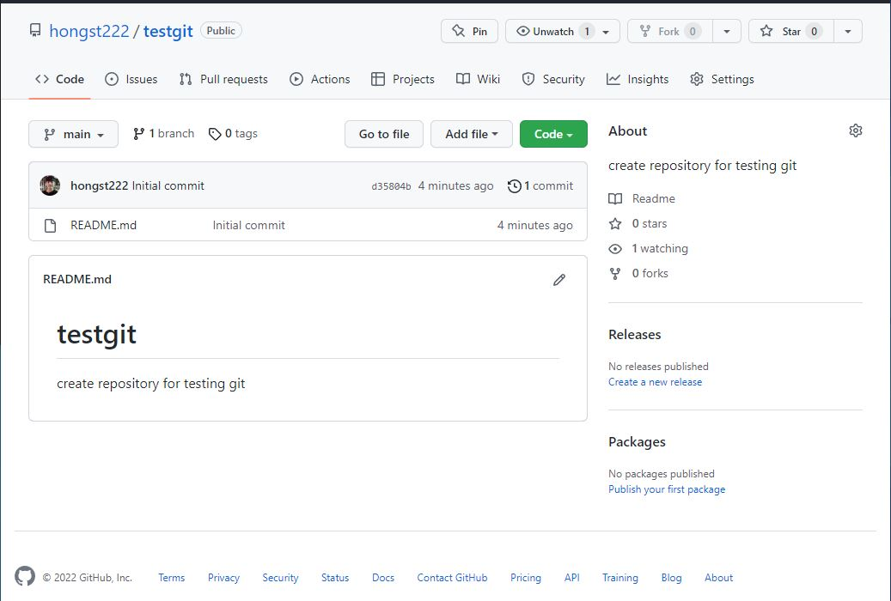
--------------------------------------
### 2. 사용자 홈 폴더 안에 school 폴더 생성 후 clone 받기
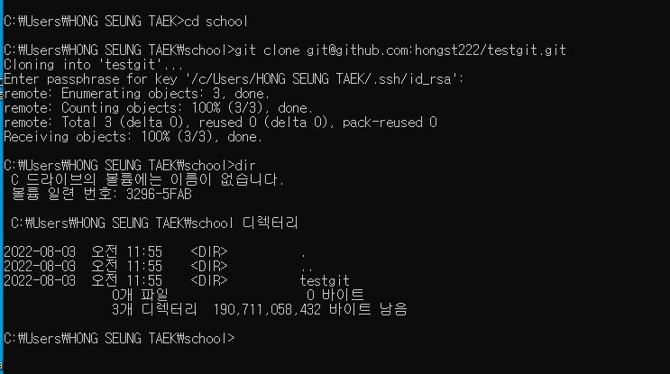
------------------------------------------------
### 3. clone받은 프로젝트 내에서 임의의 파일 3개 생성 후 push
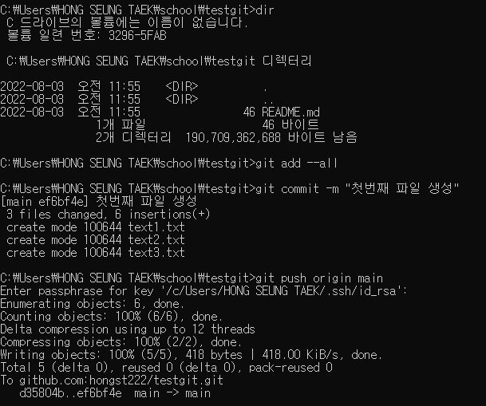
* #### github project repository에 반영된 모습
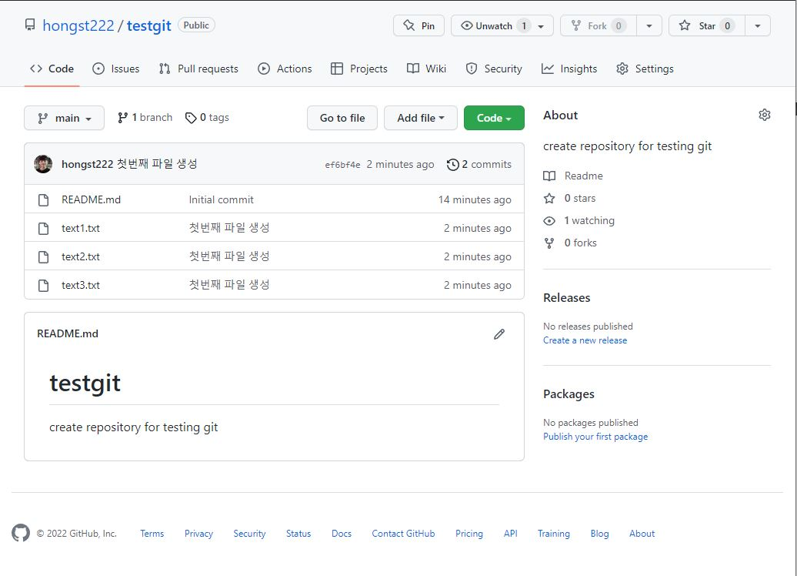
----------------------------------------------
### 4. 사용자 홈 폴더 안에 home 폴더 생성 후 새롭게 clone 받기
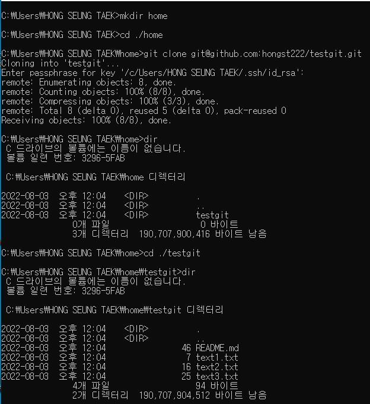
-----------------------------------------------------
### 5. home안에 받은 내용에 하나의 파일은 수정, 하나의 파일은 삭제, 하나의 새로운 파일 추가 --> push
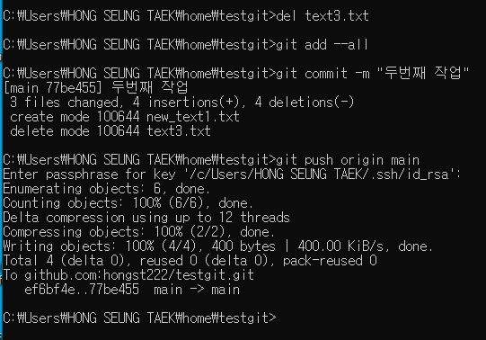

* #### github project repository에 반영된 모습
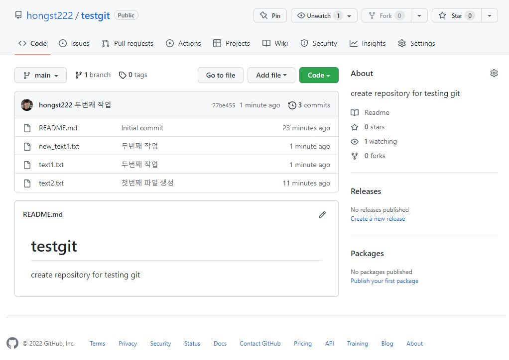
-----------------------------------------------------
### 6. school 안에서 pull 받은 후 변경 내용이 반영 되었는지 확인
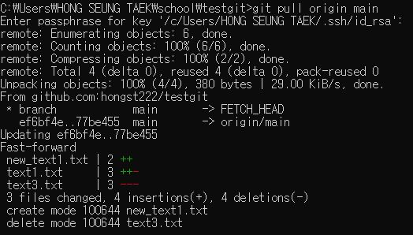
* #### github에서 pull 받은 내용이 반영된 모습

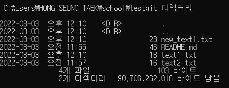
-----------------------------------------------------
### 7. school안에 받은 내용에 하나의 파일은 수정, 하나의 파일은 삭제, 새로운 파일 하나 추가 --> push
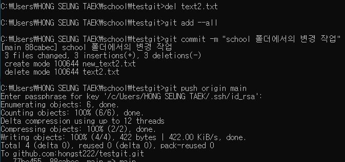
-----------------------------------------------------
### 8. home 안에서 pull 받은 후 변경 내용이 반영 되었는지 
* #### school 폴더 파일 목록
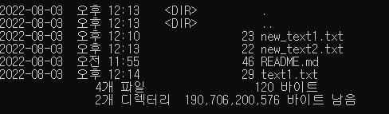
* #### github에서 pull 받은 목록이 반영된 모습
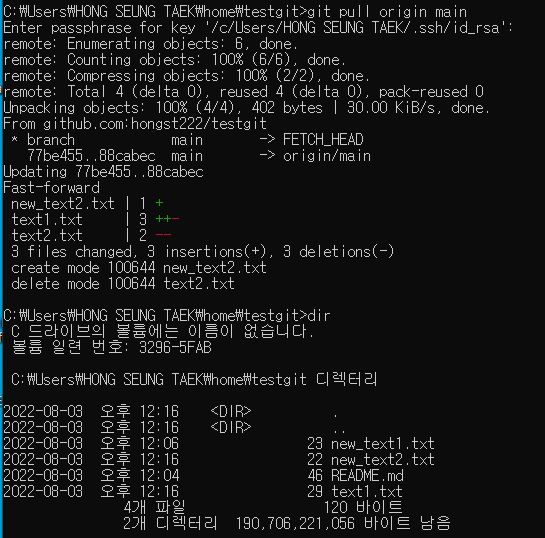
> **school/testgit의 파일목록과 home/testgit의 파일목록이 일치함으로 제대로 반영되었음을 알 수 있다.**
-----------------------------------------------------

