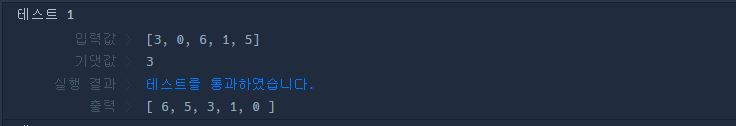

# 22.10.24 스터디

## 멀리 뛰기

**피보나치수열**

* f(n)/f(n-2) = 2.xxx...
* f(n)%f(n-2) = f(n-3)
* f(n) + f(n-1) = f(1) + f(2) + ... + f(n-1) +2 
* f(n) = f(1)+f(2)+...f(n-2)+2


값
```
f(1) = 1
f(2) = 2
f(3) = 3
f(4) = 5
f(5) = 8
f(6) = 13
f(7) = 21
```
```
21/8 = 2 ... 5
21%8 = 5
21 = (1+2+3+5+8)+2

그러므로 피보나치 수열
```

```js
function solution(n) {
    //return n <3 ? n: (solution(n-1) + solution(n-2))%1234567; --> 재귀함수 식으로 풀면 시간초과. 그러므로 피보나치 수열을 풀어서 씀.
    let when2 = 2;
    let when1 = 3;
    let answer; 
    
    if(n <=3) {
        answer = n;
    } else {
        for(let i =4; i<= n; i++){
            answer = (when2+when1)%1234567;
            when2 = when1;
            when1 = answer;
        }
        
    }
    return answer;    
}
```

## H-index

**H-index 구하는 방법**
```
    전체 논문을 피인용 수가 많은 순으로 정렬한 후
    논문의 순번(index)와 피인용 횟수를 비교하여 피인용 횟수가 논문의 순번보다
    작아지기 시작하는 직전의 순번이 h-index가 된다.
```

```js
function solution(citations) {
    //  피인용 수가 많은 순으로 정렬
    citations.sort((a,b) => b-a);
    console.log(citations);
    
    //  h-index 변수
    let answer = 0;
    
    let i = 0;
    //  순번(i)가 해당 순번 논문의 피인용 횟수보다 작지 않을때 까지만 반복.
    while(i < citations[i]){
        answer++;
        i++
    }
    return answer;
    
}
```


## 가장 큰 수

### 문제 파악

배열안의 숫자들을 가지고 조합하였을때 가장 큰 수를 만들 수 있도록 순서대로 정렬하기.
숫자들을 문자열로 만든 후 더해준 값을 비교하여 정렬

ex) [6,3,2,12,14]

6  3 비교 36 - 63 ==> 음수이므로 위치가 바꾸지 않음

3  2 비교 23 - 32 ==> 음수이므로 위치가 바꾸지 않음

2  12 비교 122 - 212 ==> 음수이므로 위치가 바꾸지 않음

12 14 비교 1412 - 1214 ==> 양수이므로 위치가 바뀜 [12,14] --> [14,12]

ex) [12,3,6,14,2]

### 0, 1 ~ 4
[0] [1] 12 3 --> **[3]** **[12]** 6 14 2

[0] [2] 3 6 --> **[6]** 12 **[3]** 14 2

[0] [3] 6 14 --> **[6]** 12 3 **[14]** 2

[0] [4] 6 2 --> **[6]** 12 3 14 **[2]**

### 1, 2 ~ 4
[1] [2] 12 3 --> 6 **[3]** **[12]** 14 2

[1] [3] 3 14 --> 6 **[3]** 12 **[14]** 2

[1] [4] 3 2 --> 6 **[3]** 12 14 **[2]**

### 2, 3 ~ 4
[2] [3] 12 14 --> 6 3 **[14]** **[12]** 2

[2] [4] 14 2 --> 6 3 **[2]** 12 **[14]**

### 3, 4
[3] [4] 12 14 --> 6 3 2 **[14]** **[12]**


0만 있을 경우 이어붙이더라도 0이 최대기 때문에 예외 처리도 해주어야함.

ex) [0,0,0,0,0]

```
'0'+'0'+ ... '0' = '00000'

==> 0
```

```js
function solution(numbers) {
    let nums =numbers.map(v => v+"");
    nums.sort((a,b) => parseInt(b+a) - parseInt(a+b));
    const answer = nums.join('');
    
    return answer[0] == '0' ? '0' : answer;
}
```