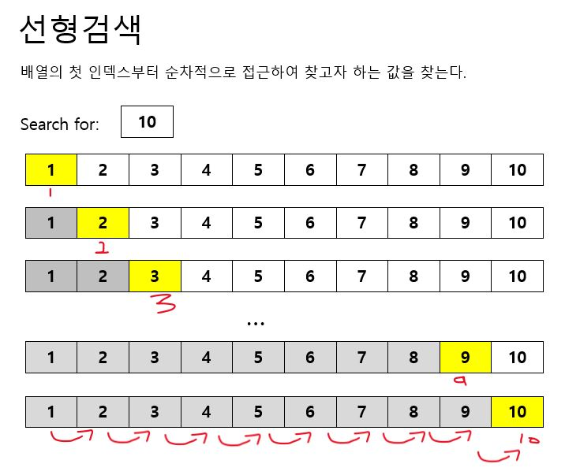
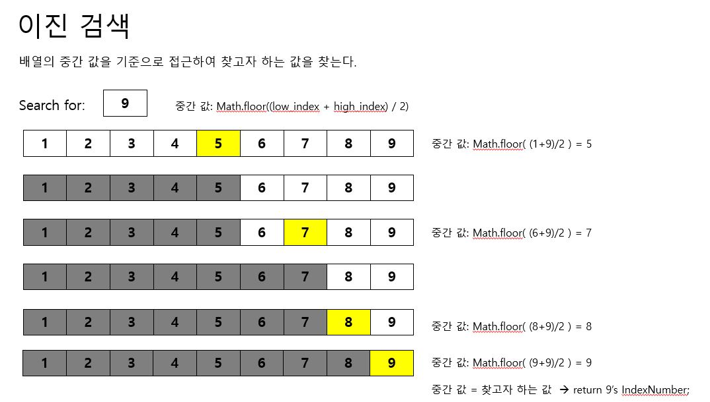

# 검색과 정렬

## 검색
자료 구조 내에 특정 항목을 찾는 일

* 선형 검색
  
  배열의 각 항목을 한 인덱스씩 순차적으로 접근하여 동작
  ```
  const arr = [1,2,3,4,5,6,7,8,9,10];
  ```
  
  

  **시간복잡도: O(n)**

* 이진 검색
  
  배열이 정렬 되어 있어야 사용 가능
  
  1) 중간 값을 확인해 원하는 값보다 중간 값이 큰지 작은지 확인
  
  2) 원하는 값이 중간 값 보다 작은 경우 작은 쪽을 검색
  
  3) 원하는 값이 중간 값 보다 큰 경우 큰 쪽을 검색
  
  ```
  const arr = [1,2,3,4,5,6,7,8,9];
  ```
  

