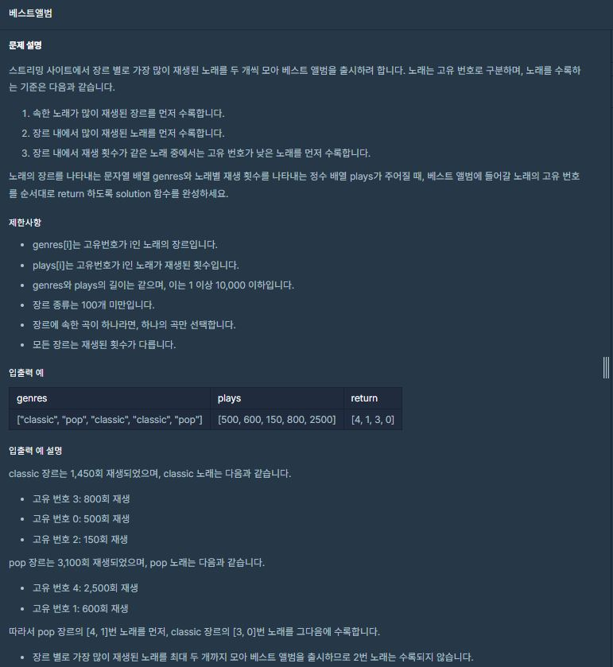

# 홍승택 베스트 앨범 풀이
> 소요시간 1시간 40분

> 정확도 (100/100)
### 문제 

#### 입력값
```js
genres = ["classic", "pop", "classic", "classic", "pop"]
plays  =[500, 600, 150, 800, 2500]
```  
#### 장르 재생 횟수 총합 구하기
```js
    let totalPlay = new Map();

    
    genres.forEach((e,i) => {
        totalPlay.set(genres[i], (totalPlay.get(genres[i])|0) + plays[i]);
    }); 

    // totalPlay를 아래와 같이 만들어준다.

    //  Map {
    //       장르1(key) => 총 재생 횟수(value) 
    //       장르2(key) => 총 재생 횟수(value) 
    //                    ...
    //  } 

    //totalPlay.set(장르, (totalPlay의 value를 받아오거나 0)에다가 'play[i]'(재생횟수)를 더해준다.)

    //결국 forEach문을 통해 genres 배열을 탐색하면서 각 장르의 재생 횟수들을 모두더해줌.

    // 장르 별 총 재생 횟수 출력
    console.log(totalPlay);
```
#### 출력 결과
```
    Map(2) { 'classic' => 1450, 'pop' => 3100 }
```

  


### 장르 배열 생성 및 제이슨 생성
```js
    let total = Array.from(totalPlay.keys());                           // totalPlay는 총 재생 횟수를 갖는 map이기 때문에 중복 값이 없으므로 
                                                                        // totalPlay의 key(장르)들을 가져와서 배열로 생성한다.
    
    let js = {};                                                        // 제이슨 형태로 해당 장르에서 첫번째로 가장 많이 들은 곡과
                                                                        // 두번째로 가장 많이 들은 곡을 추출하기 위해 빈 제이슨 생성
    
    total.forEach((e,i) => {                                            // 장르를 가지고 있는 total 배열을 탐색하며 
        js[e] = {                                                       // js[장르] = {first: [0,0], second[0,0]} 형태로 장르별 JSON 생성
            first: [0,0],                                               // 여기서 배열 [0,0]은 각각 [plays에서의 인덱스, 플레이 횟수]
            second: [0,0]
        };
    });
    // 1,2번째 횟수들 생성
    genres.forEach((e,i) => {                                           // 각 장르의 각 곡마다의 인덱스 번호와 재생횟수를 가져오기 위해
       if(js[e]["first"][1] < plays[i]){                                // genres 배열을 탐색한다.
           let tmp =js[e]["first"]                                      // js[장르][first] = [인덱스,플레이 횟수]
                                                                        // if(js[장르][first]의 재생횟수가 현재 인덱스의 재생 횟수보다 작다면)
           js[e]["first"] = [i,plays[i]];                               // js[장르][first]항목의 값을 현재 인덱스 및 플레이 횟수로 바꿔준다.
           js[e]["second"] = tmp;                                       // 그리고 현재 first항목의 값들을 second에 넣어준다 (원래는 제일 컸었으니까)
       } else if (js[e]["second"][1] <plays[i]){                        // first보다 작지만 second보다 큰 경우 현재 값들을 second에 넣어준다.
           js[e]["second"] = [i,plays[i]];
       }  
    });
    console.log(js);
```
#### 입력값
```js
genres = ["classic", "pop", "classic", "classic", "pop"]
plays  =[500, 600, 150, 800, 2500]
```
#### JSON 형태
```
total.forEach를 통해 만들어지는 JSON 형태 
{
  classic: { first: [ 0, 0 ], second: [ 0, 0 ] },
  pop: { first: [ 0, 0 ], second: [ 0, 0 ] }
}

genres.forEach를 통해 만들어지는 JSON 형태
{
  classic: { first: [ 3, 800 ], second: [ 0, 500 ] },
  pop: { first: [ 4, 2500 ], second: [ 1, 600 ] }
}
```

#### 장르 별 총 재생 횟수 내림차순 정렬

```js  
    // 장르 별 총 재생 횟수 내림차순
    total.sort((a, b) => totalPlay.get(b)-totalPlay.get(a));
    let answer = [];
    total.forEach((e,i) => {
        answer.push(js[e]["first"][0]);                         // 한 곡이라도 있을 경우에만 total에 들어가므로 first는 조건 없이 push
        if(js[e]["second"][1]){                                 // js[e]["second"][1] (그 장르의 두번째로 많이 재생한 횟수)가 0 이면
            answer.push(js[e]["second"][0]);                    // 그 장르의 음악은 한 가지 이므로 push하지 않음
        } 
    });
    
    return answer;

```
#### 내림차순 결과
```
재생 횟수 내림 차순
[ 'pop', 'classic' ]
```

##### 최종 return
```
[4, 1, 3, 0]
```