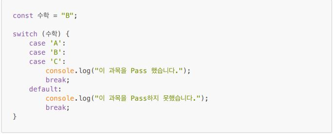
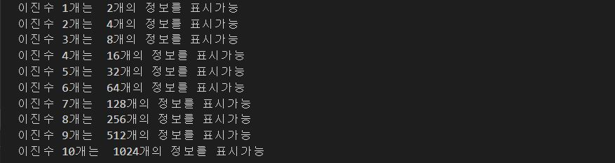
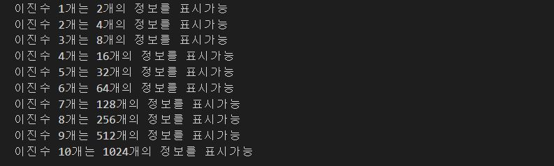

홍승택 프로그램 흐름제어 연습과제
=================================
> 작성일자: 2022.08.05
> 작성자: 홍승택

### 문제1.
>아래의 switch문을 if문으로 재작성 하시오


```
const 수학 = "B";

if(수학 == "A" || 수학 == "B" || 수학 == "C"){
    console.log("이 과목을 Pass 했습니다.");
} else {
    console.log("이 과목을 Pass하지 못했습니다.");
}

```
#### 실행결과


### 문제2.
> 한 개의 2진수는 0과 1 두개의 정보를 표시할 수 있고 두개의 이진수는 00, 01, 10, 11과 같이 총 네 개의 정보를 표시할 수 있다. 이처럼 이진수가 하나 늘어날때 마다 2배씩 표현할 수 있는 정보의 수가 늘어날 때 10개의 이진수는 총 몇개의 정보를 표현할 수 있는지를 while문으로 구현하시오.

```
let binary = 1;
cnt = 1;
while (binary <= 10) {
    cnt *= 2;
    console.log(`이진수 ${binary}개는  ${cnt}개의 정보를 표시가능`);
    binary++;
}

```
#### 실행결과



### 문제3.
> 한 개의 2진수는 0과 1 두개의 정보를 표시할 수 있고 두개의 이진수는 00, 01, 10, 11과 같이 총 네 개의 정보를 표시할 수 있다. 이처럼 이진수가 하나 늘어날때 마다 2배씩 표현할 수 있는 정보의 수가 늘어날 때 10개의 이진수는 총 몇개의 정보를 표현할 수 있는지를 if문으로 구현하시오.

```
cnt = 1;
for (let binary = 1; binary <= 10; binary++){
    cnt *= 2;
    console.log(`이진수 ${binary}개는 ${cnt}개의 정보를 표시가능`);
}

```
#### 실행결과

