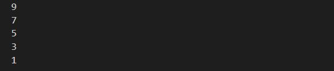
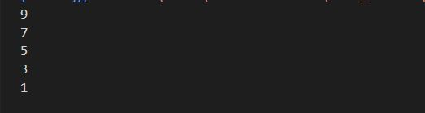
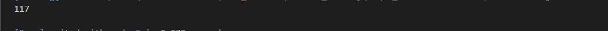
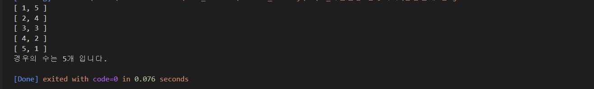
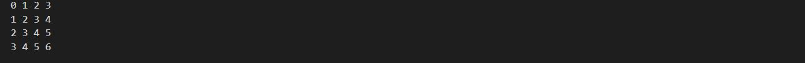
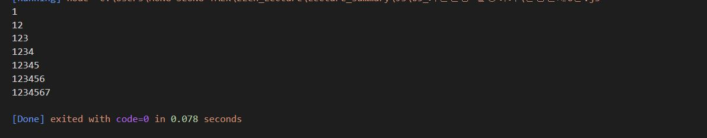
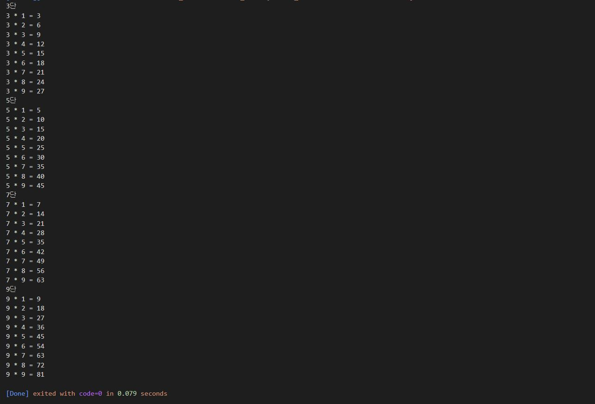

# 홍승택 기본문법 활용하기 연습문제
> 작성일자: 2022.08.22 
> 
> 작성자: 홍승택


### 문제1.
``` javascript

    for(let i = 9; i>=0; i--){
    if(i % 2 !=0){
        console.log(i);
    }
}
```
#### 실행결과



### 문제2.
``` javascript

    let i =9;
    while(i>=0){
        if(i % 2 !=0){
            console.log(i);
        }
        i--;
    }
```
#### 실행결과



### 문제3.
``` javascript
// 1부터 20미만의 정수 중에서 2 또는 3의 배수인 수의 총합을 구하시오.

let sum = 0;
for(let i = 1; i < 20; i++){
    if (i % 2 ==0 || i % 3 ==0){
        sum += i;
    }
}
console.log(sum);
```

#### 실행결과



### 문제4.
``` javascript
// 두 개의 주사위를 던졌을때 눈의 합이 6이 되는 모든 경우의 수를 출력하고 경우의 수는 총 몇가지 인지를 아래와 같이 출력하는 코드를 작성하시오.
let cnt = 0;
for (let i = 1; i<=6; i++){

    for (let j = 1; j<=6; j++){
        if(i+j == 6){
            console.log(`[ ${i}, ${j} ]`);
            cnt++;
        }
    }
}
console.log(`경우의 수는 ${cnt}개 입니다.`);
```
#### 실행결과



### 문제5.
``` javascript
//  for문을 중첩하여 실행하여 아래와 같은 출력 결과를 만드시오.

for(let i = 0; i <= 3; i++){
    let str = "";
    for(let j = 0; j <= 3; j++){
        str += (i+j);
        if(j<3){
            str +=" ";
        }
    }
    console.log(str);
}
```
#### 실행결과


### 문제6.
``` javascript
//아래와 같은 출력결과가 나타나도록 중첩반복문을 for문 형식으로 구현하시오.

for (let i = 1; i <=7; i++){
    let str ="";
    for(let j =1; j<=i; j++){
        str += j;
    }
    console.log(str);
}
```
#### 실행결과


### 문제7.
``` javascript
// 문제
/**number라는 변수를 정의하고 1 혹은 2의 값을 임의로 할당하시오. 이 변수에는 1이나 2밖에 저장될 수 없습니다.
 * 구구단 프로그램을 만들고자 한다.
 * 전체를 출력하는 구구단이 아니라 nubmer가 1일 대는 홀수 단(3,5,7,9), number가 2일 때는 입력하면 짝수 단(2,4,6,8)을 출력하는 프로그램을 완성하시오. */

let number = 1;

switch (number){
    case 1:
        for(let i = 3; i<=9; i+=2){
            console.group(`${i}단`);
            for(let j = 1; j<=9; j++){
                console.log(`${i} * ${j} = ${i*j}`);
            }
            console.groupEnd();
        }        
        break;
    case 2:
        for(let i = 2; i<=9; i+=2){
            console.group(`${i}단`);
            for(let j = 1; j<=9; j++){
            console.log(`${i} * ${j} = ${i*j}`);
            }
            console.groupEnd();
        }
        break;
    default:
        console.log("잘못된 number 값 입력");
        break;
}
```
#### 실행결과

