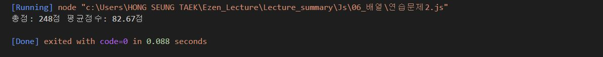
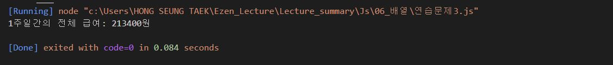
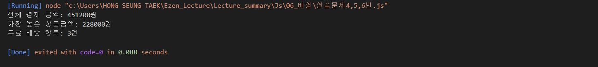
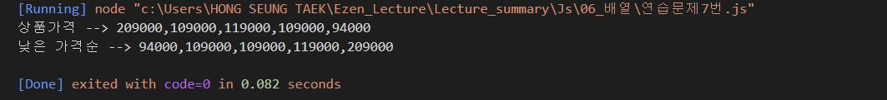
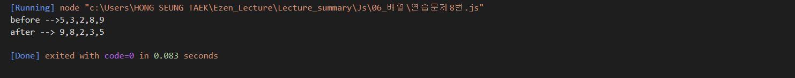
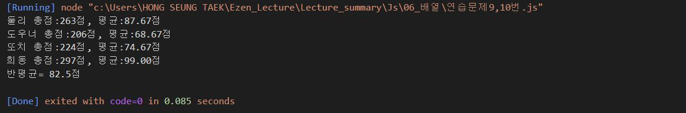
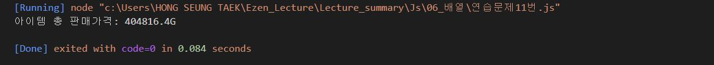
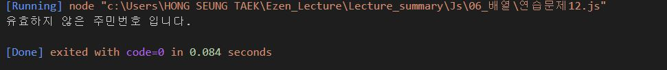

# 배열연습문제 과제
> 작성일자: 2022.08.24

> 작성자: 홍승택
--------------------
### 연습문제 1번

``` javascript
/** 연습문제1
 *  다음의 소스코드는 **bloolean 데이터**를 저장하고 있는 배열에 대한 어떤 처리를 보여준다.
 *  실행 결과에서 제시하는 것과 같이 배열에 저장되어 있는 값들을 반전(true는 false로 false는 true로) 변환하는 처리를 완성하시오.
 */

let check_list = [true, false, false, true, false];
console.log("before --> " + check_list);

// function reverse(inputArr){
//     let newArr = new Array(inputArr.length);
//     for (let i = 0; i< inputArr.length; i++){
//         newArr[i] = !check_list[i];
//     }
//     return newArr;
// }
// console.log("after --> " + reverse(check_list));

for (let i = 0; i < check_list.length; i++){
        check_list[i] = !check_list[i];
}

console.log("after --> " + check_list);
```
**실행결과**


### 연습문제 2번

``` javascript

let grade = [75, 82, 91];
let sum = 0, avg = 0;

for(let i = 0; i<grade.length; i++){
    sum += grade[i];
}
avg = (sum/grade.length).toFixed(2);
console.log(`총점: ${sum}점 평균점수: ${avg}점`);


```
**실행결과**



### 연습문제 3번

``` javascript
// 주말 7시간, 평일에는 5시간 일하기로 했지만 금요일에 다른 직원의 사정으로 대신 근무해서 10시간 일함.
// 시급이 4500이지만 목요일부터 5200으로 오름
// 총급여 계산.

// 일7 월5 화5 수5 목5 금10 토7
let time = [7, 5, 5, 5, 5, 10, 7];
let money = 0;

// 시급이 오른건 time[4]부터.

for (let i = 0; i< time.length; i++){
    money += time[i]* ((i < 4) ? 4500 : 5200);
}

console.log("1주일간의 전체 급여: " + money + "원");

```
**실행결과**



### 연습문제 4, 5, 6번

``` javascript
/** 연습문제 4번 */
//  상품의 가격을 원소로 갖는 1차 배열 price와 각 상품의 수량을 원소로 갖는
//  1차 배열 qty를 다음과 같이 정의하였을대 이 사람이 총 얼마를 결제해야 하는지 총 결제 금액을 구하는 프로그램을 작성하시오.

/** 연습문제 5번*/
// 위 장바구니 내역에서 상품 금액이 가장 비싼 항목은 얼마인지 출력하시오.

/** 연습문제 6번 */
//  문제 4번의 장바구니 내역에서는 모든 장바구니 상품이 개별 배송이라고 한다.
//  상품금액(판매가*수량)이 8만원 이상인 경우 무료로 배송이 된다고 할 때 무료로 배송되는 항목은 모두 몇개인지 구하는 프로그램을 구현하시오.

//  물품 가격
let price = [38000, 20000, 17900, 17900];
//  수량
let qty = [6, 4, 3, 5];

//  합계 가격
let money = 0;

//  가장 높은 상품 금액
let high = 0;

//  무료 배송 항목 개수
let count = 0;

for (let i = 0; i<price.length; i++){
    // 4번 합계 가격 구하기
    money += price[i] * qty[i];
    // 5,6번에서의 상품금액
    let priceValue = price[i] * qty[i];
    // 5번 가장 높은 상품 금액 구하기
    if (high < priceValue) high = priceValue; 
    // 6번 무료 배송 항목 개수 구하기
    if (priceValue>= 80000) count++;
}
// 4번 출력
console.log("전체 결제 금액: " + money + "원");
// 5번 출력
console.log(`가장 높은 상품금액: ${high}원`);
// 6번 출력
console.log(`무료 배송 항목: ${count}건`);

```
**실행결과**



### 연습문제 7번

``` javascript
/** 쇼핑몰 상품 목록에서 상품의 가격을 원소로 하는 배열 money를 정의하였을 때
    "낮은 가격순" 버튼이 눌러졌을 때 상품의 가격을 재정렬하기 위한코드에 대한 일부이다. 빈 칸을 채워 넣어 완성하시오.
*/

//  쇼핑몰 상품 목록의 가격들
let price = [209000, 109000, 119000, 109000, 94000];
console.log("상품가격 --> " + price);

//  낮은 가격순서로 뽑아내기

for (let i = 0; i< price.length-1; i++){
    for (let j=i+1; j<price.length; j++){
        if (price[i]>price[j]){
            let tmp = price[i];
            price[i] = price[j];
            price[j] = tmp;
        }
    }
}

console.log("낮은 가격순 --> " + price);


```
**실행결과**



### 연습문제 8번
``` javascript
//  배열의 원소를 반대로 배치하는 소스코드를 완성하시오.

let arr = [5, 3, 2, 8, 9];
console.log("before -->" + arr);

for (let i =0; i< parseInt(arr.length/2); i++){
    let tmp = arr[i];
    arr[i] =arr[arr.length-1-i]
    arr[arr.length-1-i]= tmp;
}
console.log("after --> " + arr);
```
**실행결과**



### 연습문제 9, 10번
``` javascript
/** 연습문제 9번 */

/** 과목명  HTML    css     javascript
 *  둘리    78      89          96
 *  도우너  62      77          67
 *  또치    54      90          80
 *  희동    100     99          98
 */

//  학생별 총점과 평균점수를 구하기 위한 소스코드를 작성하시오.
//  단, 평균점수의 경우 toFixed()함수를 사용하여 소수점 둘째 자리 까지만 출력하시오.

/** 연습문제 10번 */
//  연습문제 9번에서 반 평균을 출력하시오. 반 평균은 학생의 평균 점수 총 합/학생수로 구합니다.
// toFixed() 함수로 가공된 값은 문자열 형태이기 때문에 숫자 연산이 불가능합니다.


/** 학생 이름 배열 */
let student = ["둘리", "도우너", "또치", "희동"];

/** 성적표 배열 */
let grade = [
    [78, 89, 96],
    [62, 77, 67],
    [54, 90, 80],
    [100, 99, 98]
];


/** 총점과 평균 구하기 */

// 반평균의 평균을 구하기 위한 반평균의 평균값, 반평균 총합값
let allAvg = 0, avgSum = 0;
for (let i =0; i<grade.length; i++){
    //  총점과 평균점수를 저장할 변수
    let sum = 0, avg = 0;
    for (let j=0; j<grade[i].length; j++){
        sum += grade[i][j];
    }
    avg = (sum / grade[i].length);

    //학생별 평균점수 합계 내기
    avgSum +=avg;
    avg = avg.toFixed(2);
    console.log(`${student[i]} 총점:${sum}점, 평균:${avg}점`);
}
//반평균 구하기
allAvg = avgSum/student.length;
console.log(`반평균= ${allAvg}점`);
```
**실행결과**



### 연습문제 11번
``` javascript
/** 연습문제 11번 */
//  어느 게임 유저의 인벤토리.
//  첫 줄에 있는 아이템을 판매한다고 할 때, 이 유저가 벌어들이는 골드(G)의 총액은 얼마인가?
//  (판매를 위해 선택한 아이템의 상단에는 1개당 가격이 표시되고, 아이템을 판매할 때는 원래 가격의 90%만 받을 수 있다고 한다.)
//  가격과 아이템 수량의 정보를 2차 배열로 구성하는 소스코드를 완성하세요.
//  "단가-수량"을 한세트로 하는 정보들을 배열로 구성하면 2차 배열의 형태가 됩니다.

//  아이템 판매시 얻게될 골드량 선언
let gold = 0;

let inventory = [];
inventory = [
    [500, 291],
    [320, 586],
    [100, 460],
    [120, 558],
    [92, 18],
    [30, 72]
];

for( let i=0; i<inventory.length; i++){
    gold += (inventory[i][0]*0.9) * inventory[i][1];
}
console.log(`아이템 총 판매가격: ${gold}G`);
```
**실행결과**



### 연습문제 12번
``` javascript
/** 연습문제 12번 */
//  자신의 주민번호 한 글자씩 모든 숫자를 원소로 갖는 배열 ssn을 아래와 같이 정의하시오

//ssn = [0, 1, 1, 2, 1, 3, 1, 0, 0, 0, 1, 2, 3];

//  정의된 배열을 활용하여 유효한 주민등록번호인지 아닌지를 판별하는 코드를 구현하자.
//  판별방법은 다음과 같다.
/*  
    기본 주민등록코드에는 각 숫자에 대응하는 가중치가 잇다. 가중치는 주민등록번호의 순서에 따라 2 3 4 5 6 7 8 9 2 3 4 5 이다.

    먼저 마지막 숫자는 제외하고, 기본코드의 각 12자리와 가중치를 모두 곱하여 합한다.

    합한 값을 11로 나눈 나머지 값을 구한다.

    11에서 그 나머지 값을 뺀 후, 이를 10을 나눈 나머지를 구한다.
    나머지의 1의 자리 값과 주민등록번호 마지막 자리 값이 맞아야 유효한 주민등록 번호이다.

*/

//  위의 배열에 저장된 주민번호는 가상의 주민번호이므로 프로그램 실행시 유요하지 않은 주민 번호로 판별될 것이다.

//  주어진 주민번호
ssn = [0, 1, 1, 2, 1, 3, 1, 0, 0, 0, 1, 2, 3];
//  가중치
weight = [2, 3, 4, 5, 6, 7, 8, 9, 2, 3, 4, 5];

/**   가중치 검사 */
//  가중치 검사시 사용할 합계
let weightSum =0;
for (let i = 0; i< ssn.length-1; i++){
    
    weightSum += ssn[i] * weight[i];

}

let result = (11- weightSum%11) %10;

// 주민번호 유효성 검사
let str ="";
str = result== ssn[ssn.length-1]? "유효한" : "유효하지 않은";
console.log(`${str} 주민번호 입니다.`);
```
**실행결과**



