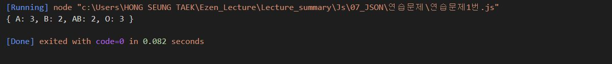

## 홍승택 JSON 연습문제
> 작성일자: 2022.08.25

> 작성자: 홍승택


-------

### 문제1.
```javascript

//  문제1.
//  다음은 10명의 학생들에 대한 혈액형 데이터이다.
//  A, A, A, O, B, B, O, AB, AB, O
//  아래와 같은 JSON을 정의하고, 각 혈액형별 학생수를 아래의 JSON의 각 key에 대한 value에 저장하시오. (혈액형별 학생 수를 for문을 활용하여 산출해야 합니다.)
const result = {"A" : 0, "B": 0, "AB": 0, "O": 0};
let bloodArr = ['A', 'A', 'A', 'O', 'B', 'B', 'O', 'AB', 'AB', 'O'];
for (const k of bloodArr) result[k]++;
console.log(result);

```


### 문제2.
```javascript

/** 문제2번 */
//  다음의 JSON은 어느 학급의 중간고사 성적을 나타낸다.
const exam = {
    "철수": [89, 82, 79, 91],
    "민영": [91, 95, 94, 89],
    "남철": [65, 57, 71, 64],
    "혜진": [82, 76, 81, 83]
};

//  문제 2-1
//  위 데이터에서 학생별 총점과 평균을 구하시오

//  문제 2-2
//  위 문제의 점수가 순서대로 국어, 영어, 수학, 과학일 경우 수학에 대한 모든 학생의 총점과 평균을 구하시오.
//let course = [ '국어', '영어', '수학', '과학'];

const keys = Object.getOwnPropertyNames(exam);
//console.log(keys);

let mSum = 0, mAvg =0;

for (const k of keys){
    let sum = 0, avg = 0;

    for(let i = 0; i<exam[k].length; i++){
        sum += exam[k][i];
    }
    avg = sum/exam[k].length;
    console.log("%s의 총점: %d 평균: %d",k,sum,avg);
    
    mSum += exam[k][2]; 
}

mAvg = mSum/keys.length;
console.log("모든 학생의 수학 총점은 %d , 평균은 %d", mSum, mAvg);


```


### 문제3.
```javascript
/** 연습문제 3번 */

const covid19 = [
    {date: '0125', active: 426},
    {date: '0126', active: 343},
    {date: '0127', active: 547},
    {date: '0128', active: 490},
    {date: '0129', active: 460},
    {date: '0130', active: 443},
    {date: '0131', active: 338},
    {date: '0201', active: 299}
];
//  3-1
//  1월 25일부터 2월 1일까지의 누적 확진자 수와 일 평균 확진자 수를 구하시오.
let sum = 0;

for (const k of covid19){
    sum += k.active;
}

let avg = sum/covid19.length;
console.log("누적 확진자 수 : %d", sum);
console.log("평균 확진자 수 : %d", avg);

//  3-2
//  1월 25일부터 2월 1일까지 중에서 확진자가 가장 많이 나타난 날짜는 언제인가?

let max = 0;
let maxDate = "";
for (const k of covid19){
    if( max < k.active){
        max = k.active;
        maxDate = k.date;
    }
}
console.log("확진자가 가장 많이 나타난 날: %s", maxDate);

```
