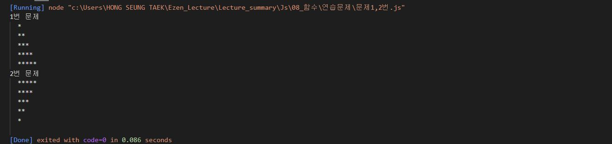
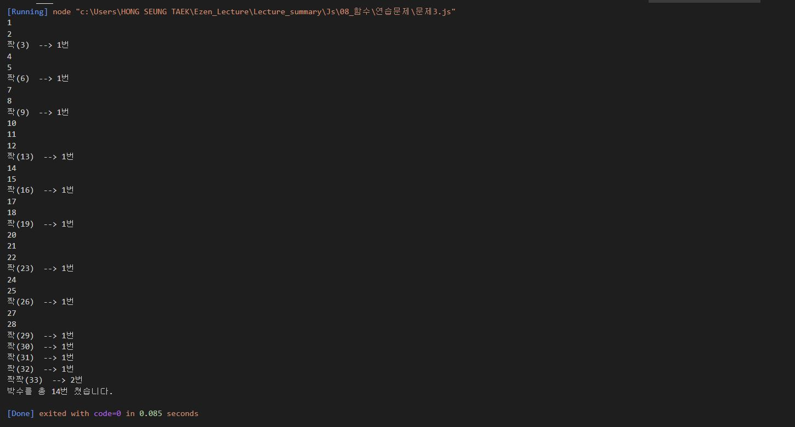
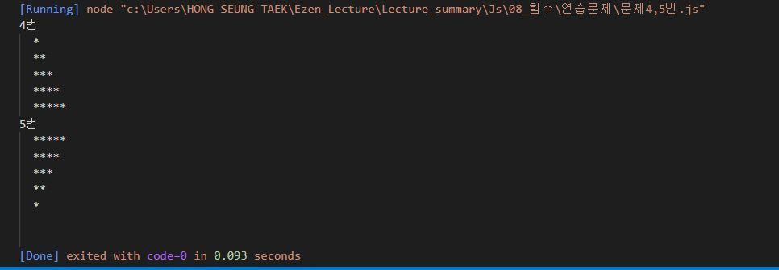

# 홍승택 함수 연습과제

> 작성일자: 2022.08.26

> 작성자: 홍승택

-------

### 문제1, 2

``` javascript
/** 문제1 */

//  max 는 출력해야 할 최대 라인 수
function printStar(max) {
    
    for (let i = 0; i < max; i++){
        let str = "";
        for(let j = 0; j<=i; j++){
            str +="*"
        }
        console.log(str);
    }
    
};
console.group("1번 문제");
printStar(5);
console.groupEnd();

/** 문제2 */
//  별을 거꾸로 찍는 함수 생성 printRevStar(max);

function printRevStar(max) {
    for(let i = 0; i<max; i++){
        let str = "";
        for(let j=max-i; j>0; j--){
            str += "*";
        }
        console.log(str);
    }
}
console.group("2번 문제");
printRevStar(5);
console.groupEnd();
```




### 문제3

``` javascript
//  문제3
//  369게임은 숫자를 순서대로 말하면서 3,6,9가 포함된 횟수만큼 박수를 치는 게임이다.
//  1부터 파라미터로 전달된 숫자까지 반복하면서 박수를 칠 조건이 충족되면 3,6,9 게임 규칙에 따라
//  박수를 의미하는 "짝"을 출력하고 그렇지 않은 경우에는 숫자를 출력하고, 박수를 총 몇번 쳤는지 리턴하는 함수
//  myGame(n)을 작성하시오.
//  힌트) 문자열은 그 자체가 배열로 인식된다.

function myGame(n){
    
    
    
    //  조건은 3 6 9가 포함이니까 3 6 9가 있는지 여부 확인이 필요하다
    //  35를 넣었을때 1~35까지 반복할 것이기 때문에 반복문이 필요함.

    // 총 짝 횟수
    let countSum =0;
    for(let i = 1; i<=n; i++){
        
        //  출력할 문자열 생성 
        let str = ""+i;
        let b = "";
        let c = "";
        // 해당 숫자 짝 횟수
        let count = 0;

        for(let j = 0 ; j<str.length; j++){
            if(str[j] === "3"|| str[j] === "6" || str[j] === "9") {
                count++;
                b +="짝";
            }


            if (count != 0 && j+1 == str.length){
                b += "(";
                c +=`)  --> ${count}번`;
            }
            
        }
        countSum += count;
        console.log(b+str+c);
    }
    console.log(`박수를 총 ${countSum}번 쳤습니다.`);
};

myGame(33);


```




### 문제4,5

``` javascript
// max는 최대 행 수, current는 현재 출력중인 행의 위치

function printStar(max, current = 1){
    if(current >max){
        return;
    } else {
        let str = "";
        for(let i = 0; i< current; i++){
            str += "*"
        }
        console.log(str);
        printStar(max, current+1);
    }

};

console.group("4번")
printStar(5);
console.groupEnd();

//  문제 5
function printRevStar(max, current = 1){
    if( max < current){
        return;
    } else {
        let str = "";
        for(let i = max; i >=current; i--){
            str += "*"
        }
        console.log(str);
        printRevStar(max, current+1);
    }
};
console.group("5번")
printRevStar(5);
console.groupEnd();


```

