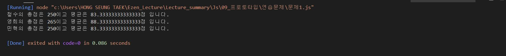
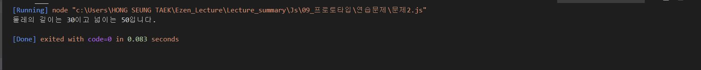
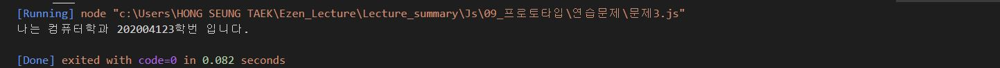
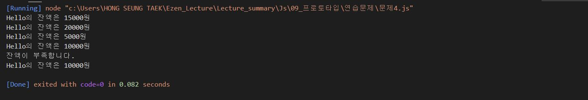

# 홍승택 프로토타입 연습과제

> 작성일자: 2022.08.29

> 작성자: 홍승택

----

### 문제 1.
```javascript

/** 문제1 */
//  국어, 영어, 수학 점수를 생성자 파라미터로 입력받아서 합계와 평균을 구하는 클래스 Student를 작성하시오.
//  이 때, Student 클래스는 합계를 리턴하는 메서드인 sum()과 평균을 리턴하는 avg()를 제공한다.
//  작성된 클래스를 활용하여 아래 표에 대한 학생별 합계 점수와 평균 점수를 출력하시오.

//  클래스는 JSON형식으로 작성되어야 한다.

const classroom = {
    "철수": [92, 81, 77],
    "영희": [72, 95, 98],
    "민혁": [80, 86, 84]
};


//  생성자 
//  여기서 k는 배열
function Student(k) {
    this._studentName = null;
    this._korean = k[0];
    this._english = k[1];
    this._math = k[2];
}
Student.prototype = {
    //  학생이름을 받기위한 getter, setter    
    get studentName() {
        return this._studentName;
    },
    set studentName(pr) {
        this._studentName = pr;
    },
    
    sum : function() {
        return this._korean + this._english + this._math;
    },

    avg : function() {
        return this.sum()/3;
    },

    print : function() {
        console.log("%s의 총점은 %d이고 평균은 %d점 입니다.",this.studentName,this.sum(),this.avg());
    }
};
//  JSON 데이터의 key값들에 대한 배열 생성
const cs = Object.getOwnPropertyNames(classroom);
//  배열을 생성한 후 배열에 객체 넣어주기
const d = new Array(cs.length);
for (let i = 0 ; i < cs.length; i++){
    d[i]= new Student(classroom[cs[i]]);
    d[i].studentName = cs[i];
    d[i].print();
}


```
**실행결과**


### 문제 2.
```javascript
/** 문제 2 */
//  가로(width), 세로(height) 정보를 getter, setter로 관리하는 Rectangle 클래스를 정의하시오.
//  이 클래스는 생성자의 파라미터가 없으며 
//  둘레의 길이를 구해 리턴하는 getAround()메서드와 넓이를 구해 리턴하는 getArea()메서드를 제공합니다.

//  클래스는 JSON형식으로 작성되어야 합니다.

function Rectangle() {
    this._width = null;
    this._height = null;
}

Rectangle.prototype = {
    //  가로 값의 getter, setter
    get width() {
        return this._width;
    },
    set width(pr) {
        this._width = pr;
    },
    
    //  세로 값의 getter, setter
    get height() {
        return this._height;
    },
    set height(pr) {
        this._height = pr;
    },

    //  둘레의 길이를 구하는 getAround 메서드 정의
    getAround : function() {
        return (this._height + this._width)* 2;
    },
    
    //  넓이를 구하는 getArea() 메서드 정의
    getArea : function() {
        return this._height * this._width;
    }
};

//  Rectangle 클래스를 이용하여 객체 rec1 생성
const rec1 = new Rectangle();

rec1.height = 5;    //세로
rec1.width = 10;    //가로
console.log("둘레의 길이는 %d이고 넓이는 %d입니다.",rec1.getAround(), rec1.getArea());
```


### 문제3.
``` javascript
/** 문제 3번 */
//  다음을 만족하는 Student 클래스를 작성하시오.
//  1. string형의 학과와 정수형의 학번을 프로퍼티로 선언 후 생성자를 통해 주입
//  2. getter, setter를 정의
//  3. sayHello() 메서드를 통해 "나는 0000학과 00학번입니다."를 출력하는 기능 구현

function Student(course, number) {
    this._course = course;
    this._number = number;
}
Student.prototype = {
    sayHello : function() {
        console.log("나는 %s학과 %d학번 입니다.",this._course, this._number);
    }
};

const stud = new Student("컴퓨터", 202004123);
stud.sayHello();
```




### 문제 4.
``` javascript
/** 문제 4번 */
//  다음을 만족하는 클래스 Account를 작성하시오.
//  1. 다음의 2개의 필드를 선언
//      문자열 owner; (이름);
//      숫자형 balance; (금액);
//  2. 위 모든 필드에 대한 getter와 setter 구현
//  3. 위 모든 필드를 사용하는 가능한 모든 생성자의 구현
//  4. 메소드 deposit()의 헤드는 다음과 같으며 인자인 금액을 저축하는 메소드
//      deposit(amount)
//  5. 메소드 withdraw()의 헤드는 다음과 같으며 인자인 금액을 인출(리턴)하는 메소드
//      withdraw(long amount)
//      인출 상한 금액은 잔액까지로 하며, 이 경우 이러한 상황을 출력.

/** 문제 4번 */
//  다음을 만족하는 클래스 Account를 작성하시오.
//  1. 다음의 2개의 필드를 선언
//      문자열 owner; (이름);
//      숫자형 balance; (금액);
//  2. 위 모든 필드에 대한 getter와 setter 구현
//  3. 위 모든 필드를 사용하는 가능한 모든 생성자의 구현
//  4. 메소드 deposit()의 헤드는 다음과 같으며 인자인 금액을 저축하는 메소드
//      deposit(amount)
//  5. 메소드 withdraw()의 헤드는 다음과 같으며 인자인 금액을 인출(리턴)하는 메소드
//      withdraw(long amount)
//      인출 상한 금액은 잔액까지로 하며, 이 경우 이러한 상황을 출력.

function Account(owner, balance) {
    this._owner = owner;
    this._balance = balance;
}

Account.prototype = {
    get owner() {
        return this._owner;
    },
    set owner(pr) {
        this._owner = pr;
    },

    get balance() {
        return this._balance;
    },
    set balance(pr) {
        this._balance = pr;
    },

    deposit : function(amount) {
        this.balance += amount;
    },
    withdraw : function(long_amount){
        if(this.balance < long_amount){
            console.log("잔액이 부족합니다.");
        } else {
            this.balance -= long_amount;
        }
    },
    printAccount : function() {
        console.log("%s의 잔액은 %d원",this.owner, this.balance);
    }
}

const acc = new Account("Hello", 15000);
acc.printAccount();

acc.deposit(5000);
acc.printAccount();

acc.withdraw(15000);
acc.printAccount();

acc.deposit(5000);
acc.printAccount();

acc.withdraw(15000);
acc.printAccount();
```
