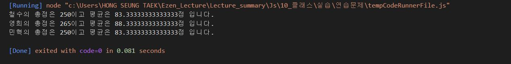
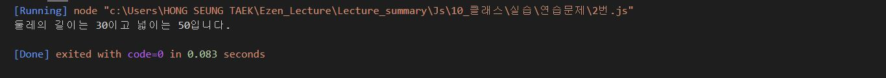
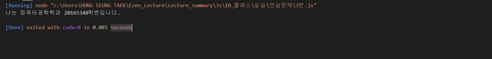
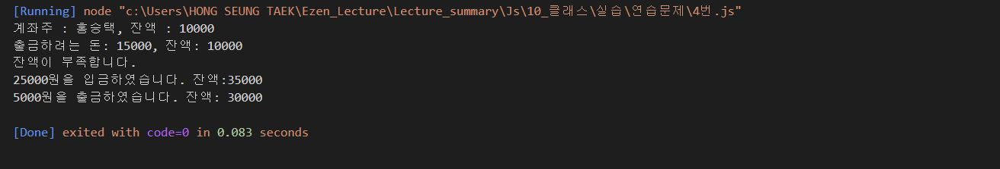

# 홍승택 클래스 연습문제
> 작성일자 2022.08.30

> 작성자: 홍승택

### 문제1
```js
/** 문제1 */
//  국어, 영어, 수학 점수를 생성자 파라미터로 입력받아서 합계와 평균을 구하는 클래스 Student를 작성하시오.
//  이 때, Student 클래스는 합계를 리턴하는 메서드인 sum()과 평균을 리턴하는 avg()를 제공한다.
//  작성된 클래스를 활용하여 아래 표에 대한 학생별 합계 점수와 평균 점수를 출력하시오.

//  클래스는 JSON형식으로 작성되어야 한다.

const classroom = {
    "철수": [92, 81, 77],
    "영희": [72, 95, 98],
    "민혁": [80, 86, 84]
};

class Student {
    #studentName;
    #kor;
    #eng;
    #math;
    constructor(k){
        this.#studentName = null;
        this.#kor = k[0];
        this.#eng = k[1];
        this.#math = k[2];
    }
    get studentName() {
        return this.#studentName;
    }
    set studentName(pr) {
        this.#studentName = pr;
    }

    get kor() {
        return this.#kor;
    }
    set kor(pr) {
        this.#kor = pr;
    }
    
    get eng() {
        return this.#eng;
    }
    set eng(pr) {
        this.#eng = pr;
    }
    
    get math() {
        return this.#math;
    }
    set math(pr) {
        this.#math = pr;
    }

    sum() {
        return this.kor + this.eng + this.math;
    }
    avg() {
        return this.sum()/3;
    }
    print() {
        console.log("%s의 총점은 %d이고 평균은 %d점 입니다.",this.studentName,this.sum(),this.avg());
    }
}

const cs = Object.getOwnPropertyNames(classroom);
const d = new Array(cs.length);
for(let i = 0; i<cs.length; i++){
    d[i] = new Student(classroom[cs[i]]);
    d[i].studentName = cs[i];
    d[i].print();
}
```


### 문제2
```js
/** 문제 2 */
//  가로(width), 세로(height) 정보를 getter, setter로 관리하는 Rectangle 클래스를 정의하시오.
//  이 클래스는 생성자의 파라미터가 없으며 
//  둘레의 길이를 구해 리턴하는 getAround()메서드와 넓이를 구해 리턴하는 getArea()메서드를 제공합니다.

//  클래스는 JSON형식으로 작성되어야 합니다.

class Rectangle {
    #width;
    #height;

    constructor(){
        this._width = null;
        this._height = null;
    }

      //  가로 값의 getter, setter
    get width() {
        return this.#width;
    }
    set width(pr) {
        this.#width = pr;
    }
    
    //  세로 값의 getter, setter
    get height() {
        return this.#height;
    }
    set height(pr) {
        this.#height = pr;
    }

    //  둘레의 길이를 구하는 getAround 메서드 정의
    getAround() {
        return (this.#height + this.#width)* 2;
    }
    
    //  넓이를 구하는 getArea() 메서드 정의
    getArea() {
        return this.#height * this.#width;
    }

}

const rec1 = new Rectangle();

rec1.height = 5;    //세로
rec1.width = 10;    //가로
console.log("둘레의 길이는 %d이고 넓이는 %d입니다.",rec1.getAround(), rec1.getArea());
```


### 문제3
```js
/** 문제 3번 */
//  다음을 만족하는 Student 클래스를 작성하시오.
//  1. string형의 학과와 정수형의 학번을 프로퍼티로 선언 후 생성자를 통해 주입
//  2. getter, setter를 정의
//  3. sayHello() 메서드를 통해 "나는 0000학과 00학번입니다."를 출력하는 기능 구현

class Student {
    #major;
    #studno;

    constructor(major, studno){
        this.#major = major;
        this.#studno = studno;
    }

    get major() {
        return this.#major;
    }
    set major(pr) {
        this.#major = pr;
    }

    get studno() {
        return this.#studno;
    }
    set studno(pr) {
        this.#studno = pr;
    }

    sayHello() {
        console.log("나는 %s학과 %s학번입니다.", this.major, this.studno);
    }
}
const a = new Student("컴퓨터공학","20165340");
a.sayHello();
```


### 문제4
```js
/** 문제 4번 */
//  다음을 만족하는 클래스 Account를 작성하시오.
//  1. 다음의 2개의 필드를 선언
//      문자열 owner; (이름);
//      숫자형 balance; (금액);
//  2. 위 모든 필드에 대한 getter와 setter 구현
//  3. 위 모든 필드를 사용하는 가능한 모든 생성자의 구현
//  4. 메소드 deposit()의 헤드는 다음과 같으며 인자인 금액을 저축하는 메소드
//     deposit(amount)
//  5. 메소드 withdraw()의 헤드는 다음과 같으며 인자인 금액을 인출(리턴)하는 메소드
//      withdraw(long amount)
//      인출 상한 금액은 잔액까지로 하며, 이 경우 이러한 상황을 출력.

class Account {
    #owner;
    #balance;

    constructor(owner,balance){
        this.#owner = owner;
        this.#balance = balance;
    }
    
    get owner() {
        return this.#owner;
    }
    set owner(pr) {
        this.#owner = pr;
    }

    
    get balance() {
        return this.#balance;
    }
    set balance(pr) {
        this.#balance = pr;
    }
    //  4. 메소드 deposit()의 헤드는 다음과 같으며 인자인 금액을 저축하는 메소드
    //     deposit(amount)
    deposit(amount) {
        this.balance += amount;
        console.log(`${amount}원을 입금하였습니다. 잔액:${this.balance}`);
    }

    //  5. 메소드 withdraw()의 헤드는 다음과 같으며 인자인 금액을 인출(리턴)하는 메소드
    //      withdraw(long amount)
    withdraw(long_amount){
        if(long_amount<this.balance){
            this.balance -=long_amount
            console.log(`${long_amount}원을 출금하였습니다. 잔액: ${this.#balance}`);
        } else {
            console.log(`출금하려는 돈: ${long_amount}, 잔액: ${this.balance}`);
            console.log("잔액이 부족합니다.");
        }
    }

    print_amount() {
        console.log(`계좌주 : ${this.owner}, 잔액 : ${this.balance}`);
    }
}

const bank = new Account("홍승택", 10000);
bank.print_amount();
bank.withdraw(15000);
bank.deposit(25000);
bank.withdraw(5000);

```
