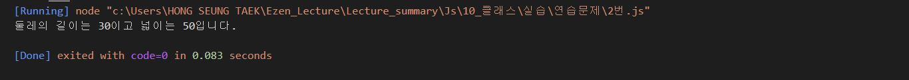
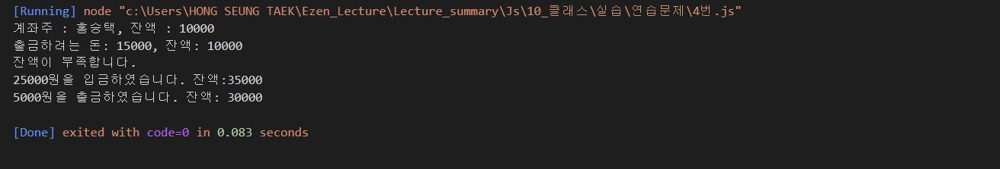
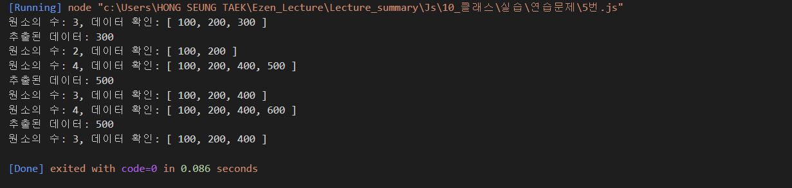
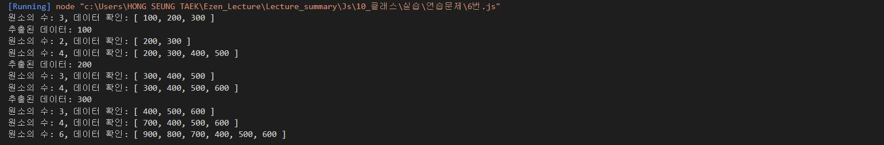

# 홍승택 클래스 연습문제
> 작성일자 2022.08.30

> 작성자: 홍승택

### 문제1
```js
/** 문제1 */
//  국어, 영어, 수학 점수를 생성자 파라미터로 입력받아서 합계와 평균을 구하는 클래스 Student를 작성하시오.
//  이 때, Student 클래스는 합계를 리턴하는 메서드인 sum()과 평균을 리턴하는 avg()를 제공한다.
//  작성된 클래스를 활용하여 아래 표에 대한 학생별 합계 점수와 평균 점수를 출력하시오.

//  클래스는 JSON형식으로 작성되어야 한다.

const classroom = {
    "철수": [92, 81, 77],
    "영희": [72, 95, 98],
    "민혁": [80, 86, 84]
};

class Student {
    #studentName;
    #kor;
    #eng;
    #math;
    constructor(k){
        this.#studentName = null;
        this.#kor = k[0];
        this.#eng = k[1];
        this.#math = k[2];
    }
    get studentName() {
        return this.#studentName;
    }
    set studentName(pr) {
        this.#studentName = pr;
    }

    get kor() {
        return this.#kor;
    }
    set kor(pr) {
        this.#kor = pr;
    }
    
    get eng() {
        return this.#eng;
    }
    set eng(pr) {
        this.#eng = pr;
    }
    
    get math() {
        return this.#math;
    }
    set math(pr) {
        this.#math = pr;
    }

    sum() {
        return this.kor + this.eng + this.math;
    }
    avg() {
        return this.sum()/3;
    }
    print() {
        console.log("%s의 총점은 %d이고 평균은 %d점 입니다.",this.studentName,this.sum(),this.avg());
    }
}

const cs = Object.getOwnPropertyNames(classroom);
const d = new Array(cs.length);
for(let i = 0; i<cs.length; i++){
    d[i] = new Student(classroom[cs[i]]);
    d[i].studentName = cs[i];
    d[i].print();
}
```


### 문제2
```js
/** 문제 2 */
//  가로(width), 세로(height) 정보를 getter, setter로 관리하는 Rectangle 클래스를 정의하시오.
//  이 클래스는 생성자의 파라미터가 없으며 
//  둘레의 길이를 구해 리턴하는 getAround()메서드와 넓이를 구해 리턴하는 getArea()메서드를 제공합니다.

//  클래스는 JSON형식으로 작성되어야 합니다.

class Rectangle {
    #width;
    #height;

    constructor(){
        this._width = null;
        this._height = null;
    }

      //  가로 값의 getter, setter
    get width() {
        return this.#width;
    }
    set width(pr) {
        this.#width = pr;
    }
    
    //  세로 값의 getter, setter
    get height() {
        return this.#height;
    }
    set height(pr) {
        this.#height = pr;
    }

    //  둘레의 길이를 구하는 getAround 메서드 정의
    getAround() {
        return (this.height + this.width)* 2;
    }
    
    //  넓이를 구하는 getArea() 메서드 정의
    getArea() {
        return this.height * this.width;
    }

}

const rec1 = new Rectangle();

rec1.height = 5;    //세로
rec1.width = 10;    //가로
console.log("둘레의 길이는 %d이고 넓이는 %d입니다.",rec1.getAround(), rec1.getArea());
```


### 문제3
```js
/** 문제 3번 */
//  다음을 만족하는 Student 클래스를 작성하시오.
//  1. string형의 학과와 정수형의 학번을 프로퍼티로 선언 후 생성자를 통해 주입
//  2. getter, setter를 정의
//  3. sayHello() 메서드를 통해 "나는 0000학과 00학번입니다."를 출력하는 기능 구현

class Student {
    #major;
    #studno;

    constructor(major, studno){
        this.#major = major;
        this.#studno = studno;
    }

    get major() {
        return this.#major;
    }
    set major(pr) {
        this.#major = pr;
    }

    get studno() {
        return this.#studno;
    }
    set studno(pr) {
        this.#studno = pr;
    }

    sayHello() {
        console.log("나는 %s학과 %s학번입니다.", this.major, this.studno);
    }
}
const a = new Student("컴퓨터공학","20165340");
a.sayHello();
```


### 문제4
```js
/** 문제 4번 */
//  다음을 만족하는 클래스 Account를 작성하시오.
//  1. 다음의 2개의 필드를 선언
//      문자열 owner; (이름);
//      숫자형 balance; (금액);
//  2. 위 모든 필드에 대한 getter와 setter 구현
//  3. 위 모든 필드를 사용하는 가능한 모든 생성자의 구현
//  4. 메소드 deposit()의 헤드는 다음과 같으며 인자인 금액을 저축하는 메소드
//     deposit(amount)
//  5. 메소드 withdraw()의 헤드는 다음과 같으며 인자인 금액을 인출(리턴)하는 메소드
//      withdraw(long amount)
//      인출 상한 금액은 잔액까지로 하며, 이 경우 이러한 상황을 출력.

class Account {
    #owner;
    #balance;

    constructor(owner,balance){
        this.#owner = owner;
        this.#balance = balance;
    }
    
    get owner() {
        return this.#owner;
    }
    set owner(pr) {
        this.#owner = pr;
    }

    
    get balance() {
        return this.#balance;
    }
    set balance(pr) {
        this.#balance = pr;
    }
    //  4. 메소드 deposit()의 헤드는 다음과 같으며 인자인 금액을 저축하는 메소드
    //     deposit(amount)
    deposit(amount) {
        this.balance += amount;
        console.log(`${amount}원을 입금하였습니다. 잔액:${this.balance}`);
    }

    //  5. 메소드 withdraw()의 헤드는 다음과 같으며 인자인 금액을 인출(리턴)하는 메소드
    //      withdraw(long amount)
    withdraw(long_amount){
        if(long_amount<this.balance){
            this.balance -=long_amount
            console.log(`${long_amount}원을 출금하였습니다. 잔액: ${this.balance}`);
        } else {
            console.log(`출금하려는 돈: ${long_amount}, 잔액: ${this.balance}`);
            console.log("잔액이 부족합니다.");
        }
    }

    print_amount() {
        console.log(`계좌주 : ${this.owner}, 잔액 : ${this.balance}`);
    }
}

const bank = new Account("홍승택", 10000);
bank.print_amount();
bank.withdraw(15000);
bank.deposit(25000);
bank.withdraw(5000);

```


### 문제 5번
```js
/**
 * 
### 문제5
Stack은 배열을 내장하는 클래스로서 FILO(First Input Last Output, 선입후출) 기능을 구현하는 대표적인 자료구조 중 하나이다.

아래의 요구사항을 충족하는 MyList 클래스를 정의하시오.

1. 자료를 저장하기 위한 배열인 data와 배열의 원소 수를 카운트 하기 위한 size라는 멤버변수를 은닉된 형태로 선언한다.
2. 생성자에서는 data를 원소가 0개인 빈 배열로, size는 0으로 초기화 한다.
3. data와 size에 대한 getter는 갖지만 setter는 갖지 않는다.
4. push(item) 메서드는 파라미터로 전달된 값을 배열의 맨 뒤에 추가하고 size의 값을 1 증가시킨다.
5. pop() 메서드는 배열의 마지막 원소를 꺼내어 리턴하고 배열의 크기를 1 축소시킨다.
   - 이를 위해 data는 임시 변수에 깊은 복사 처리된 후 기존의 크기보다 1 작은 사이즈로 새로 초기화 되어야 한다
   - 깊은 복사 처리된 임시 변수의 원소 중에서 마지막 원소를 제외한 상태로 다시 data에 깊은 복사 처리되어야 한다.
   - 이 모든 과정은 slice() 등의 javascript 내장 함수를 사용하지 않고 반복문으로 직접 구현하시오.
6. 완성된 클래스는 아래의 테스트 코드를 사용하여 결과를 확인하시오.

 */
class MyList {
    #size
    #data   // 배열
    constructor(){
        this.#data = new Array(0);
        this.#size = 0;
    } 
    get data() {
        return this.#data;
    }
    get size() {
        return this.#size;
    }
    push(item) {
        this.#data[this.#size] = item;
        this.#size++
    }
    pop() {
        if(this.#size === 0){
            console.log("빈 배열입니다.");
            return;
        }
        else {
            // data 배열의 마지막 원소값을 tmp에 복사
            let tmp = this.#data[this.#size-1];
            // data2라는 배열을 data배열의 길이보다 1 작은 크기로 생성
            let data2 = new Array(this.#size-1);
            // data2에 data를 깊은 복사
            for(let i = 0 ; i<this.#size-1; i++){
                data2[i] = this.#data[i];
            }
            // data를 기존의 크기보다 1 작은 배열로 초기화
            this.#data = new Array(this.#size-1);

            // data2의 내용을 data에 깊은 복사
            for(let i = 0 ; i<this.#size-1; i++){
                this.#data[i] = data2[i];
            }
            // size 1 감소
            this.#size--;
            // data 배열의 마지막 원소값 리턴
            return tmp;
        }
    }

}

const list = new MyList();

list.push(100);
list.push(200);
list.push(300);
console.log('원소의 수: %d, 데이터 확인: %s', list.size, list.data);

const x = list.pop();
console.log('추출된 데이터: %d', x);
console.log('원소의 수: %d, 데이터 확인: %s', list.size, list.data);

list.push(400);
list.push(500);
console.log('원소의 수: %d, 데이터 확인: %s', list.size, list.data);

const y = list.pop();
console.log('추출된 데이터: %d', y);
console.log('원소의 수: %d, 데이터 확인: %s', list.size, list.data);

list.push(600);
console.log('원소의 수: %d, 데이터 확인: %s', list.size, list.data);

const z = list.pop();
console.log('추출된 데이터: %d', z);
console.log('원소의 수: %d, 데이터 확인: %s', list.size, list.data);
```


### 문제6

```js
/**
 * ### 문제6

Queue(큐)는 배열을 내장하는 클래스로서 Stack과 더불어 가장 널리 사용되는 자료구조이다.active

Stack의 특징이 FILO(First Input Last Output, 선입후출)인 반면 Queue의 특징은 FIFO(First Input First Output, 선입선출)이다.

전통적인 자료구조에서는 추가되는 데이터는 무조건 배열의 맨 마지막 원소로 등록되지만 요즘 프로그래밍 언어는 배열의 맨 앞에 데이터를 추가하고 기존의 데이터는 한칸씩 뒤로 밀리는 기능도 제공되고 있다.

문제05에서 완성한 MyList 클래스에 기능을 추가하시오.

1. 문제05에서 구현한 MyList 클래스를 문제06에 동일하게 복사하고 shift() 메서드와 unshift(item) 메서드를 추가한다.
2. shift() 메서드는 배열의 가장 첫 번째 원소를 꺼내어 리턴하고 배열의 크기를 1축소 시킨다.
   - 이를 위해 data의 첫 번째 원소를 지역변수(혹은 상수)에 복사한다.
   - 임시 변수를 data의 길이보다 1 작은 크기로 초기화 하고 data의 1번째 원소부터 나머지 원소들을 임시 변수에 깊은 복사 처리한다. (data의 1번째 항목이 임시 변수의 0번째 자리에 복사)
   - 복사가 완료되면 data의 크기를 기존보다 1 작게 다시 초기화 하고 임시 변수의 항목들을 그대로 깊은 복사 처리한다.
   - 이 모든 과정은 slice() 등의 javascript 내장 함수를 사용하지 않고 반복문으로 직접 구현하시오.
3. unshift(item) 메서드는 파라미터로 전달된 값을 data의 맨 첫 번째 원소로 추가하고 기존의 데이터들은 한 칸씩 뒤로 밀어낸다.
   - 이를 위해 임시 변수를 data와 동일한 길이로 생성하고 data의 모든 원소를 깊은 복사 한다.
   - data를 기존의 길이보다 1 큰 값으로 초기화 한다.
   - data의 첫 번째 원소로 item을 저장한다.
   - data의 두 번째 원소부터는 복사된 임시 변수의 원소를 깊은 복사 처리한다. (임시 변수의 0번째 항목이 data의 1번째 자리에 복사)
   - 이 모든 과정은 slice() 등의 javascript 내장 함수를 사용하지 않고 반복문으로 직접 구현하시오.
4. 완성된 클래스는 아래의 테스트 코드를 사용하여 결과를 확인하시오.


 */
class MyList {
    #size
    #data   // 배열
    constructor(){
        this.#data = new Array(0);
        this.#size = 0;
    } 
    get data() {
        return this.#data;
    }
    get size() {
        return this.#size;
    }
    push(item) {
        this.#data[this.#size] = item;
        this.#size++
    }

    pop() {
        // 빈 배열의 경우.
        if(this.#size == 0){
            console.log("빈 배열입니다.");
            return;
        } else {
            // data 배열의 마지막 원소값을 tmp에 복사
            let tmp = this.#data[this.#size-1];
            // data2라는 배열을 data배열의 길이보다 1 작은 크기로 생성
            let data2 = new Array(this.#size-1);
            // data2에 data를 깊은 복사
            for(let i = 0 ; i<this.#size-1; i++){
                data2[i] = this.#data[i];
            }
            // data를 기존의 크기보다 1 작은 배열로 초기화
            this.#data = new Array(this.#size-1);

            // data2의 내용을 data에 깊은 복사
            for(let i = 0 ; i<this.#size-1; i++){
                this.#data[i] = data2[i];
            }
            // size 1 감소
            this.#size--;
            // data 배열의 마지막 원소값 리턴
            return tmp;
        }
    }

    unshift(item) {
        // data2를 data와 같은 사이즈의 배열로 만들어준다.
        let data2 = new Array(this.#size);
        // data2에 data 깊은복사.
        for(let i = 0 ; i<this.#size; i++){
            data2[i] = this.#data[i];
        }
        // data의 배열 크기를 이전 크기보다 1 큰 배열로 초기화
        this.#data = new Array(this.#size + 1);
        // data의 0번째 인덱스에 item 값을 넣어줌
        this.#data[0] = item;
        
        // data의 첫번째 인덱스부터 size+1번째 인덱스까지 data2의 0번째 인덱스부터 size번째까지 대입해줌.
        for(let i = 1; i<this.#size+1; i++){
            this.#data[i] = data2[i-1];
        }
        // size값 1증가.
        this.#size++;

    }

    shift() {
        // 빈 배열의 경우.
        if(this.#size == 0){
            console.log("빈 배열입니다.");
            return;
        } else {
            // data 배열의 0번째 원소값을 tmp에 복사
            let tmp = this.#data[0];

            // data2라는 배열을 data배열의 길이보다 1 작은 크기로 생성
            let data2 = new Array(this.#size-1);

            // data2에 data를 깊은 복사
            for(let i = 1 ; i<this.#size; i++){
                data2[i-1] = this.#data[i];
            }
            // data를 기존의 크기보다 1 작은 배열로 초기화
            this.#data = new Array(this.#size-1);

            // data2의 내용을 data에 깊은 복사
            for(let i = 0 ; i<this.#size-1; i++){
                this.#data[i] = data2[i];
            }
            // size 1 감소
            this.#size--;
            // data 배열의 0번째 원소값 리턴
            return tmp;
        }
    }

}

const list = new MyList();

list.push(100);
list.push(200);
list.push(300);
console.log('원소의 수: %d, 데이터 확인: %s', list.size, list.data);

const x = list.shift();
console.log('추출된 데이터: %d', x);
console.log('원소의 수: %d, 데이터 확인: %s', list.size, list.data);

list.push(400);
list.push(500);
console.log('원소의 수: %d, 데이터 확인: %s', list.size, list.data);

const y = list.shift();
console.log('추출된 데이터: %d', y);
console.log('원소의 수: %d, 데이터 확인: %s', list.size, list.data);

list.push(600);
console.log('원소의 수: %d, 데이터 확인: %s', list.size, list.data);

const z = list.shift();
console.log('추출된 데이터: %d', z);
console.log('원소의 수: %d, 데이터 확인: %s', list.size, list.data);

list.unshift(700);
console.log('원소의 수: %d, 데이터 확인: %s', list.size, list.data);

list.unshift(800);
list.unshift(900);
console.log('원소의 수: %d, 데이터 확인: %s', list.size, list.data);
```
