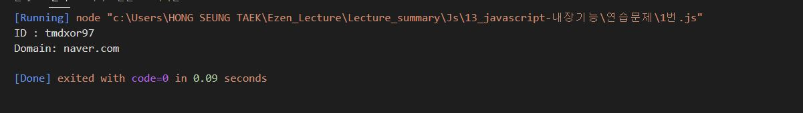
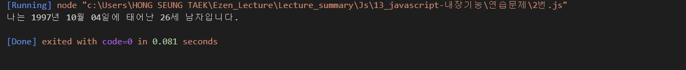
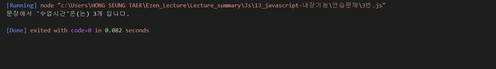
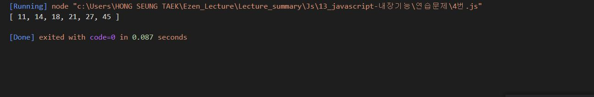
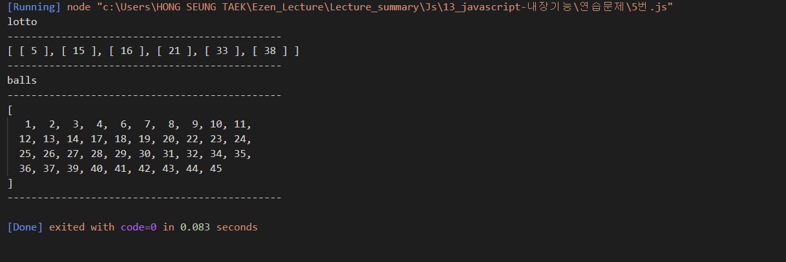
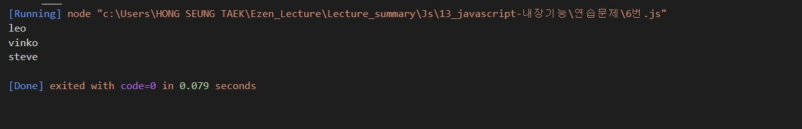

# 홍승택 javascript-내장기능 연습문제

### 문제1.
```js
/** 문제1
    자신의 이메일 주소를 email이라는 변수에 저장하고 @를 기준으로 아이디와 도메인
    부분을 분리하여 출력하시오.
 */

const email = "tmdxor97@naver.com";

function printSeperateEmail(str)
{
    const a = str.split('@');
    console.log("ID : %s", a[0]);
    console.log("Domain: %s",a[1]);
}

printSeperateEmail(email);

```


### 문제2.
```js
/** 문제2
    임의의 주민번호를 다음과 같이 *를 포함하여 변수에 저장하시오.
    또한 현재 년도를 now_year라는 변수로 저장하시오.
 */

const ssn = '971004-1******';

function printPersonInfo(ssn){
    //  현재년도 구하기
    const a = new Date();
    const now_year = a.getFullYear();
    //  주민번호 뒷자리 구하기
    const behindNumber = ssn.substring(7,8);
    //  성별 구하기
    let gender = behindNumber%2 == 1 ? '남자' : '여자' ;
    //  생년월일 구하기
    let birthYear = parseInt(ssn.substring(0,2));
    birthYear += behindNumber > 2 ? 2000 : 1900; 
    let birthMonth = ssn.substring(2,4);
    let birthDate = ssn.substring(4,6);
    
    //  나이 구하기
    let age = now_year - birthYear + 1;

    //  출력
    console.log("나는 %d년 %s월 %s일에 태어난 %d세 %s입니다. ", birthYear,birthMonth,birthDate,age,gender);
}
printPersonInfo(ssn);
```


### 문제3.
```js
/** 문제3번
 *  아래의 문장에서 "수업시간"이라는 단어가 총 몇번 등장하는지 카운트하는
 *  프로그램을 구현하시오.
 *  
 *  str = "수업시간에 배운것은 수업시간에 다 이해하고 넘어가야지 수업시간에 놓치면 따라오기 힘들다."
 */

let str = "수업시간에 배운것은 수업시간에 다 이해하고 넘어가야지 수업시간에 놓치면 따라오기 힘들다."

function printFindStr(str1,str2){

    const arr = new Array(2).fill(0);

    for(let i = 0; true; i++){
        arr[i] = str.indexOf(str2,arr[i-1]+1);
        if(arr[i]===-1) break;
    }
    
    console.log("문장에서 '%s'은(는) %d개 입니다.",str2,arr.length-1);
}

printFindStr(str,"수업시간");

```


### 문제4.
```js
/** 문제4번
 *  주어진 범위 안에서 랜덤한 숫자를 추출하는 함수는 아래와 같다.
 *  function random(n1,n2) {
 *  return parseInt(Math.random()*(n2-n1+1)) +n1;
 * }
 */
function random(n1,n2) {
    return parseInt(Math.random()*(n2-n1+1)) +n1;
}
function foundSameNumber(array,number){
    if(array.find(e => number === e)){
        return true;
    } else return false;
}

function makeLotto(array){
    for(let i = 0; i<6; i++){
    
        let number = random(1,45);
        if(!foundSameNumber(array,number) ){
            array.push(number);
        } else {
            i--;
        }
    }
    //  오름차순 정렬
    array.sort((a,b) => a-b); 
}
lotto = new Array(0);
makeLotto(lotto);
console.log(lotto);

```


### 문제5.
```js
/** 문제5번
 *  1~45사이의 범위의 1씩 증가 하는 원소가 저장되어 있는 배열 balls을 생성하고 
 *  6개의 빈 칸을 갖는 배열 lotto를 생성하시오.
 *  lotto 배열을 탐색하는 반복을 수행하면서 balls 배열에서 임의의 원소 하나를 추출하여 
 *  lotto 배열에 채워 넣으시오.
 *  추출된 숫자는 balls 배열에서는 삭제되어야 합니다.
 */
function random(n1,n2) {
    return parseInt(Math.random()*(n2-n1+1)) +n1;
}
lotto = new Array(6).fill("");

balls = new Array(45).fill(0);
balls.forEach((element,index) => balls[index] = index+1);

lotto.forEach((e,i) => {
    let a = balls.splice([random(0,balls.length-1)],1);
    lotto[i] = a;

});
lotto = lotto.sort((a,b) => a-b);
console.log("lotto");
console.log("----------------------------------------------");
console.log(lotto);
console.log("----------------------------------------------");
console.log("balls");
console.log("----------------------------------------------");
console.log(balls);
console.log("----------------------------------------------");


```


### 문제6.
```js
/** 문제6.
    수많은 마라톤 선수들이 마라톤에 참여하였습니다. 단 한 명의 선수를 제외하고는 모든 선수가 마라톤을 완주하였습니다.

    마라톤에 참여한 선수들의 이름이 담긴 배열 participant와 완주한 선수들의 이름이 담긴 배열 completion이 주어질 때
    완주하지 못한 선수의 이름을 return 하도록 solution 함수를 작성해주세요.

 */

let participant1 = ["leo", "kiki", "eden"];
let completion1 = ["eden", "kiki"];

let participant2 = ["marina","josipa","nikola","vinko","filipa"];
let completion2 = ["josipa", "filipa", "marina", "nikola"];

let participant3 = ["mislav", "stanko", "steve", "ana"];
let completion3 = ["stanko", "ana", "mislav"];

let participant4 = ["mislav", "stanko", "mislav", "ana"];
let completion4 = ["stanko", "ana", "mislav"];

function solution(participant, completion) {
   
    participant.sort();
    completion.sort();
    let answer = participant.find((e,i) => e !== completion[i]);


    return answer;
}
console.log(solution(participant1,completion1));
console.log(solution(participant2,completion2));
console.log(solution(participant3,completion3));
//console.log(solution(participant4,completion4));


```
