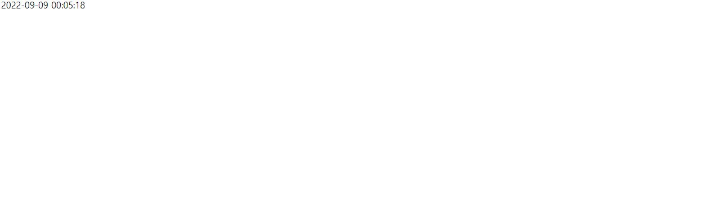
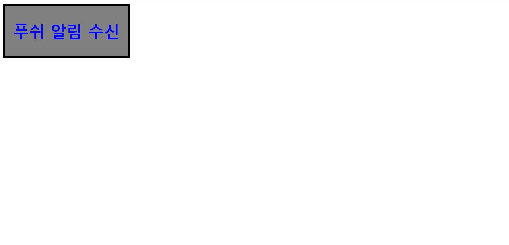
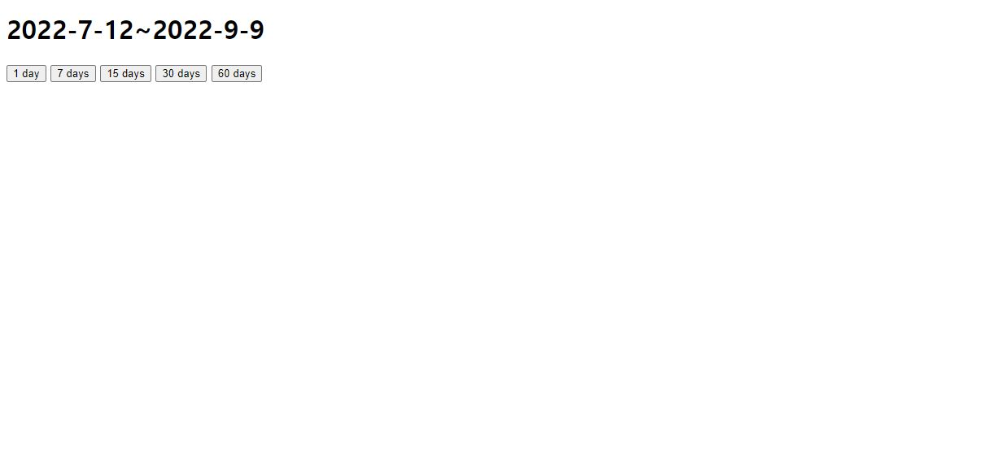

#HTML 제어하기 연습문제

### 문제1.

```js
<!DOCTYPE html>
<html lang="ko">
<head>
    <meta charset="UTF-8">
    <meta http-equiv="X-UA-Compatible" content="IE=edge">
    <meta name="viewport" content="width=device-width, initial-scale=1.0">
    <title>Document</title>
</head>

<body>
    <div class="time"></div>

    <script>
        const timer = document.querySelector('.time');
        
        
        function timeFunc() {
            const date = new Date();
            
            let arr = [date.getFullYear(),date.getMonth()+1,date.getDate(),date.getHours(),date.getMinutes(),date.getSeconds()];
            arr =arr.map(e => e<10? '0'+ e : e );
            let printTime = (`${arr[0]}-${arr[1]}-${arr[2]} ${arr[3]}:${arr[4]}:${arr[5]}`);
            
            timer.innerHTML = printTime;
        }
        setInterval(() => {
            timeFunc();
        },1000);
        

    </script>
    
</body>
</html>
```


### 문제2.

```js
<!DOCTYPE html>
<html lang="ko">
<head>
    <meta charset="UTF-8">
    <meta http-equiv="X-UA-Compatible" content="IE=edge">
    <meta name="viewport" content="width=device-width, initial-scale=1.0">
    <title>Document</title>

    <style type="text/css">
        .box1 {
            display: inline-block;
            font-size: 20px;
            border: 5px solid #000;
            text-align: center;
            background-color: gray;
            color:blue;
            padding: 10px 20px;

        }
        .box1.active {
            background-color: #ff0;
            color: #f00;
        }

        
    </style>

</head>
<body>
    <div id="box" class="box1">
        <h1>푸쉬 알림 수신</h1>
    </div>

    <script>
        document.querySelector('.box1').addEventListener('click',e => {
            e.currentTarget.classList.toggle('active');
        });
    </script>
</body>
</html>
```



### 문제3.

```js
<!DOCTYPE html>
<html lang="ko">
<head>
    <meta charset="UTF-8">
    <meta http-equiv="X-UA-Compatible" content="IE=edge">
    <meta name="viewport" content="width=device-width, initial-scale=1.0">
    <title>Document</title>
</head>
<body>

    <h1><span id="s_date"></span>~<span id="e_date"></span></h1>
    <button id ="day1" date-value-="1" class="timerBox">1 day</button>
    <button id ="day7" date-value-="7" class="timerBox">7 days</button>
    <button id ="day15" date-value-="15" class="timerBox">15 days</button>
    <button id ="day30" date-value-="30" class="timerBox">30 days</button>
    <button id ="day60" date-value-="60" class="timerBox">60 days</button>
    

    <script>
        function getTime(value){
            let nowDate = new Date();
            let prevDate = new Date();

            prevDate.setDate(prevDate.getDate()-(value-1));
            prevArr = [ prevDate.getFullYear(), prevDate.getMonth()+1, prevDate.getDate()];
            prevArr.map((e => e<10? '0'+e : e));
            document.getElementById('s_date').innerHTML = `${prevArr[0]}-${prevArr[1]}-${prevArr[2]}`;

            nowArr = [ nowDate.getFullYear(), nowDate.getMonth()+1, nowDate.getDate()];
            document.getElementById('e_date').innerHTML = `${nowArr[0]}-${nowArr[1]}-${nowArr[2]}`;
        }
        getTime(1);
        document.querySelector('#day1').addEventListener('click', e => getTime(1));
        document.querySelector('#day7').addEventListener('click', e => getTime(7));
        document.querySelector('#day15').addEventListener('click', e => getTime(15));
        document.querySelector('#day30').addEventListener('click', e => getTime(30));
        document.querySelector('#day60').addEventListener('click', e => getTime(60));
    </script>

</body>
</html>
```
