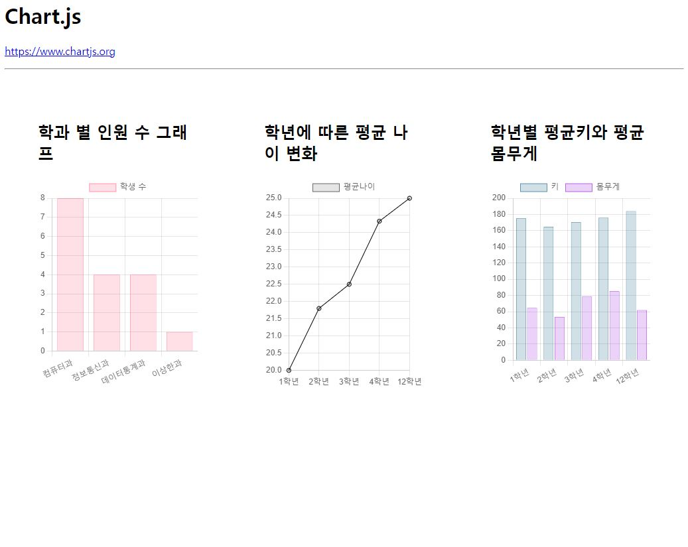

# 21-모듈사용하기 연습문제 홍승택

### 문제 1,2,3

```html
<!DOCTYPE html>
<html lang="ko">
    <head>
        <meta charset="UTF-8">
        <meta http-equiv="X-UA-Compatible" content="IE=edge">
        <meta name="viewport" content="width=device-width, initial-scale=1.0">
        <title>Document</title>
        <style>
            .subplot{
                float: left;
                width: 33.3%;
                padding: 50px;
                box-sizing: border-box;
            }

            .subplot-item {
                width: auto;
                height: 320px;
            }
        </style>

    </head>
    <body>
        <h1>Chart.js</h1>
        <p>
            <a href="https://www.chart.js.org/">https://www.chartjs.org</a>
        </p>
        <hr />

        <div class="subplot">
            <h2>학과 별 인원 수 그래프</h2>
            <div class="subplot-item">
                <canvas id="mychart1"></canvas>
            </div>
        </div>

        <div class="subplot">
            <h2>학년에 따른 평균 나이 변화</h2>
            <div class="subplot-item">
                <canvas id="mychart2"></canvas>
            </div>
        </div>

        <div class="subplot">
            <h2>학년별 평균키와 평균 몸무게</h2>
            <div class="subplot-item">
                <canvas id="mychart3"></canvas>
            </div>
        </div>
        <script type="text/javascript" src="../node_modules/chart.js/dist/chart.min.js"></script>
        <script src="./dataset.js"></script>

        <!-- 2번,3번에서 평균 구하는 함수-->
        <script>
            function getAvg(data){
                let sum = 0;
                data.forEach((e,i) => {
                    sum +=e;
                });
                return sum/data.length;
            }
        </script>

        <script>
            //1번 데이터 추출
            const deptList = {};
            
            student.forEach((e,i) => {
                const dname = e.deptno;
                if (deptList[dname] === undefined) deptList[dname] = 0;
                deptList[dname]++;
            });

            const department = [];
            const studentCount = [];

            for(const key in deptList){
                department.push(key);
                studentCount.push(deptList[key]);
            }

            console.log(deptList);
            //2번 데이터 추출
            let agearr = [];
            const nwYear= new Date().getFullYear();
            console.log(nwYear);

            student.forEach((e,i) => {                
                const avalue = e.grade;
                if(!agearr.includes(avalue)) agearr.push(avalue);
            });
            //  학년 자료.
            agearr = agearr.sort((a,b) => a-b).map(e => e+"학년");
            
            const ageInfo = {};
            agearr.forEach((e,i) => {
                    ageInfo[e] = [];
            });

            student.forEach((e,i) => {
                const birth = +e['birthdate'].substring(0,4);
                const age =nwYear-birth+1
                ageInfo[e['grade']+"학년"].push(age);
            });
            console.log(ageInfo);

            // 학년별 평균 연령 자료
            gradeAge = []; 
            for(const kk in ageInfo){
                gradeAge.push(getAvg(ageInfo[kk]));
            }
            console.log(gradeAge);


            
            // 3번 데이터 추출
            // 2반에서 사용한 agearr 그대로 사용.
            
            const bodyInfo = {};
            agearr.forEach( (e,i) => {
                bodyInfo[e] = {"height": [], "weight": []};
                
            });
            console.log(bodyInfo);
            student.forEach((e,i) => {
                bodyInfo[e['grade']+"학년"].height.push(e['height']);
                bodyInfo[e['grade']+"학년"].weight.push(e['weight']);
            });
            
            console.log(bodyInfo);
           
            heightAvg = [];
            weightAvg = [];

            for(const e in bodyInfo){
                
                heightAvg.push(getAvg(bodyInfo[e]['height']));
                weightAvg.push(getAvg(bodyInfo[e]['weight']));
            }


            // 캔버스 그리기
            //  그래프가 표시될 캔버스 영역
            let mychart = [];
            for(let i = 1; i<=3; i++){
                let a = "mychart" + i;
                mychart[i-1] = document.getElementById(a);
            }
            
            //1
            new Chart(mychart1, {
                type: 'bar',
                data: {
                    
                    labels: department,

                    datasets: [
                    {
                        label:'학생 수',
                        data: studentCount,
                        borderWidth: 0.5,

                        borderColor: ['rgba(255,99,132,1)'],
                        backgroundColor: ['rgba(255,99,132,0.2)'],
                    },
                    ],

                },

                options: {
                    maintainAspectRatio: false,
                    indexAxis: 'x',
                },
                
            });
            //2
        /** 선 그래프 그리기 */
        new Chart(mychart2, {
                
                type: 'line',

                //  data area
                data: {
                    // x axis
                    labels: agearr,
                    // data struct
                    datasets: [
                        // data1
                        {
                            label: '평균나이', // data name
                            data: gradeAge, // data array
                            borderWidth: 1,
                            borderColor: 'ff6600',
                        },
                        
                        
                    ],
                },
                options: {
                    maintainAspectRatio: false,
                }
            });

            //3
            new Chart(mychart3, {
                type: 'bar',
                data: {
                    
                    labels: agearr,

                    datasets: [
                    {
                        label:'키',
                        data: heightAvg,
                        borderWidth: 0.5,

                        borderColor: ['rgba(25,99,132,1)'],
                        backgroundColor: ['rgba(25,99,132,0.2)'],
                    },
                    {
                        label:'몸무게',
                        data:  weightAvg,
                        borderWidth: 0.5,

                        borderColor: ['rgba(155,29,222,1)'],
                        backgroundColor: ['rgba(155,29,222,0.2)'],
                    },
                    ],

                },

                options: {
                    maintainAspectRatio: false,
                    indexAxis: 'x',
                },
                
            });

        </script>
    <body>
<html>


```


## 변수 추가 시

