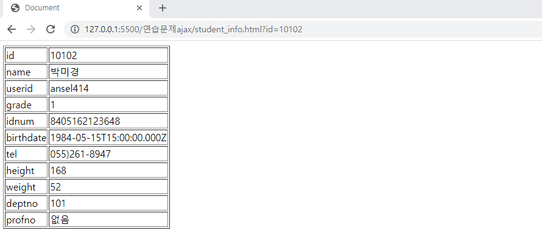
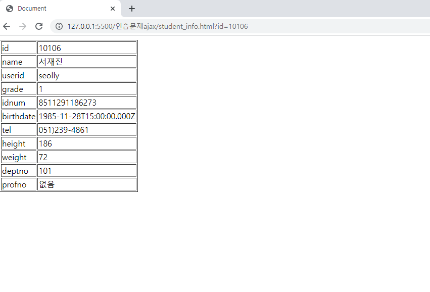

# ajax 연습문제 홍승택
> 작성자: 홍승택

> 작성일자: 2022.09.30


## student_list.html
```html
<!DOCTYPE html>
<html lang="ko">

<head>
    <meta charset="UTF-8">
    <meta http-equiv="X-UA-Compatible" content="IE=edge">
    <meta name="viewport" content="width=device-width, initial-scale=1.0">
    <title>Document</title>

    <style></style>
</head>

<body>
    <div id="loading"></div>
    <h1>Dept List</h1>

    <hr />

    <table border="1">
        <thead>
            <tr>
                <th>학생번호</th>
                <th>이름</th>
                <th>학년</th>
                <th>연락처</th>
            </tr>
        </thead>
        <tbody id="list-body"></tbody>
    </table>

    <script type="module">
        import ajaxHelper from '../helper/AjaxHelper.js';
        let page = 1;
        let json = null;
        (async() => {
            try {
                json = await ajaxHelper.requestAsync('http://localhost:3001/student');
                console.log(json);
            } catch (e) {
                console.error(e);
                alert(`[${e.status}] ${e.text}\n${e.msg}`);
            }
            const listBody = document.querySelector('#list-body');
    
            json.forEach((v, i) => {
                const tr = document.createElement('tr');
    
                const td1 = document.createElement('td');
                td1.innerHTML = v.id;
    
                const td2 = document.createElement('td');
                const td2_a = document.createElement('a');
                td2.appendChild(td2_a);
                td2_a.innerHTML = v.name;
                td2_a.setAttribute('href','./student_info.html?id=' + v.id);

                const td3 = document.createElement('td');
                td3.innerHTML = v.grade;
    
                const td4 = document.createElement('td');
                td4.innerHTML = v.tel;
    
                tr.appendChild(td1);
                tr.appendChild(td2);
                tr.appendChild(td3);
                tr.appendChild(td4);
    
                listBody.appendChild(tr);
            });
        })();
        
        
    </script>
</body>

</html>
```

## student_info.html
```html
<!DOCTYPE html>
<html lang="ko">
<head>
    <meta charset="UTF-8">
    <meta http-equiv="X-UA-Compatible" content="IE=edge">
    <meta name="viewport" content="width=device-width, initial-scale=1.0">
    <title>Document</title>
</head>
<style>
    table {
        
    }
</style>
<body>
    
    <table border ='1'>
        <tbody class="studentinfo"></tbody>
    </table>
    

    <script type="module">
        import ajaxHelper from '../helper/AjaxHelper.js';
        const ids = new URLSearchParams(location.search).get('id');
        console.log(ids);
        let json = null;
        (async() => {
            try{
                json = await ajaxHelper.requestAsync('http://localhost:3001/student/');
            } catch (e) {
                console.error(e);
                alert(`[${e.status}], ${e.text}\n ${e.msg}`);
            }
            const studInfo = document.querySelector('.studentinfo');
            
            json.forEach((e,i) => {
                if(e.id == ids) {
                    console.log()
                    for(const k in e){
                        let td1 = document.createElement('td')
                        let td2 = document.createElement('td')
                        let tr = document.createElement('tr'); 
                        
                        if(e[k]){
                            td2.innerHTML= e[k];    
                        } else {
                            td2.innerHTML = '없음';
                        }
                        td1.innerHTML = k;
                        studInfo.appendChild(tr);
                        tr.appendChild(td1);
                        tr.appendChild(td2);
                                           
                    }
                    
                }
            });
        })();
   </script>
</body>
</html>
```

## 출력결과
### student_list.html


### student_info.html

### student_info.html (교수번호 NULL)
