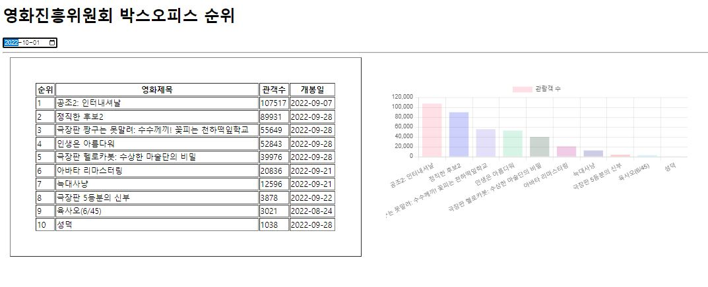
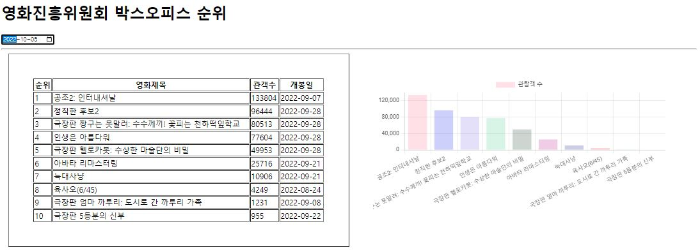

# axios 차트 그리기 연습문제 홍승택
> 작성일자: 2022.10.04

> 작성자: 홍승택

```html
<!DOCTYPE html>
<html lang="ko">

<head>
    <meta charset="UTF-8">
    <meta http-equiv="X-UA-Compatible" content="IE=edge">
    <meta name="viewport" content="width=device-width, initial-scale=1.0">
    <title>Document</title>
    <style>
        #lodaing {
            width: 100px;
            height: 100px;
            background: url(img/loading.gif) no-repeat center/cover;
            position: absolute;
            left: 50%;
            top: 50%;
            transform: translate(-50%, -50%);
            z-index: 999999;
            display: none;
        }

        #loading.active {
            display: block;
        }

        .mainwrap {
            width: 98%;
            display: flex;
            flex-direction: row;
            margin: auto;
        }

        table {
            width: 50%;
            padding: 50px;
            box-sizing: border-box;
        }

        .subplot {
            width: 50%;
            padding: 50px;
            box-sizing: border-box;
        }

        .subplot-item {
            width: auto;
            height: 100%;
        }
    </style>
</head>

<body>
    <div id="loading"></div>
    <h1>영화진흥위원회 박스오피스 순위</h1>

    <input type="date" id="targetDt" />

    <hr />
    <div class="mainwrap">
        <table border="1">
            <thead>
                <tr>
                    <th>순위</th>
                    <th>영화제목</th>
                    <th>관객수</th>
                    <th>개봉일</th>
                </tr>
            </thead>
            <tbody id="list-body"></tbody>
        </table>

        <div class="subplot">
            <div class="subplot-item">
                <canvas id="mychart1"></canvas>
            </div>
        </div>

    </div>

    <script type="text/javascript" src="../node_modules/chart.js/dist/chart.min.js"></script>
    <script src="../node_modules/axios/dist/axios.min.js"></script>
    <script>
        /**
        *  파라미터로 백엔드에 전달할 값을 받아 이를 Ajax로 요청한 후 결과를 수신한다.
        */
        const getMovieRank = async (targetDt) => {
            const loading = document.querySelector("#loading");
            loading.classList.add('active');

            //  검색결과 저장 빈 변수
            let json = null;
            try {
                const response = await axios.get('http://www.kobis.or.kr/kobisopenapi/webservice/rest/boxoffice/searchDailyBoxOfficeList.json', {
                    params: {
                        key: '3c90915695981b5a5847bb75af37dc64',
                        targetDt: targetDt.replaceAll('-', ''),
                    },
                });
                json = response.data;
            } catch (error) {
                //  Axios의 기본 에러 메세지를 추출하여 문자열로 구성
                console.error(`[Error Code] ${error.code}`);
                console.error(`[Error Message] ${error.message}`);
                let alertMsg = error.message;

                //  HTTP 상태메시지가 포함되어 있다면 해당 내용을 에러 문자열에 추가
                if (error.response !== undefined) {
                    const errorMsg = `${error.response.status} error - ${error.response.statusText}`;
                    console.error(`[HTTP Status] ${errorMsg}`);
                    alertMsg += `\n${errorMsg}`;
                }

                alert(alertMsg);

                //catch에서 return 하더라도 finally가 수행된 후 실행이 취소된다.
                return;
            } finally {
                //  로딩바 닫기
                loading.classList.remove('actvie');
            }
            // 파라미터를 적용하여 수정된 URL과, 수신된 결과 데이터를 히스토리에 저장한다.
            const state = { targetDt: targetDt, data: JSON.stringify(json) };
            const url = `${location.pathname}?targetDt=${targetDt}`;
            history.pushState(state, null, url);

            renderMovieRank(json);
        };

        /**
         *  JSON 데이터를 테이블에 출력한다.
         *  기존에 출력되고 있던 항목은 삭제
        */
        const renderMovieRank = (json) => {

            const listBody = document.querySelector('#list-body');

            //  이미 출력되고 있는 항목이 있다면 삭제

            Array.from(listBody.getElementsByTagName('tr')).map((v, i) => {
                listBody.removeChild(v);
            });
            const sbi = document.querySelector('.subplot-item');
            const cav = document.getElementById('mychart1');
            sbi.removeChild(cav);
            let name = [];
            let audience = [];
            if (json) {
                json.boxOfficeResult.dailyBoxOfficeList.forEach((v, i) => {
                    const tr = document.createElement('tr');
                    listBody.appendChild(tr);

                    const td1 = document.createElement('td');
                    td1.innerHTML = v.rank;
                    tr.appendChild(td1);

                    const td2 = document.createElement('td');
                    td2.innerHTML = v.movieNm;
                    tr.appendChild(td2);

                    const td3 = document.createElement('td');
                    td3.innerHTML = v.audiCnt;
                    tr.appendChild(td3);

                    const td4 = document.createElement('td');
                    td4.innerHTML = v.openDt;
                    tr.appendChild(td4);

                    name[i] = v.movieNm;
                    audience[i] = v.audiCnt;
                });
                const cav2 = document.createElement('canvas');
                cav2.setAttribute('id', 'mychart1');
                sbi.appendChild(cav2);
                new Chart(mychart1, {
                    type: 'bar',
                    data: {
                        labels: name,
                        datasets: [
                            {
                                label: '관람객 수',
                                data: audience,
                                bodrderWidth: 0.5,
                                boderColor: ['rgba(255,99,132,1)', 'rgba(0,19,232,1)', 'rgba(125,99,232,1)', 'rgba(55,199,132,1)', 'rgba(5,44,22,1)', 'rgba(185,0,132,1)', 'rgba(5,9,132,1)', 'rgba(255,0,0,1)', 'rgba(25,199,252,1)', 'rgba(255,255,132,1)'],
                                backgroundColor: ['rgba(255,99,132,0.2)', 'rgba(0,19,232,0.2)', 'rgba(125,99,232,0.2)', 'rgba(55,199,132,0.2)', 'rgba(5,44,22,0.2)', 'rgba(185,0,132,0.2)', 'rgba(5,9,132,0.2)', 'rgba(255,0,0,0.2)', 'rgba(25,199,252,0.2)', 'rgba(255,255,132,0.2)']

                            }
                        ],
                    },
                    options: {
                        maintainAspectRatio: false,
                        indexAxis: 'x'
                    },
                });

            }
        };
        //** 날짜 값이 변경된 경우에 대한 이벤트 */
        document.querySelector('#targetDt').addEventListener('change', e => {
            getMovieRank(e.currentTarget.value);
        });

        // history가 이전 페이지로 되돌아 갈 때 발생하는 이벤트
        window.addEventListener('popstate', e => {
            if (e.state) {
                const json = JSON.parse(e.state.data);
                renderMovieRank(json);
                document.querySelector('#targetDt').value = e.state.targetDt;
            } else {
                renderMovieRank();
                document.querySelector('#targetDt').value = '';
            }
        });
    </script>

</body>

</html>
```

### 실행결과
#### 새로고침, 뒤로가기 모두 적용 가능.



