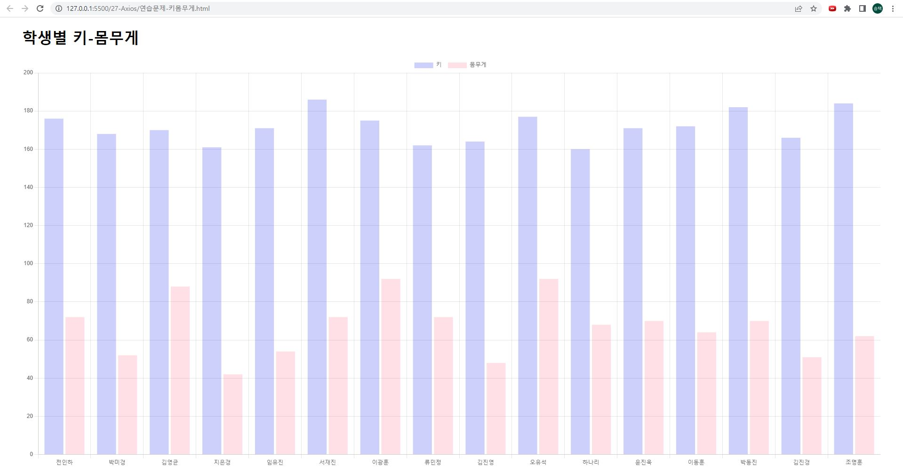

# 연습문제 학생 별 키 몸무게 홍승택
> 작성일자: 2022.10.04

> 작성자: 홍승택


``` html

<!DOCTYPE html>
<html lang="ko">

<head>
    <meta charset="UTF-8">
    <meta http-equiv="X-UA-Compatible" content="IE=edge">
    <meta name="viewport" content="width=device-width, initial-scale=1.0">
    <title>Document</title>

    <style>
        body{
            margin: 0;
            padding: 0;
        }
        h1 {
            margin-left: 2.5%;
        }
        .chartContainer {
            width: 95%;
            margin: auto;
            height: 90vh;
        }
        .myChart1 {
            height: 100%;
        }
    </style>
</head>

<body>

    <h1>학생별 키-몸무게</h1>
    <div class="chartContainer">
    </div>
    <script type="text/javascript" src="../node_modules/chart.js/dist/chart.min.js"></script>
    <script src="../node_modules/axios/dist/axios.min.js"></script>
    <script>
        let json = null;
        (async () => {
            try {
                const response = await axios.get('http://localhost:3001/student');
                json = response.data;
                console.log(json);
            } catch (error){
                //  Axios의 기본 에러 메세지를 추출하여 문자열로 구성
                console.error(`[Error Code] ${error.code}`);
                console.error(`[Error Message] ${error.message}`);
                let alertMsg = error.message;

                //  HTTP 상태메시지가 포함되어 있다면 해당 내용을 에러 문자열에 추가
                if (error.response !== undefined) {
                    const errorMsg = `${error.response.status} error - ${error.response.statusText}`;
                    console.error(`[HTTP Status] ${errorMsg}`);
                    alertMsg += `\n${errorMsg}`;
                }

                alert(alertMsg);
                return;
            }
            drawChart(json);
        })();
        const drawChart = (json) => {

            const chartContainer =document.querySelector('.chartContainer');
            const mc = document.querySelector('#myChart')
            if(mc){
                chartContainer.removeChild(mc);
            }

            if(json){
                const canvas = document.createElement('canvas');
                canvas.setAttribute('id', 'myChart')
                chartContainer.appendChild(canvas);
                const height = [];
                const weight = [];
                const name = [];
                json.forEach(v => {
                    height.push(v.height);
                    weight.push(v.weight);
                    name.push(v.name);
                });
                console.log(height, weight);
                new Chart(myChart, {
                    type: 'bar',
                    data: {
                        labels: name,
                        datasets: [
                            {
                                label: '키 ',
                                data: height,
                                bodrderWidth: 0.5,
                                boderColor: ['rgba(0,19,232,1)',],
                                backgroundColor: [ 'rgba(0,19,232,0.2)',
                                ]
                            },
                            {
                                label: '몸무게 ',
                                data: weight,
                                bodrderWidth: 0.5,
                                boderColor: ['rgba(255,99,132,1)', ],
                                backgroundColor: ['rgba(255,99,132,0.2)',
                                ]
                            },
                        ],
                    },
                    options: {
                        maintainAspectRatio: false,
                        indexAxis: 'x'
                    },
                });

            }

        }
    </script>
</body>

</html>
```
### 실행결과
