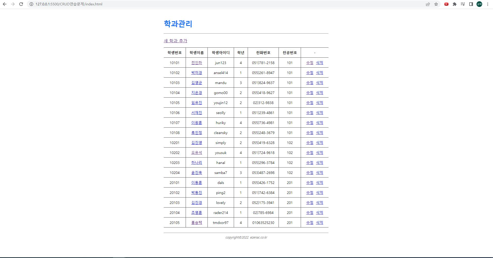
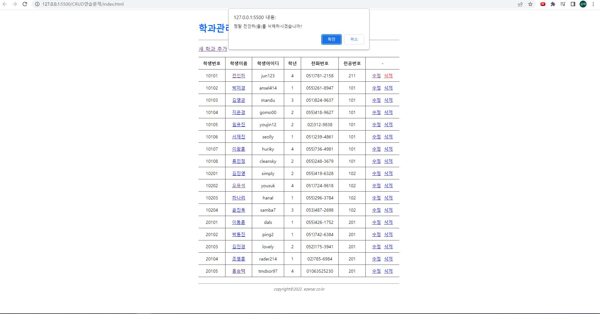
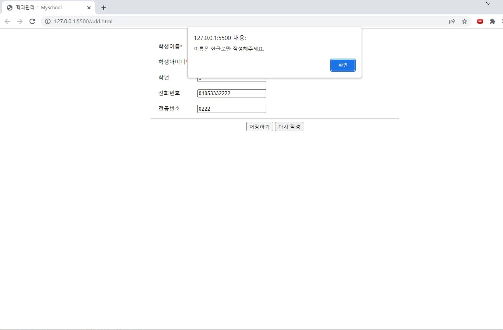
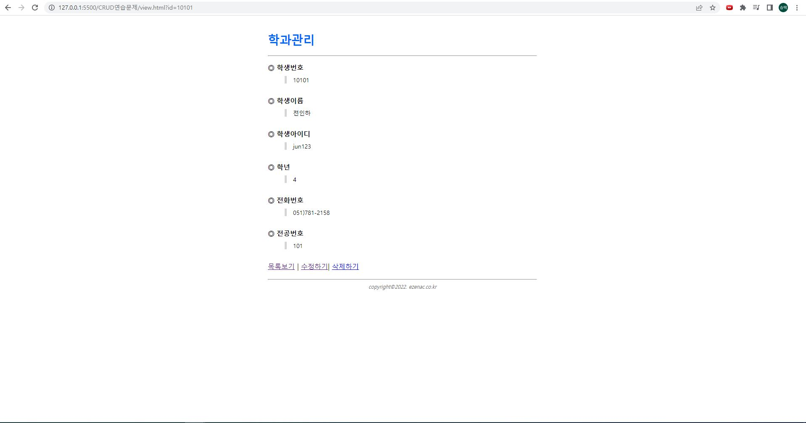
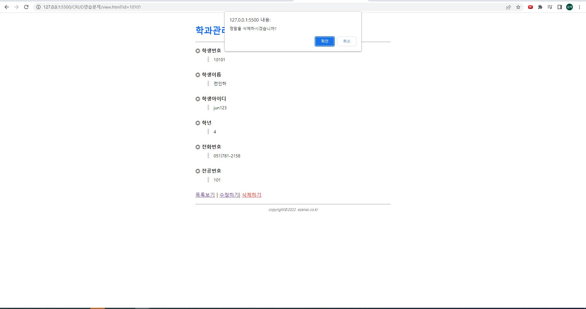
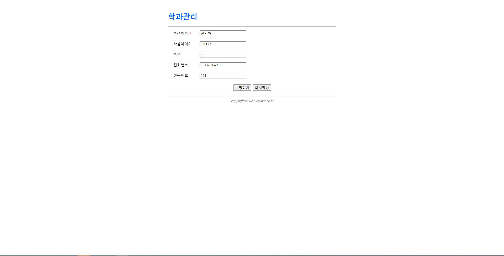
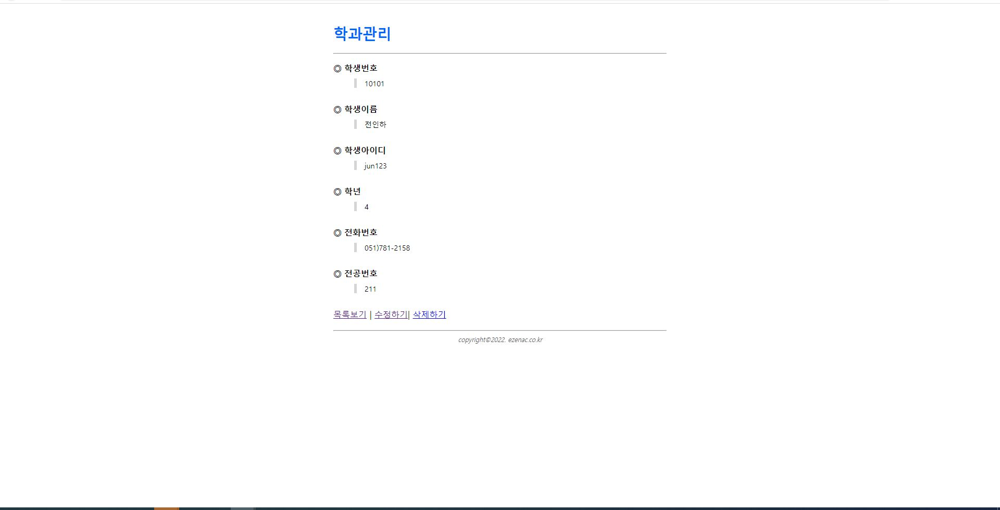

# CRUD연습문제(학생) 홍승택
> 작성일자: 2022.10.06

> 작성자: 홍승택

### index.html
```html
<!DOCTYPE html>
<html lang="ko">

<head>
    <meta charset="UTF-8">
    <meta http-equiv="X-UA-Compatible" content="IE=edge">
    <meta name="viewport" content="width=device-width, initial-scale=1.0">
    <title>학과관리 ::: MySchool</title>
    <link rel="stylesheet" href="assets/css/style.css">
</head>

<body>
    <div class="container">
        <!-- header -->
        <div data-include="inc/header.html"></div>
        <!-- body -->
        <section>
            <!-- 데이터 추가 페이지로 이동하기 위한 링크-->
            <p>
                <a href="add.html">새 학과 추가</a>
            </p>

            <!--  데이터 조회 목록을 위한 테이블 시작-->
            <table class="table">

                <thead>
                    <tr>
                        <th class="text-center">학생번호</th>

                        <th class="text-center">학생이름</th>
                        <th class="text-center">학생아이디</th>
                        <th class="text-center">학년</th>


                        <th class="text-center">전화번호</th>


                        <th class="text-center">전공번호</th>

                        <th class="text-center">-</th>
                    </tr>
                </thead>
                <tbody id="listBody">
                    <!-- Ajax로 조회한 목록이 출력될 위치-->
                </tbody>
            </table>
        </section>
        <!-- footer -->
        <div data-include="inc/footer.html"></div>
    </div>

    <script src="../node_modules/axios/dist/axios.min.js"></script>
    <script src="assets/js/include.js"></script>
    <script>
        const listBody = document.querySelector('#listBody');

        //  페이지가 실행되면서 자동으로 동작해야 하므로 즉시 실행 함수 형태로 구현
        (async () => {
            let json = null;

            try {
                const response = await axios.get('http://localhost:3001/student');
                json = response.data;

            } catch (e) {
                console.error(e);
                alert('요청 처리 실패');
                return;
            }

            json.forEach((v, i) => {
                // tr을 tbody에 추가
                const tr = document.createElement('tr');
                listBody.appendChild(tr);

                //  일련 번호를 출력한 첫 번째 칸을 tr에 추가
                const td1 = document.createElement('td');
                td1.innerHTML = v.id;
                tr.appendChild(td1);

                //  두 번째 칸을 생성한 후 tr에 추가
                const td2 = document.createElement('td');
                tr.appendChild(td2);

                //  상세보기를 위한 링크로 구현된 학과 이름을 두 번째 칸에 추가
                //  --> 어떤 학과를 열람할 것인가를 의미하는 id값을 GET 파라미터로 전달함.
                //  대체로 id라는 이름의 변수는 그 대상을 식별하기 위한 고유한 값을 의미 (일련번호)
                const a1 = document.createElement('a');
                a1.setAttribute('href', `view.html?id=${v.id}`);
                a1.innerHTML = v.name;
                td2.appendChild(a1);

                //  학과 위치를 포함하는 세 번째 칸을 tr에 추가
                const td3 = document.createElement('td');
                td3.innerHTML = v.userid;
                tr.appendChild(td3);

                const td4 = document.createElement('td');
                td4.innerHTML = v.grade;
                tr.appendChild(td4);

                const td6 = document.createElement('td');
                td6.innerHTML = v.tel;
                tr.appendChild(td6);


                const td7 = document.createElement('td');
                td7.innerHTML = v.deptno;
                tr.appendChild(td7);

                //  네 번째 칸을 생성한 후 tr에 추가
                const td8 = document.createElement('td');
                tr.appendChild(td8);

                //  어떤 항목을 수정할 것인지 GET 파라미터로 담은 링크를 네 번째 칸에 추가
                const a2 = document.createElement('a');
                a2.setAttribute('href', `edit.html?id=${v.id}`);
                a2.innerHTML = '수정';
                td8.appendChild(a2);

                // 어떤 항목을 삭제할 것인지 dataset으로 저장하고 있는 링크를 네 번째 칸에 추가
                const a3 = document.createElement('a');
                a3.setAttribute('href', '#');
                a3.dataset.id = v.id;
                a3.dataset.name = v.name;
                a3.dataset.userid = v.userid;

                a3.dataset.grade = v.grade;
                a3.dataset.tel = v.tel;
                a3.dataset.deptno = v.deptno;;
                a3.innerHTML = '삭제';
                a3.classList.add('btn-delete');
                td8.appendChild(a3);

                //  삭제 버튼에 대한 클릭 이벤트 구현
                a3.addEventListener('click', async (e) => {
                    e.preventDefault();
                    const current = e.currentTarget;
                    const id = current.dataset.id;
                    const name = current.dataset.name;
                    const userid = current.dataset.userid;

                    const grade = current.dataset.grade;
                    const tel = current.dataset.tel;
                    const deptno = current.dataset.deptno;;

                    if (confirm(`정말 ${name}(을)를 삭제하시겠습니까?`)) {
                        try {
                            await axios.delete(`http://localhost:3001/student/${id}`);
                        } catch (e) {
                            console.error(e);
                            alert('요청을 처리하는데 실패했습니다.');
                            return;
                        }
                        alert('삭제되었습니다.');
                        // 클릭된 링크를 기준으로 가장 가까운 tr태그를 상위 요소 중에서 찾아제거함
                        current.closest('tr').remove();
                    }

                });
            });
        })();
    </script>
</body>

</html>
```

### add.html

```html
<!DOCTYPE html>
<html lang="ko">
<head>
    <meta charset="UTF-8">
    <meta name="viewport" content="width=device-width, initial-scale=1.0">
    <link rel="stylesheet" href="assets/css/style.css"/>
    <title>학과관리 ::: MySchool</title>
</head>
<body>
    <div class="container">
        <!-- header -->
        <div data-include="inc/header.html"></div>
        <!-- body-->
        <section>
            <form name="form" id="department-form">
                <div class="form-group">
                    <label for="name">학생이름<span class="text-danger">*</span></label>
                    <div>
                        <input type="text" name="name" id="name" />
                    </div>
                </div>

                <div class="form-group">
                    <label for="userid">학생아이디<span class="text-danger">*</span></label>
                    <div>
                        <input type="text" name="userid" id="userid" />
                    </div>
                </div>

                <div class="form-group">
                    <label for="grade">학년</label>
                    <div>
                        <input type="text" name="grade" id="grade" />
                    </div>
                </div>

                <div class="form-group">
                    <label for="tel">전화번호</label>
                    <div>
                        <input type="text" name="tel" id="tel" />
                    </div>
                </div>

                <div class="form-group">
                    <label for="deptno">전공번호</label>
                    <div>
                        <input type="text" name="deptno" id="deptno" />
                    </div>
                </div>

                
                <hr />
                <div class="text-center">
                    <button type="submit">저장하기</button>
                    <button type="reset">다시 작성</button>
                </div>
            </form>
        </section>
        <!-- footer -->
        <div data-include="inc/footer.html"></div>
    </div>
    
    <script src="../node_modules/axios/dist/axios.min.js"></script>
    <script src="assets/js/include.js"></script>
    <script type= 'module'>
        import RegexHelper from './assets/helper/RegexHelper.js';
        document.querySelector('#department-form').addEventListener('submit', async e=> {
            e.preventDefault();

            const regexHelper = RegexHelper.getInstance();

            // 입력값 받아오기
            const name= document.querySelector('#name').value;
            const userid= document.querySelector('#userid').value;
            const grade= document.querySelector('#grade').value;
            const tel= document.querySelector('#tel').value;
            const deptno= document.querySelector('#deptno').value;
            

            let json = null;
            try{
                regexHelper.value(document.querySelector('#name'),'이름을 입력하세요.');
                regexHelper.maxLength(document.querySelector('#name'),10,'글자수는 최대 10자 입니다.');
                regexHelper.minLength(document.querySelector('#name'),1,'이름은 최소 1자 이상입니다.');
                regexHelper.kor(document.querySelector('#name'),'이름은 한글로만 작성해주세요.');

                regexHelper.value(document.querySelector('#userid'),'학생아이디를 입력하세요.');
                regexHelper.maxLength(document.querySelector('#userid'),10,'글자수는 최대 10자 입니다.');
                regexHelper.minLength(document.querySelector('#userid'),3,'학생아이디는 최소 3자 이상입니다.');
                regexHelper.engNum(document.querySelector('#userid'),'학생아이디는 영문숫자 조합으로 작성해주세요.');

                regexHelper.value(document.querySelector('#grade'),'학년을 입력하세요.');
                regexHelper.maxLength(document.querySelector('#grade'),2,'학년은 최대 2자 입니다.');
                regexHelper.minLength(document.querySelector('#grade'),1,'학년은 최소 1자 이상입니다.');
                regexHelper.num(document.querySelector('#grade'),'학년은 숫자로만 작성해주세요.');

                regexHelper.value(document.querySelector('#tel'),'전화번호를 입력하세요.');
                regexHelper.phone(document.querySelector('#tel'),'올바른 전화번호 형식으로 작성해주세요.');

                regexHelper.value(document.querySelector('#deptno'),'전공번호를 입력하세요.');
                regexHelper.maxLength(document.querySelector('#deptno'),10,'글자수는 최대 4자 입니다.');
                regexHelper.minLength(document.querySelector('#deptno'),3,'전공번호는 최소 3자 이상입니다.');
                regexHelper.num(document.querySelector('#deptno'),'전공번호는 숫자로만 작성해주세요.');


                const response = await axios.post('http://localhost:3001/student', {
                    name: name,
                    userid: userid,
                    grade: grade,
                    tel: tel,
                    deptno: deptno,
                });
                json = response.data;
            } catch(e) {
                alert(e.message);
                console.error(e);
                document.querySelector(e.selector).focus();
                return;
            }
            // 백엔드에서 데이터 저장에 대한 응답으로 보낸 JSON에는 생성된 신규 항목에 대한 일련 번호가 포함되어 있다.
            // 이 값을 활용하여 상세 페이지로 이동해야 한다.
            // 이 때, 어떤 대상을 열람할 것인지에 대한 GET 파라미터를 구성한다.
            window.location = `view.html?id=${json.id}`
        });
    </script>
</body>
</html>
```

### edit.html

```html
<!DOCTYPE html>
<html lang="ko">

<head>
    <meta charset="UTF-8">
    <meta http-equiv="X-UA-Compatible" content="IE=edge">
    <meta name="viewport" content="width=device-width, initial-scale=1.0">
    <link rel="stylesheet" href="assets/css/style.css" />
    <title>학과관리 ::: MySchool</title>
</head>

<body>
    <div class="container">
        <div data-include="inc/header.html"></div>

        <section>
            <form name="form" id="department-form">
                <input type="hidden" name="id" id="id" />

                <div class="form-group">
                    <label for="name">학생이름 <span class="text-danger">*</span></label>
                    <div>
                        <input type="text" name="name" id="name" />
                    </div>
                </div>

                <div class="form-group">
                    <label for="userid">학생아이디</label>
                    <div>
                        <input type="text" name="userid" id="userid" />
                    </div>
                </div>

                <div class="form-group">
                    <label for="grade">학년</label>
                    <div>
                        <input type="text" name="grade" id="grade" />
                    </div>
                </div>

                <div class="form-group">
                    <label for="tel">전화번호</label>
                    <div>
                        <input type="text" name="tel" id="tel" />
                    </div>
                </div>

                <div class="form-group">
                    <label for="deptno">전공번호</label>
                    <div>
                        <input type="text" name="deptno" id="deptno" />
                    </div>
                </div>
                <hr />
                <div class="text-center">
                    <button type="submit">수정하기</button>
                    <button type="reset">다시작성</button>
                </div>
            </form>
        </section>
        <div data-include="inc/footer.html"></div>
    </div>

    <script src="../node_modules/axios/dist/axios.min.js"></script>
    <script src="assets/js/include.js"></script>
    <script type="module">
        import utilHelper from './assets/helper/UtilHelper.js';
        import RegexHelper from './assets/helper/RegexHelper.js';
        const regexHelper = RegexHelper.getInstance();
        // 페이지가 실행되면서 자동으로 동작해야 하므로 즉시실행함수형태로 구현.
        (async () => {
            /** GET 파라미터 받기 */
            const params = utilHelper.getUrlParams();

            //  파라미터가 정상적이지 않으므로 메시지 출력, 전페이지 이동 처리 후 수행중단 (return)
            if (!params.id) {
                alert('학과번호가 없습니다.');
                history.back();
                return;

            }
            /** Ajax 요청 */
            //  기존에 저장되어 있는 내용을 <form>안에 셋팅하기 위해 Ajax 데이터로 가져온다.
            let json = null;
            try {
                const response = await axios.get(`http://localhost:3001/student/${params.id}/`);
                json = response.data;

            } catch (e) {
                console.error(e);
                alert('요청 처리 실패');
                return;
            }

            // 가져온 데이터가 있다면 <input> 태그의  value 속성으로 가져온 값을 적용한다.
            // 일련번호와 같이 시스템이 관리하는 값은 hidden 요소로 포함시킨다.
            document.querySelector('#id').value = json.id;
            document.querySelector('#name').value = json.name;
            document.querySelector('#userid').value = json.userid;
            document.querySelector('#grade').value = json.grade;
            document.querySelector('#tel').value = json.tel;
            document.querySelector('#deptno').value = json.deptno;
            


        })();

        /** 수정 버튼 submit 이벤트 */
        document.querySelector('#department-form').addEventListener('submit', async (e) => {
            e.preventDefault();

            // 입력값 받아오기
            const id = document.querySelector('#id').value;
            const name = document.querySelector('#name').value;
            const userid = document.querySelector('#userid').value;
            const grade = document.querySelector('#grade').value;
            const tel = document.querySelector('#tel').value;
            const deptno = document.querySelector('#deptno').value;

            try {
                await axios.put(`http://localhost:3001/student/${id}/`, {
                    name: name,
                    userid: userid,
                    grade: grade,
                    tel: tel,
                    deptno: deptno,
                });

                regexHelper.value(document.querySelector('#name'),'이름을 입력하세요.');
                regexHelper.maxLength(document.querySelector('#name'),10,'글자수는 최대 10자 입니다.');
                regexHelper.minLength(document.querySelector('#name'),1,'이름은 최소 1자 이상입니다.');
                regexHelper.kor(document.querySelector('#name'),'이름은 한글로만 작성해주세요.');

                regexHelper.value(document.querySelector('#userid'),'학생아이디를 입력하세요.');
                regexHelper.maxLength(document.querySelector('#userid'),10,'글자수는 최대 10자 입니다.');
                regexHelper.minLength(document.querySelector('#userid'),3,'학생아이디는 최소 3자 이상입니다.');
                regexHelper.engNum(document.querySelector('#userid'),'학생아이디는 영문숫자 조합으로 작성해주세요.');

                regexHelper.value(document.querySelector('#grade'),'학년을 입력하세요.');
                regexHelper.maxLength(document.querySelector('#grade'),2,'학년은 최대 2자 입니다.');
                regexHelper.minLength(document.querySelector('#grade'),1,'학년은 최소 1자 이상입니다.');
                regexHelper.num(document.querySelector('#grade'),'학년은 숫자로만 작성해주세요.');

                regexHelper.value(document.querySelector('#tel'),'전화번호를 입력하세요.');
                regexHelper.phone(document.querySelector('#tel'),'올바른 전화번호 형식으로 작성해주세요.');

                regexHelper.value(document.querySelector('#deptno'),'전공번호를 입력하세요.');
                regexHelper.maxLength(document.querySelector('#deptno'),10,'글자수는 최대 4자 입니다.');
                regexHelper.minLength(document.querySelector('#deptno'),3,'전공번호는 최소 3자 이상입니다.');
                regexHelper.num(document.querySelector('#deptno'),'전공번호는 숫자로만 작성해주세요.');

                
            } catch (e) {
                alert(e.message);
                console.error(e);
                document.querySelector(e.selector).focus();
                return;
            }
            //alert('수정되었습니다.');
            window.location.href = `view.html?id=${id}`;
        });
    </script>

</body>

</html>
```

### view.html

```html

<!DOCTYPE html>
<html lang="ko">

<head>
    <meta charset="UTF-8">
    <meta http-equiv="X-UA-Compatible" content="IE=edge">
    <meta name="viewport" content="width=device-width, initial-scale=1.0">
    <link rel="stylesheet" href="assets/css/style.css">
    <title>학과관리 ::: MySchool</title>
</head>

<body>
    <div class="container">
        <div data-include="inc/header.html"></div>

        <section>
            <dl>
                <dt>학생번호</dt>
                <dd class="id"></dd>
                <dt>학생이름</dt>
                <dd class="name"></dd>
                <dt>학생아이디</dt>
                <dd class="userid"></dd>
                <dt>학년</dt>
                <dd class="grade"></dd>
                <dt>전화번호</dt>
                <dd class="tel"></dd>
                <dt>전공번호</dt>
                <dd class="deptno"></dd>
            </dl>
            <a href="index.html">목록보기</a> | <a href="#" class="btn-edit">수정하기</a>|
            <a href="#" class="btn-delete">삭제하기</a>
        </section>
        <div data-include="inc/footer.html"></div>
    </div>

    <script src="../node_modules/axios/dist/axios.min.js"></script>
    <script src="assets/js/include.js"></script>
    <script type="module">
        import utilHelper from './assets/helper/UtilHelper.js';

        // 페이지가 실행되면서 자동으로 동작해야 하므로 즉시실행함수형태로 구현.
        (async () => {
            /** GET 파라미터 받기 */
            const params = utilHelper.getUrlParams();

            //  파라미터가 정상적이지 않으므로 메시지 출력, 전페이지 이동 처리 후 수행중단 (return)
            if (!params.id) {
                alert('학과번호가 없습니다.');
                history.back();
                return;

            }
            /** Ajax 요청 */
            //  기존에 저장되어 있는 내용을 <form>안에 셋팅하기 위해 Ajax 데이터로 가져온다.
            let json = null;
            try {
                const response = await axios.get(`http://localhost:3001/student/${params.id}/`);
                json = response.data;

            } catch (e) {
                console.error(e);
                alert('요청 처리 실패');
                return;
            }


            document.querySelector('.id').innerHTML = json.id;
            document.querySelector('.name').innerHTML = json.name;
            document.querySelector('.userid').innerHTML = json.userid;
            document.querySelector('.grade').innerHTML = json.grade;
            document.querySelector('.tel').innerHTML = json.tel;
            document.querySelector('.deptno').innerHTML = json.deptno;
            
            //  가져온 데이터의 일련번호를 사용하여 어떤 대상을 수정할지에 대한 링크 URL 구성
            document.querySelector('.btn-edit').setAttribute('href', `edit.html?id=${json.id}`);

            //  가져온 데이터의 일련번홀르 사용하여 어떤 대상을 삭제할지에 대한 dataset구성
            const btnDelete = document.querySelector('.btn-delete');
            btnDelete.dataset.id = json.id;
            btnDelete.dataset.name = json.name;
            btnDelete.dataset.userid = json.userid;
            btnDelete.dataset.grade = json.grade;
            btnDelete.dataset.tel = json.tel;
            btnDelete.dataset.deptno = json.deptno;

        })();

        /** 삭제 버튼 클릭 이벤트 */
        document.querySelector('.btn-delete').addEventListener('click', async (e) => {
            e.preventDefault();

            // 입력값 받아오기
            const current = e.currentTarget;
            const id = current.dataset.id;
            const name = current.dataset.dname;
            const userid = current.dataset.userid;

            const grade = current.dataset.grade;
            const tel = current.dataset.tel;
            const deptno = current.dataset.deptno;
            if (confirm(`정말${name}을 삭제하시겠습니까?`)) {

                try {
                    await axios.delete(`http://localhost:3001/department/${id}/`);
                } catch (e) {
                    console.error(e);
                    alert('요청 처리 실패');
                    return;
                }
                alert('삭제되었습니다.');
                window.location = `index.html`;
            }
        });
    </script>

</body>

</html>
```

### 실행결과

#### index.html




#### add.html



#### view.html



#### edit.html


