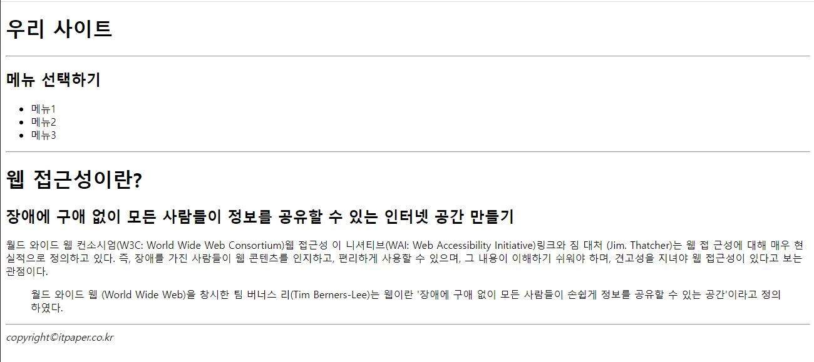

# 리액트 연습문제 1 홍승택


App.js 

```js

import Container from "./Container";
function App() {
  return (
    <Container />
  );
}

export default App;
```
index.js
```js
import React from 'react';
import ReactDOM from 'react-dom/client';
import App from './App';

const root = ReactDOM.createRoot(document.getElementById('root'));
root.render(
  <React.StrictMode>
    <App />
  </React.StrictMode>
);

```

Container.js
```js
import React from "react";

import Header from './Header';
import Content from './Content';
import Footer from './Footer';
const Container = () => {
    return(
        <div id = 'container'>
            <Header/>
            <hr />
            <Content/>
            <hr />
            <Footer/>

        </div>
    );
};

export default Container;

```
Header.js
```js
import React from "react";

const Header = () => {
    return(
        <div id = 'header'>
            <h1>우리 사이트</h1>
        </div>
    );
};

export default Header;


```
Content.js

```js
import React from "react";
import Sidebar from './Sidebar';
import Main from './Main';

const Content = () => {
    return(
        <div id='content'>
            <Sidebar/>
            <Main/>
        </div>
    );
};

export default Content;
```
Sidebar.js
```js
import React from "react";

const Sidebar = () => {
    return(
    <div id = 'sidebar'>
        <h2>메뉴 선택하기</h2>
        <ul>
            <li>메뉴1</li>
            <li>메뉴2</li>
            <li>메뉴3</li>
        </ul>
    </div>
    );
};

export default Sidebar;
```

Main.js
```js
import React from "react";

const Main = () => {
    return (
        <div id = 'main' >
            <h1>웹 접근성이란?</h1>
            <h2>장애에 구애 없이 모든 사람들이 정보를 공유할 수 있는 인터넷 공간 만들기</h2>
            <p>월드 와이드 웹 컨소시엄(W3C: World Wide Web Consortium)웹 접근성 이
                니셔티브(WAI: Web Accessibility Initiative)링크와 짐 대처 (Jim. Thatcher)는 웹 접 근성에 대해 매우 현실적으로 정의하고 있다. 즉, 장애를 가진 사람들이 웹 콘텐츠를 인지하고, 편리하게 사용할 수 있으며, 그 내용이 이해하기 쉬워야 하며, 견고성을 지녀야 웹 접근성이 있다고 보는 관점이다.
            </p>
            <blockquote>
                <p>월드 와이드 웹 (World Wide Web)을 창시한 팀 버너스 리(Tim
                    Berners-Lee)는 웹이란 '장애에 구애 없이 모든 사람들이 손쉽게 정보를 공유할 수 있는 공간'이라고 정의하였다.
                </p>
            </blockquote>

        </div>
    );
};

export default Main;
```


Footer.js

```js
import React from "react";

const Footer= () => {
    return (
        <div id = 'footer'>
            <address>copyright&copy;itpaper.co.kr</address>
        </div>
    );
};

export default Footer;
```

## 실행결과

