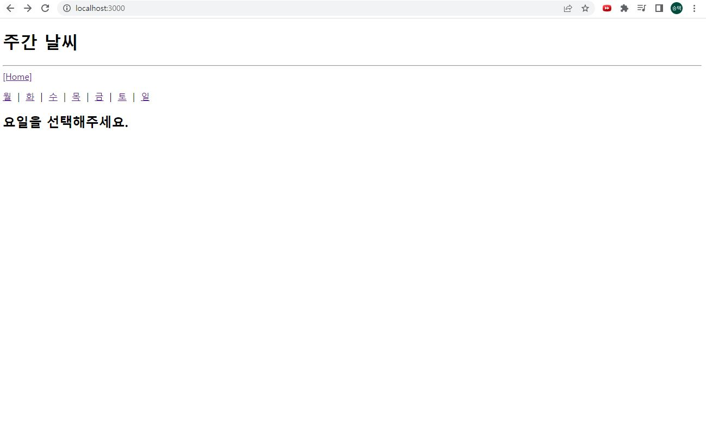
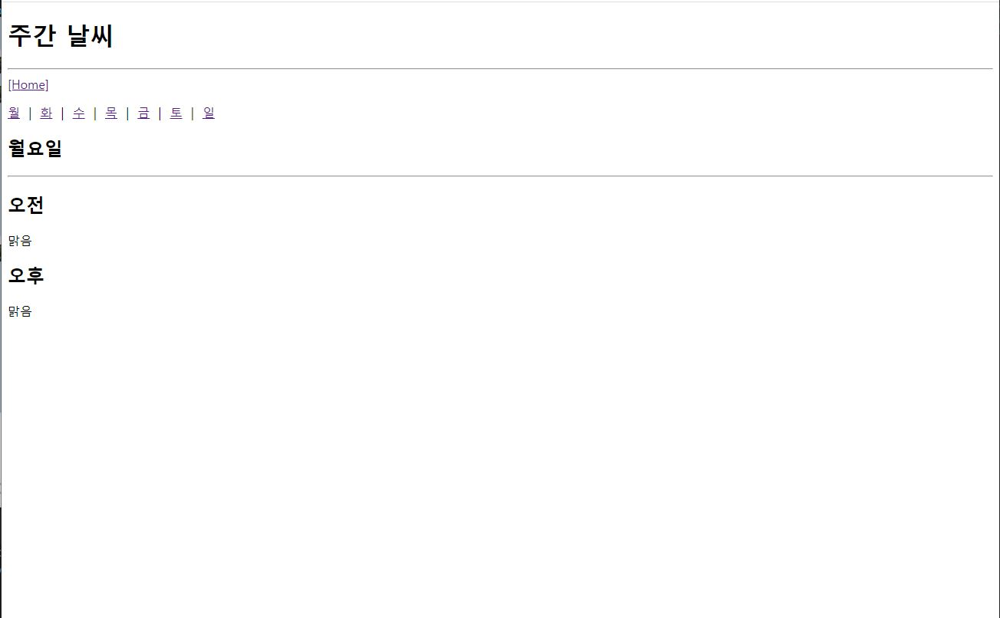

# 연습문제 React2 홍승택

App.js

```js

import React from "react";
import { Link, Routes, Route} from "react-router-dom";

import Weather from "./pages/Weather";
function App() {
  return (
    <div>
        <h1>주간 날씨</h1>
        <hr />
        <nav>
          
          {/* --- PATH 파라미터를 포함하는 링크 구성 --- */}
          <Link to = "/weather/mon">월</Link>&nbsp; | &nbsp;
          <Link to = "/weather/tue">화</Link>&nbsp; | &nbsp;
          <Link to = "/weather/wed">수</Link>&nbsp; | &nbsp;
          <Link to = "/weather/thu">목</Link>&nbsp; | &nbsp;
          <Link to = "/weather/fri">금</Link>&nbsp; | &nbsp;
          <Link to = "/weather/sat">토</Link>&nbsp; | &nbsp;
          <Link to = "/weather/sun">일</Link>

        </nav>
        {/* --- 페이지 역할을 할 컴포넌트 명시하기 --- */}
        <Routes>
          {/* Path 파라미터는 URL 형식에 변수의 위치와 이름을 정해줘야 한다. */}
          <Route path = "/weather/:day" element = {<Weather/>}/>
        </Routes>
    </div>    
  );
}

export default App;
```

Weather.js

```js
import React from 'react'
import { useParams } from 'react-router-dom';

const Weather = () => {

    console.clear();

    const params = useParams();

    const weatherList = {
        "mon": ["맑음", "맑음"],
        "tue": ["비", "맑음"],
        "wed": ["맑음", "흐림"],
        "thu": ["맑음", "흐림"],
        "fri": ["흐림", "흐림"],
        "sat": ["비", "맑음"],
        "sun": ["맑음", "맑음"],
    }

    const day = params.day;
    const days = Object.keys(weatherList);
    const korDays = ['월','화','수','목','금','토','일']
    const index = days.indexOf(day)
    if(!weatherList[day]) {
        return (<h2>존재하지 않는 요청</h2>);
    }
    return (
        <div>
            <h2>{korDays[index]}요일</h2>
            <hr />
            <h2>오전</h2>
            <p>{weatherList[day][0]}</p>
            <h2>오후</h2>
            <p>{weatherList[day][1]}</p>
        </div>
    );
};

export default Weather

```



