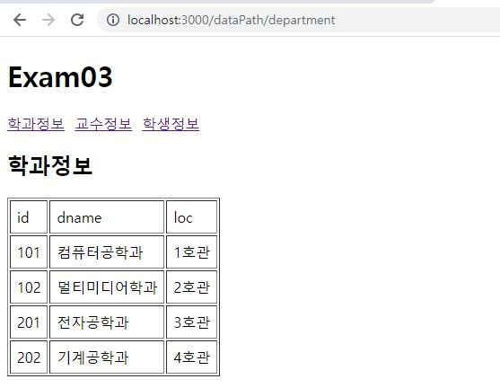
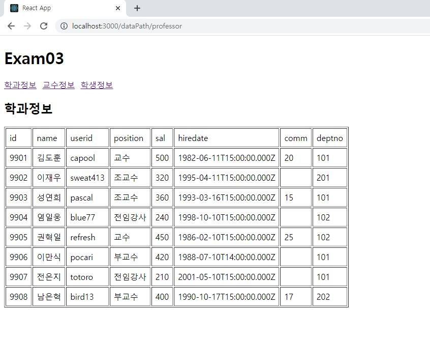
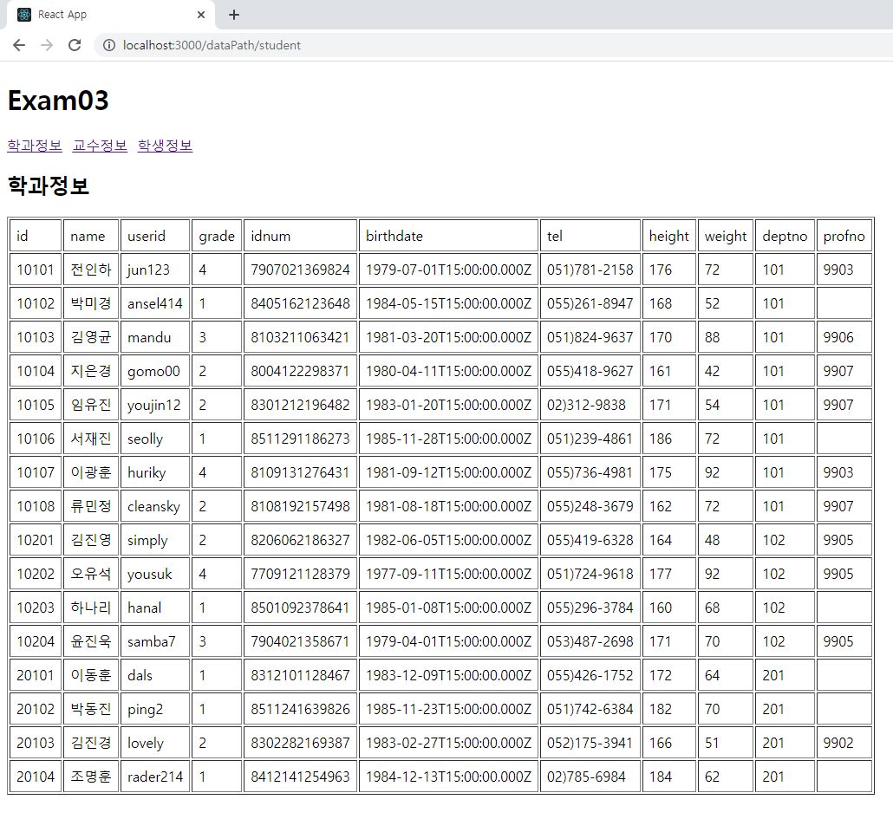

# React(3) 연습문제 홍승택

/Component/DataPath.js

```js
import React from 'react';
import { useParams } from 'react-router-dom';
import Data from '../Data.js';
const DataPath = () => {
    const params = useParams();
    const listName = params.lN;
    const head = Object.keys(Data[listName][0]);
    const createListItems = (v) => {
        let tr = [];
        let i = 0;
        for (const k in v) {
            let dt = v[k];
            if(k==='idnum'){
                dt = v[k].substring(0,6) +"-*******";
            } 
            tr.push(<td key={i}><strong>{dt}</strong></td>);
            i++;
        }
        return tr;
    }
    return (
        <div>
            <h2>학과정보</h2>
            <table border="1" cellPadding="7">
                <thead>
                    <tr>
                        {head.map(v => {
                            return (<td>{v}</td>);
                        })}
                    </tr>
                </thead>
                <tbody>
                    {Data[listName].map((v, i) => {
                        console.log(v);
                        return (
                            <tr key={i}>{createListItems(v)}</tr>
                        )
                    })}
                </tbody>
            </table>
        </div>
    );
};

export default DataPath
```

App.js

```js
import React from "react";
import{Link, Routes, Route} from 'react-router-dom';

import DataPath from "./pages/DataPath";

function App() {
  return (
    <div>
      <h1>Exam03</h1>
      <nav>
      <Link to="/dataPath/department">학과정보</Link>&nbsp;&nbsp;
      <Link to="/dataPath/professor">교수정보</Link>&nbsp;&nbsp;
      <Link to="/dataPath/student">학생정보</Link>&nbsp;&nbsp;
      </nav>

      <Routes>
        <Route path = "/datapath/:lN" element = {<DataPath/>}/>
      </Routes>
    </div>
  );
}

export default App;

```
index.js
```js
import React from 'react';
import ReactDOM from 'react-dom/client';
import App from './App';
import { BrowserRouter } from 'react-router-dom';

const root = ReactDOM.createRoot(document.getElementById('root'));
root.render(
  <React.StrictMode>
    <BrowserRouter>
    <App />
    </BrowserRouter>
  </React.StrictMode>
);

```
### 실행 결과 - 첫 로드 화면


### 실행 결과 - 학과정보 화면


### 실행 결과 - 교수정보 화면


### 실행 결과 - 학생정보 화면



### 사용한 데이터 
Data.js
```js
const data = {
    // 학과목록
    "department": [
        { "id": 101, "dname": "컴퓨터공학과", "loc": "1호관" },
        { "id": 102, "dname": "멀티미디어학과", "loc": "2호관" },
        { "id": 201, "dname": "전자공학과", "loc": "3호관" },
        { "id": 202, "dname": "기계공학과", "loc": "4호관" }
    ],
    // 교수목록
    "professor": [
        {
            "id": 9901,
            "name": "김도훈",
            "userid": "capool",
            "position": "교수",
            "sal": 500,
            "hiredate": "1982-06-11T15:00:00.000Z",
            "comm": 20,
            "deptno": 101
        },
        {
            "id": 9902,
            "name": "이재우",
            "userid": "sweat413",
            "position": "조교수",
            "sal": 320,
            "hiredate": "1995-04-11T15:00:00.000Z",
            "comm": null,
            "deptno": 201
        },
        {
            "id": 9903,
            "name": "성연희",
            "userid": "pascal",
            "position": "조교수",
            "sal": 360,
            "hiredate": "1993-03-16T15:00:00.000Z",
            "comm": 15,
            "deptno": 101
        },
        {
            "id": 9904,
            "name": "염일웅",
            "userid": "blue77",
            "position": "전임강사",
            "sal": 240,
            "hiredate": "1998-10-10T15:00:00.000Z",
            "comm": null,
            "deptno": 102
        },
        {
            "id": 9905,
            "name": "권혁일",
            "userid": "refresh",
            "position": "교수",
            "sal": 450,
            "hiredate": "1986-02-10T15:00:00.000Z",
            "comm": 25,
            "deptno": 102
        },
        {
            "id": 9906,
            "name": "이만식",
            "userid": "pocari",
            "position": "부교수",
            "sal": 420,
            "hiredate": "1988-07-10T14:00:00.000Z",
            "comm": null,
            "deptno": 101
        },
        {
            "id": 9907,
            "name": "전은지",
            "userid": "totoro",
            "position": "전임강사",
            "sal": 210,
            "hiredate": "2001-05-10T15:00:00.000Z",
            "comm": null,
            "deptno": 101
        },
        {
            "id": 9908,
            "name": "남은혁",
            "userid": "bird13",
            "position": "부교수",
            "sal": 400,
            "hiredate": "1990-10-17T15:00:00.000Z",
            "comm": 17,
            "deptno": 202
        }
    ],
    // 학생목록
    "student": [
        {
            "id": 10101,
            "name": "전인하",
            "userid": "jun123",
            "grade": 4,
            "idnum": "7907021369824",
            "birthdate": "1979-07-01T15:00:00.000Z",
            "tel": "051)781-2158",
            "height": 176,
            "weight": 72,
            "deptno": 101,
            "profno": 9903
        },
        {
            "id": 10102,
            "name": "박미경",
            "userid": "ansel414",
            "grade": 1,
            "idnum": "8405162123648",
            "birthdate": "1984-05-15T15:00:00.000Z",
            "tel": "055)261-8947",
            "height": 168,
            "weight": 52,
            "deptno": 101,
            "profno": null
        },
        {
            "id": 10103,
            "name": "김영균",
            "userid": "mandu",
            "grade": 3,
            "idnum": "8103211063421",
            "birthdate": "1981-03-20T15:00:00.000Z",
            "tel": "051)824-9637",
            "height": 170,
            "weight": 88,
            "deptno": 101,
            "profno": 9906
        },
        {
            "id": 10104,
            "name": "지은경",
            "userid": "gomo00",
            "grade": 2,
            "idnum": "8004122298371",
            "birthdate": "1980-04-11T15:00:00.000Z",
            "tel": "055)418-9627",
            "height": 161,
            "weight": 42,
            "deptno": 101,
            "profno": 9907
        },
        {
            "id": 10105,
            "name": "임유진",
            "userid": "youjin12",
            "grade": 2,
            "idnum": "8301212196482",
            "birthdate": "1983-01-20T15:00:00.000Z",
            "tel": "02)312-9838",
            "height": 171,
            "weight": 54,
            "deptno": 101,
            "profno": 9907
        },
        {
            "id": 10106,
            "name": "서재진",
            "userid": "seolly",
            "grade": 1,
            "idnum": "8511291186273",
            "birthdate": "1985-11-28T15:00:00.000Z",
            "tel": "051)239-4861",
            "height": 186,
            "weight": 72,
            "deptno": 101,
            "profno": null
        },
        {
            "id": 10107,
            "name": "이광훈",
            "userid": "huriky",
            "grade": 4,
            "idnum": "8109131276431",
            "birthdate": "1981-09-12T15:00:00.000Z",
            "tel": "055)736-4981",
            "height": 175,
            "weight": 92,
            "deptno": 101,
            "profno": 9903
        },
        {
            "id": 10108,
            "name": "류민정",
            "userid": "cleansky",
            "grade": 2,
            "idnum": "8108192157498",
            "birthdate": "1981-08-18T15:00:00.000Z",
            "tel": "055)248-3679",
            "height": 162,
            "weight": 72,
            "deptno": 101,
            "profno": 9907
        },
        {
            "id": 10201,
            "name": "김진영",
            "userid": "simply",
            "grade": 2,
            "idnum": "8206062186327",
            "birthdate": "1982-06-05T15:00:00.000Z",
            "tel": "055)419-6328",
            "height": 164,
            "weight": 48,
            "deptno": 102,
            "profno": 9905
        },
        {
            "id": 10202,
            "name": "오유석",
            "userid": "yousuk",
            "grade": 4,
            "idnum": "7709121128379",
            "birthdate": "1977-09-11T15:00:00.000Z",
            "tel": "051)724-9618",
            "height": 177,
            "weight": 92,
            "deptno": 102,
            "profno": 9905
        },
        {
            "id": 10203,
            "name": "하나리",
            "userid": "hanal",
            "grade": 1,
            "idnum": "8501092378641",
            "birthdate": "1985-01-08T15:00:00.000Z",
            "tel": "055)296-3784",
            "height": 160,
            "weight": 68,
            "deptno": 102,
            "profno": null
        },
        {
            "id": 10204,
            "name": "윤진욱",
            "userid": "samba7",
            "grade": 3,
            "idnum": "7904021358671",
            "birthdate": "1979-04-01T15:00:00.000Z",
            "tel": "053)487-2698",
            "height": 171,
            "weight": 70,
            "deptno": 102,
            "profno": 9905
        },
        {
            "id": 20101,
            "name": "이동훈",
            "userid": "dals",
            "grade": 1,
            "idnum": "8312101128467",
            "birthdate": "1983-12-09T15:00:00.000Z",
            "tel": "055)426-1752",
            "height": 172,
            "weight": 64,
            "deptno": 201,
            "profno": null
        },
        {
            "id": 20102,
            "name": "박동진",
            "userid": "ping2",
            "grade": 1,
            "idnum": "8511241639826",
            "birthdate": "1985-11-23T15:00:00.000Z",
            "tel": "051)742-6384",
            "height": 182,
            "weight": 70,
            "deptno": 201,
            "profno": null
        },
        {
            "id": 20103,
            "name": "김진경",
            "userid": "lovely",
            "grade": 2,
            "idnum": "8302282169387",
            "birthdate": "1983-02-27T15:00:00.000Z",
            "tel": "052)175-3941",
            "height": 166,
            "weight": 51,
            "deptno": 201,
            "profno": 9902
        },
        {
            "id": 20104,
            "name": "조명훈",
            "userid": "rader214",
            "grade": 1,
            "idnum": "8412141254963",
            "birthdate": "1984-12-13T15:00:00.000Z",
            "tel": "02)785-6984",
            "height": 184,
            "weight": 62,
            "deptno": 201,
            "profno": null
        }
    ]
};

export default data;
```