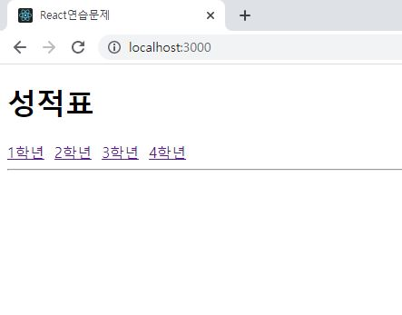
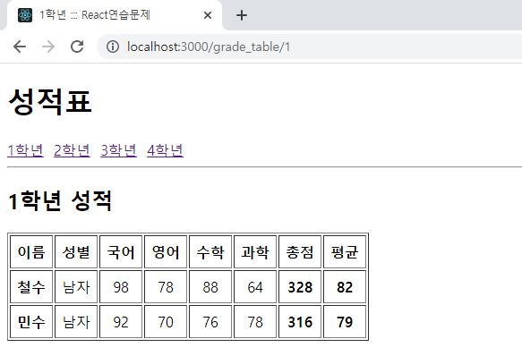
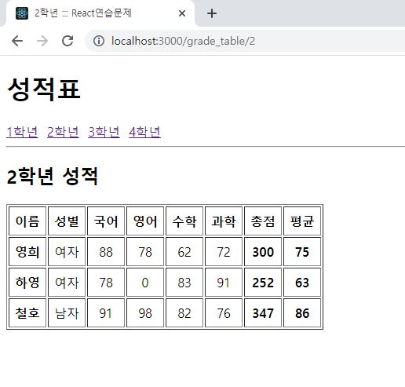
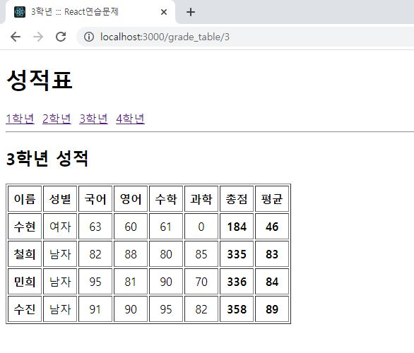
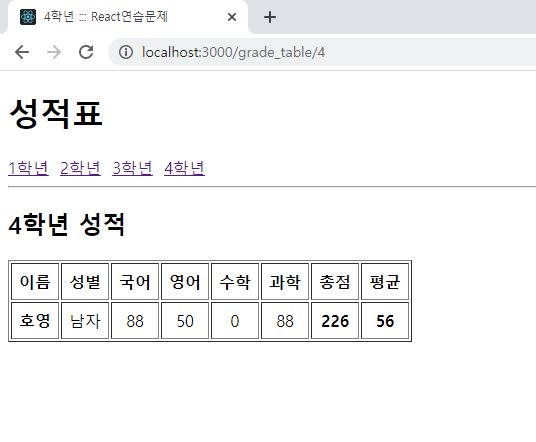

# 연습문제 (4) - prop 홍승택

components/GradeItem.js
```js
import React from 'react'
import PropTypes from 'prop-types';

const GradeItem = ({name,sex,kor,eng,math,sinc}) => {
  const sum = parseInt(kor+eng+math+sinc);
    const avg = Math.floor(sum/4);
    return (
        <tr align = "center">
            <td><strong>{name}</strong></td>
            <td>{sex}</td>
            <td>{kor}</td>
            <td>{eng}</td>
            <td>{math}</td>
            <td>{sinc}</td>
            <td><strong>{sum}</strong></td>
            <td><strong>{avg}</strong></td>
        </tr>
    );
};
GradeItem.propTypes = {
  name: PropTypes.string.isRequired,
  sex: PropTypes.string.isRequired,
};

GradeItem.defaultProps = {
  kor:0,
  eng:0,
  math:0,
  sinc:0
};
export default GradeItem;
```

components/Meta.js
```js
import React from 'react'
import { Helmet, HelmetProvider } from 'react-helmet-async';
const Meta = (props) => {
    
    return (
        <HelmetProvider>
            <Helmet>
                <meta charset='utf-8' />
                <title>{props.title}</title>
                {/*SEO 태그 */}
                <meta name="description" content={props.description} />
                
                
            </Helmet>
        </HelmetProvider>
    );
};

export default Meta;
```

pages/GradeTable.js
```js
import React from 'react'
import { useParams } from 'react-router-dom';

import GrandItem from '../components/GradeItem';
import Meta from '../components/Meta';

import Data from '../GradeData';
const GradeTable = () => {
  const params = useParams();
  const listName = params.grade;
  const data = Data[listName+"학년"];

  return (
    <div>
      <Meta title={`${listName}학년 ::: React연습문제`} description={`${listName}학년 성적 정보`} />
      <h2>{listName+"학년 성적"}</h2>
      <table border="1" cellPadding="7">
        <thead>
          <tr align="center">
            <th>이름</th>
            <th>성별</th>
            <th>국어</th>
            <th>영어</th>
            <th>수학</th>
            <th>과학</th>
            <th>총점</th>
            <th>평균</th>
          </tr>
        </thead>
        <tbody>
          {data.map((v,i) => {
            return(<GrandItem
              key={i}
              name={v.이름}
              level={v.학년}
              sex={v.성별}
              kor={v.국어}
              eng={v.영어}
              math={v.수학}
              sinc={v.과학}
              />)
          })}
        </tbody>
      </table>
    </div>
  );
}

export default GradeTable
```

App.js

```js
import React from "react";
import { Link, Routes, Route } from 'react-router-dom'
import GradeTable from "./pages/GradeTable";
import Meta from './components/Meta';

function App() {
  return (
    <div>
      <Meta title='React연습문제' description='React 연습문제 첫 로드페이지' />
      <h1>성적표</h1>
      <nav>
        <Link to="grade_table/1">1학년</Link>&nbsp;|&nbsp;
        <Link to="grade_table/2">2학년</Link>&nbsp;|&nbsp;
        <Link to="grade_table/3">3학년</Link>&nbsp;|&nbsp;
        <Link to="grade_table/4">4학년</Link>
      </nav>
      <hr />
      <Routes>
        <Route path="grade_table/:grade" element={<GradeTable/>} />
      </Routes>
    </div>
  );
}

export default App;

```


index.js
```js
import React from 'react';
import ReactDOM from 'react-dom/client';
import App from './App';
import {BrowserRouter} from 'react-router-dom';


const root = ReactDOM.createRoot(document.getElementById('root'));
root.render(
  <BrowserRouter>
    <App />
  </BrowserRouter>
  
);


```
### 첫 로드 페이지


### 1학년 페이지


### 2학년 페이지


### 3학년 페이지



### 4학년 페이지



### 사용데이터
GreadeData.js
```js
const GradeData = {
    "1학년": [
        { "이름": "철수", "성별": "남자", "국어": 98, "영어": 78, "수학": 88, "과학": 64 },
        { "이름": "민수", "성별": "남자", "국어": 92, "영어": 70, "수학": 76, "과학": 78 }
    ],
    "2학년": [
        { "이름": "영희", "성별": "여자", "국어": 88, "영어": 78, "수학": 62, "과학": 72 },
        { "이름": "하영", "성별": "여자", "국어": 78, "수학": 83, "과학": 91 },
        { "이름": "철호", "성별": "남자", "국어": 91, "영어": 98, "수학": 82, "과학": 76 }
    ],
    "3학년": [
        { "이름": "수현", "성별": "여자", "국어": 63, "영어": 60, "수학": 61 },
        { "이름": "철희", "성별": "남자", "국어": 82, "영어": 88, "수학": 80, "과학": 85 },
        { "이름": "민희", "성별": "남자", "국어": 95, "영어": 81, "수학": 90, "과학": 70 },
        { "이름": "수진", "성별": "남자", "국어": 91, "영어": 90, "수학": 95, "과학": 82 }
    ],
    "4학년": [
        { "이름": "호영", "성별": "남자", "국어": 88, "영어": 50, "과학": 88 }
    ],
};

export default GradeData;
```