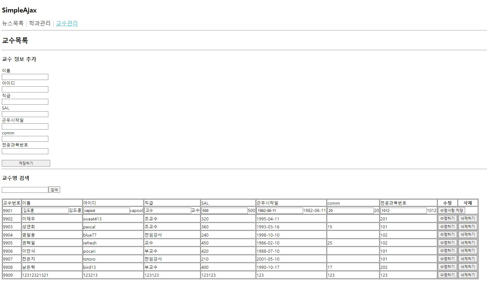

# 연습문제 React - (10) 홍승택


## code
index.js

```js
import React from 'react';
import ReactDOM from 'react-dom/client';
import App from './App';
import { BrowserRouter } from 'react-router-dom';

const root = ReactDOM.createRoot(document.getElementById('root'));
root.render(
  <BrowserRouter>
    <App />
  </BrowserRouter>
);


```


App.js

```js
import React from "react";
import MenuLink from "./components/MenuLink";
import {Routes, Route} from 'react-router-dom';
import News from "./pages/News";
import Department from "./pages/Department";
import Professor from "./pages/Professor";
const App = () => {
  return (
    <div>
      <h2>SimpleAjax</h2>

      <nav>
        <MenuLink to ='/news'>뉴스목록</MenuLink>
        <MenuLink to ='/department'>학과관리</MenuLink>
        <MenuLink to ='/professor'>교수관리</MenuLink>
      </nav>

      <hr />

      <Routes>
        <Route path='/news' element={<News/>}/>
        <Route path='/department' element={<Department/>}/>
        <Route path='/professor' element={<Professor/>}/>
      </Routes>
    </div>
  );
}

export default App;
```


MenuLink.js

```js
import React from 'react';
import styled from 'styled-components';
import { NavLink } from 'react-router-dom';

/** 메뉴링크 --> NavLink: 현재 머물고 있는 페이지와 관련된  CSS 적용 */
const MenuLinkContainer = styled(NavLink)`
    font-size: 20px;
    cursor: pointer;
    text-decoration: none;
    padding-bottom: 2px;
    color: #222;

    /** CSS의 가상클래스 hover */
    &:hover {
        color: #22b8cf;
    }

    &:after {
        content: '|';
        display: inline-block;
        padding: 0 7px;
        color: #ccc;
    }

    &:last-child {
        &:after {
            /** 글자색을 흰색으로 지정하여 화면에서 숨긴다 */
            color: #fff;
        }
    }

    /**
        URL이 현재 메뉴를 가르키는 경우 (콜론이 아닌 점에 주의)
        활성 메뉴에 적용되는 기본 클래스 이름이 'active'이다.
    */
    &.active {
        text-decoration: underline;
        color: #22b8cf;

        &:after {
            /** 흰색선을 추가하여 .active에서 지정한 border를 덮을 수 있도록 지정한다.(가림효과)) */
            border-bottom: 4px solid #fff !important;
        }
    }
`;

const MenuLink = ({to, children}) => <MenuLinkContainer to={to}>{children}</MenuLinkContainer>;

export default MenuLink;
```


Spinner.js

```js
import React, {memo} from 'react';
import PropTypes from 'prop-types';


/** 로딩바 컴포넌트 */
// --> hhtps://mhnpd.github.io/react-loader-spinner/
import {Blocks} from 'react-loader-spinner';

const Spinner = memo(({loading, width, height}) => {
    return(
        <Blocks
            visible={loading}
            height={width}
            width={height}
            ariaLabel='blocks-loading'
            wrapperStyle={{
                position:'absolute',
                zIndex: 9999,
                left: '50%',
                top: '50%',
                transform: 'translate(-50%,50%)'
            }}
            wrapperClass='blocks-wrapper'/>
    );
});

/** 기본 값 정의 */
Spinner.defaultProps = {
    visible: false,
    width: 100,
    height: 100
};

/** 데이터 타입 설정 */
Spinner.propTypes = {
    visible: PropTypes.bool.isRequired,
    width: PropTypes.number,
    height: PropTypes.number,
};

export default Spinner;
```


Professor.js
```js
import React, { memo, useState, useEffect, useCallback } from 'react';
import axios from 'axios';
import Spinner from '../components/Spinner';
import { useLocation, useNavigate } from 'react-router-dom';


const Professor = memo(() => {
    /** state */
    // loading state
    const [loading, setLoading] = React.useState(false);
    // 화면 표시 상태값
    const [professor, setProfessor] = React.useState([]);
    // 검색 키워드
    const [keyword, setKeyword] = React.useState('');
    // 삭제 항목 id 저장 상태변수
    const [dropId, setDropId] = React.useState(-1);
    // 수정할 항목에 대한 id값을 저장하기 위한 상태값
    const [updateId, setUpdateId] = React.useState(-1);

    /** URL 변수 */
    const URL = 'http://localhost:3001/professor'

    /** 페이지가 처음 열렸을 때 실행할 hook */
    React.useEffect(() => {
        // start Loading ajax
        setLoading(true);


        setTimeout(() => {
            (async () => {
                try {
                    const response = await axios.get(URL, {
                        // 검색어가 있다면 position값으로 설정, 그렇지 않으면 정의하지 않음
                        params: keyword ? { position: keyword, } : null
                    });
                    // 일반 업뎃 setprofessor(response.professor);
                    //  함수형 업데이트
                    //  async 안에서는 함수형 업데이트를 사용하는게 더 좋다고 함!
                    setProfessor(professor => response.data);
                } catch (e) {
                    console.error(e);
                    alert('Ajax 연동 실패');
                } finally {
                    // Ajax 로딩 종료
                    setLoading(false);
                }
            })();
        }, 500);
    }, [keyword]);


    /** 검색어 입력 요소에 연결할 참조 변수 */
    const myKeywordInput = React.useRef();
    /** 검색 버튼 Click 이벤트 */
    const onButtonClick = React.useCallback(e => {
        setKeyword(myKeywordInput.current.value);

    }, []);
    const onEnter = React.useCallback(e => {
        if (e.key == 'Enter') {
            setKeyword(myKeywordInput.current.value);
        }
    }, []);

    /** form에서 submit 이벤트가 발생할 때 호출될 이벤트 핸들러. */
    const onProfessorSave = React.useCallback(e => {
        e.preventDefault();
        const form = e.currentTarget;
        //  form안에 있는 입력 요소 값 추출
        const name = form.name.value;
        const userid = form.userid.value;
        const position = form.position.value;
        const sal = form.sal.value;
        const hiredate = form.hiredate.value;
        const comm = form.comm.value;
        const deptno = form.deptno.value;

        //  Ajax 로딩 start
        setLoading(true);

        setTimeout(() => {
            (async () => {
                // 결과 저장 json
                let json = null;
                try {
                    //Post 방식 전송 파라미터 정의
                    const response = await axios.post(URL, {
                        id: '',
                        name: name,
                        userid: userid,
                        position: position,
                        sal: sal,
                        hiredate: hiredate,
                        comm: comm,
                        deptno: deptno
                    });
                    json = response.data;
                } catch (e) {
                    console.error(e);
                    alert('데이터 저장 실패');
                } finally {
                    setLoading(false);
                }

                if (json != null) {
                    //  기존의 상태값과 배열간 병합을 처리하기 위해 응답결과를 배열로 묶음
                    const addArr = [json];
                    setProfessor(professor => professor.concat(addArr));
                }
                console.log(form);
            })();
        }, 450);
    }, []);
    /** Ref for searching selector*/
    const filterRef = React.useRef();

    /** 삭제하기 버튼이 클릭되었을때 호출될 이벤트 핸들러 */
    //  성능 최적화를 위해 useCallback() 적용함
    const onDeleteClick = React.useCallback(e => {
        const crt = e.currentTarget;
        const id = parseInt(crt.dataset.id);
        setDropId(id);
    }, [])

    /** 데이터 수정 버튼 클릭 이벤트 핸들러 */
    const onDataEditClick = useCallback(e => {
        e.preventDefault();
        const crt = e.currentTarget;
        const id = parseInt(crt.dataset.id);
        setUpdateId(id);
    }, []);

    /** 데이터 수정사항 저장 버튼 click 이벤트 */
    const onDataEditSubmit = useCallback(e => {
        e.preventDefault();

        const crt = e.target;
        console.log(crt);
        const id = crt.id.value;
        const name = crt.name.value;
        const userid = crt.userid.value;
        const position = crt.position.value;
        const sal = crt.sal.value;
        const hiredate = crt.hiredate.value;
        const comm = crt.comm.value;
        const deptno = crt.deptno.value;

        //  백엔드에 데이터가 수정되었음을 알림
        (async () => {
            setLoading(true);

            let json = null;

            try {
                const response = await axios.put(URL + `/${id}`, {
                    id: id,
                    name: name,
                    userid: userid,
                    position: position,
                    sal: sal,
                    hiredate: hiredate,
                    comm: comm,
                    deptno: deptno
                });

                json = response.data;
            } catch (e) {
                console.error(e);
                alert(`데이터 수정 실패 \n ${e.message}`);
                return;
            } finally {
                setLoading(false);
            }
            if (json !== null) {
                setProfessor(professor => {
                    const editId = professor.findIndex((v) => v.id === json.id);
                    professor.splice(editId, 1, json);

                    return professor;
                });
            }
        })();
        setUpdateId(-1);
    }, []);

    /** dropid useEffect */
    React.useEffect(() => {
        if (dropId !== -1) {
            // dropId가 아닌것만 걸러내서 professor 상태변수 변경
            setProfessor(professor => professor.filter((v, i) => v.id !== dropId));

            setLoading(true);
            setTimeout(() => {
                (async () => {
                    try {
                        await axios.delete(URL + `/${dropId}`);
                    } catch (e) {
                        console.error(e);
                        alert('연동실패 ');
                    } finally {
                        setLoading(false);
                    }
                })();
            }, 500);

            setDropId(-1);
        }
    }, [dropId]);

    /** use to create HTML DOM */
    const types = ['교수번호', '이름', '아이디', '직급', 'SAL', '근무시작일', 'comm', '전공과목번호'];
    const types2 = ['이름', '아이디', '직급', 'SAL', '근무시작일', 'comm', '전공과목번호'];
    const selector = ['id', 'name', 'userid', 'position', 'sal', 'hiredate', 'comm', 'deptno'];
    const saveTypes = ['name', 'userid', 'position', 'sal', 'hiredate', 'comm', 'deptno'];
    return (
        <div>
            {/* loading bar */}
            <Spinner loading={loading} />
            <h2>교수목록</h2>
            <hr />
            <h3>교수 정보 추가</h3>
            <form onSubmit={onProfessorSave}>
                {saveTypes.map((v, idx) => {
                    return (
                        <div key={idx + 30}>
                            <label htmlFor={v} style={{ display: 'block' }}> {types2[idx]} </label>
                            <input type="text" name={v} id={v} />

                        </div>
                    );
                })}
                <br />
                <button type="submit" style={{ width: '177px' }}>저장하기</button>
            </form>
            <hr />
            <h3>교수명 검색</h3>
            <form >
                {/* input태그가 하나일때에는 엔터를 치면 submit이 강제로 되버려서 숨겨진 input태그를 하나 추가해주었다. */}
                <input hidden="hidden" />
                <input type="text" name="keyword" ref={myKeywordInput} onKeyPress={onEnter} />
                <button type='button' onClick={onButtonClick}>검색</button>
            </form>
            <br />
            <form onSubmit={onDataEditSubmit}>
            <table border='1'>
                <thead>
                    <tr>
                        {types.map((v, i) => {
                            return (
                                <td key={i + 100}>
                                    {v}
                                </td>
                            );
                        })}
                        <th>수정</th>
                        <th>삭제</th>
                    </tr>
                </thead>
                <tbody>

                    {professor.length === 0 ? (
                        <tr>
                            <td colSpan={types.length + 2} align='center'>
                                검색결과 X
                            </td>
                        </tr>
                    ) : (
                        professor.map((item, idx) => {
                            let keys = Object.keys(item);

                            if (item.id === updateId) {
                                return (
                                    <tr key={item.id}>
                                        {keys.map((v1, idx1) => {
                                            if (idx1 == 0) {
                                                return (
                                                    <td key={idx1}>
                                                        <input type="hidden" name='id' defaultValue={item.id} />
                                                        {item[v1]}
                                                    </td>
                                                )
                                            } else if (idx1 == 5) {
                                                return(
                                                <td key={idx1}>
                                                    <input type="text" name={v1} defaultValue={item[v1].substring(0,10)} />{item[v1].substring(0,10)}
                                                </td>
                                                );
                                            } else {
                                                return (
                                                    <td key={idx1}>
                                                        <input type="text" name={v1} defaultValue={item[v1]} />{item[v1]}
                                                    </td>
                                                )
                                            }
                                        })}
                                        <td colSpan='2'>
                                            <button type='submit'>
                                                수정사항 저장
                                            </button>
                                        </td>
                                    </tr>
                                )
                            } else {

                                return (
                                    <tr key={item.id}>
                                        {/* 수정을 위한 input 요소 표시 */}

                                        {keys.map((v2, i2) => {
                                            if (v2 === 'hiredate') {
                                                return (<td key={i2 + 20}>{item[v2].substring(0, 10)}</td>);
                                            }
                                            return (<td key={i2 + 20}>{item[v2]}</td>);
                                        })}
                                        <td>
                                            <button type='button' data-id={item.id} onClick={onDataEditClick}>
                                                수정하기
                                            </button>
                                        </td>
                                        <td>
                                            <button type='button' data-id={item.id} onClick={onDeleteClick}>
                                                삭제하기
                                            </button>
                                        </td>
                                    </tr>
                                );
                            }
                        })
                    )}

                </tbody>
            </table>
            </form>
        </div>
    );
});

export default Professor;

```

### 실행화면



