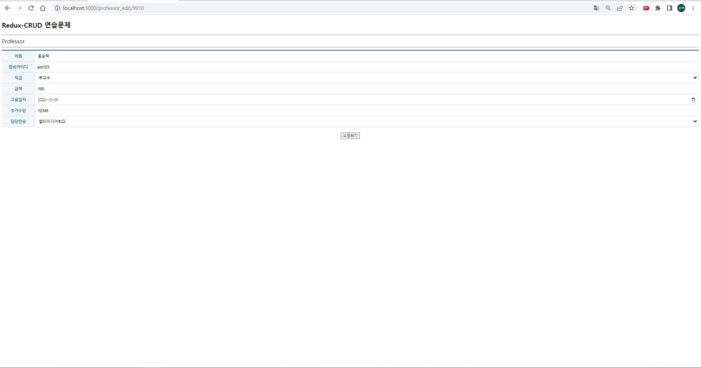

# 22.11.16-Redux-CRUD(1) 연습문제 홍승택

# 파일 구조
```
src 
├────  components
│           ├─ ErrorView.js
│           ├─ MenuLink.js
│           ├─ Spinner.js
│           ├─ Table.js
│           └─ TableEx.js
├────  helper
│           └─ ReduxHelper.js
├────  pages
│           ├─ ProfessorAdd.js
│           ├─ ProfessorEdit.js
│           ├─ ProfessorList.js
│           └─ ProfessorView.js
├────  slices
│           ├─ DepartmentSlice.js
│           └─ ProfessorSlice.js
├────  App.js
├────  index.js
└────  store.js

/backend/data.json

.env.development
.env.production

```

### components, helper는 공통되므로 생략

# pages

### ProfessorAdd.js
```js
import React, { memo, useCallback, useEffect } from 'react';
/** 주소 강제 이동 */
import { useNavigate } from 'react-router-dom';
/** redux 패키지 */
import { useSelector, useDispatch } from 'react-redux';
/** ProfessorSlice 이용 */
import { postItem } from '../slices/ProfessorSlice';
/** DepartmentSlice 이용 */
import { getDepartmentList } from '../slices/DepartmentSlice';

/** 컴포넌트 */
import TableEx from '../components/TableEx';
import Spinner from '../components/Spinner';
import ErrorView from '../components/ErrorView';

const ProfessorAdd = memo(() => {
  // 슬라이스 사용을 위한 초기화
  const dispatch = useDispatch();
  /** professor */
  const { loading: loading1, error: error1 } = useSelector(state => state.ProfessorSlice);
  /** department(부서선택을 위함) */
  const { data: department, loading: loading2, error: error2 } = useSelector(state => state.DepartmentSlice);

  // 저장 후 주소 이동을 위한 네비게이터 '/professor' 로 갈 것
  const navigate = useNavigate();

  /** 최초 렌더링 시 학과 목록 불러옴 */
  useEffect(() => {
    dispatch(getDepartmentList());
  }, []);

  /** 데이터 폼 제출 시 이벤트 처리 */
  const onSubmitAdd = useCallback(e => {
    e.preventDefault();
    const current = e.currentTarget;
    
    dispatch(postItem({
      name: current.name.value,
      userid: current.userid.value,
      position: current.position.value,
      sal: current.sal.value,
      hiredate: current.hiredate.value,
      comm: current.comm.value,
      deptno: current.deptno.value
    })).then((result) => {
      // dispatch 함수는 promise 객체를 반환함, 성공시 fulfilled의 리턴이 결과로 나옴.
      navigate(`/professor_view/${result.payload.id}`);
    });
  }, [dispatch, navigate]);
  return (
    <>
      <Spinner loading={loading1 || loading2} />
      {
        error2 ? (
          <ErrorView error={error2} />
        ) : (
            <form onSubmit={onSubmitAdd}>
              <TableEx>
                <colgroup>
                  <col width='120' />
                  <col />
                </colgroup>
                <tbody>
                  <tr>
                    <th>이름</th>
                    <td className='inputWrapper'>
                      <input type="text" className="field" name='name' />
                    </td>
                  </tr>

                  <tr>
                    <th>접속아이디</th>
                    <td className='inputWrapper'>
                      <input type="text" className="field" name='userid' />
                    </td>
                  </tr>

                  <tr>
                    <th>직급</th>
                    <td className='inputWrapper'>
                      <select className="field" name='position' >
                        <option value="교수">교수</option>
                        <option value="부교수">부교수</option>
                        <option value="조교수">조교수</option>
                        <option value="전임강사">전임강사</option>
                      </select>
                    </td>
                  </tr>

                  <tr>
                    <th>급여</th>
                    <td className='inputWrapper'>
                      <input type="number" className="field" name='sal' />
                    </td>
                  </tr>

                  <tr>
                    <th>고용일자</th>
                    <td className='inputWrapper'>
                      <input type="datetime-local" className="field" name='hiredate' />
                    </td>
                  </tr>

                  <tr>
                    <th>추가수당</th>
                    <td className='inputWrapper'>
                      <input type="number" className="field" name='comm' />
                    </td>
                  </tr>

                  <tr>
                    <th>담당전공</th>
                    <td className='inputWrapper'>
                      <select name="deptno" className='field'>
                        <option value = "">---- 담당전공을 선택해주세요 ----</option>
                        {
                          department && department.map((v, i) => {
                            return (
                              <option key={v.id} value={v.id}>{v.dname}</option>
                            );
                          })
                        }
                      </select>
                    </td>
                  </tr>
                </tbody>
              </TableEx>

              <div style={{ textAlign: 'center', marginTop: '20px' }}>
                <button type="submit">저장하기</button>
              </div>
            </form>
          )}
    </>
  );
});

export default ProfessorAdd;
```

### ProfessorEdit.js
```js
import React, { memo, useCallback, useEffect, useMemo } from 'react';
/** 리덕스 사용 */
import { useSelector, useDispatch } from 'react-redux';

/** 파라미터, 네비게이터 사용 */
import { useParams, useNavigate } from 'react-router-dom';

/** 고용일자를 위한 dayjs */
import dayjs from 'dayjs';

/** 동기로 받아오는 형식을 위함 */
import { getCurrentData } from '../slices/ProfessorSlice';

/** 슬라이스 */
import { getDepartmentList } from '../slices/DepartmentSlice';
import { getItem, putItem} from '../slices/ProfessorSlice';
/** 컴포넌트 */
import Spinner from '../components/Spinner';
import TableEx from '../components/TableEx';
import ErrorView from '../components/ErrorView';


const ProfessorEdit = memo(() => {
  /** path 파라미터 받기 */
  const {id} = useParams();

  /** 리덕스 관련 초기화 */
  const dispatch = useDispatch();
  const {data: professor, loading: loading1, error: error1} = useSelector(state => state.ProfessorSlice);
  const {data: department, loading: loading2, error: error2} = useSelector(state => state.DepartmentSlice);

  /** 데이터 가져오기 */
  useEffect(() => {
    dispatch(getCurrentData());
    dispatch(getDepartmentList());
  },[]);

  /** professor 데이터 변경에 따른 사이드 이펙트 처리 */
  const item = useMemo(() => {
    if(professor){
      return professor.find((v,i) => v.id == id);
    } else {
      dispatch(getItem({id: id}));
    }
  },[professor]);
  /**  페이지 강제 이동을 위한 Navigate */
  const navigate = useNavigate();

  /** form의 submit이 눌렸을 때 호출될 이벤트 핸들러 */
  const onProfessorSubmit = useCallback(e => {
    e.preventDefault();
    const current = e.currentTarget;

    dispatch(putItem({
      id: current.id.value,
      name: current.name.value,
      userid: current.userid.value,
      position: current.position.value,
      sal: current.sal.value,
      hiredate: current.hiredate.value,
      comm: current.comm.value,
      deptno: current.deptno.value,
    })).then((result) => {
      navigate(`/professor_view/${result.payload.id}`);
    });
  },[]);
  return (
    <>
    <Spinner loading={loading1 || loading2} />
    {
      error1 || error2 ? (
        <ErrorView error={error1||error2} />
      ) : (
          <form onSubmit={onProfessorSubmit}>
            <input type="hidden" name="id"  defaultValue={item?.id}/>
            <TableEx>
              <colgroup>
                <col width='120' />
                <col />
              </colgroup>
              <tbody>
                <tr>
                  <th>이름</th>
                  <td className='inputWrapper'>
                    <input type="text" className="field" name='name'  defaultValue={item?.name} />
                  </td>
                </tr>

                <tr>
                  <th>접속아이디</th>
                  <td className='inputWrapper'>
                    <input type="text" className="field" name='userid' defaultValue={item?.userid} />
                  </td>
                </tr>

                <tr>
                  <th>직급</th>
                  <td className='inputWrapper'>
                    <select className="field" name='position' defaultValue={item?.position} >
                      <option value="교수">교수</option>
                      <option value="부교수">부교수</option>
                      <option value="조교수">조교수</option>
                      <option value="전임강사">전임강사</option>
                    </select>
                  </td>
                </tr>

                <tr>
                  <th>급여</th>
                  <td className='inputWrapper'>
                    <input type="number" className="field" name='sal' defaultValue={item?.sal} />
                  </td>
                </tr>

                <tr>
                  <th>고용일자</th>
                  <td className='inputWrapper'>
                    <input type="date" className="field" name='hiredate' defaultValue={dayjs(item?.hiredate).format("YYYY-MM-DD")} />
                  </td>
                </tr>

                <tr>
                  <th>추가수당</th>
                  <td className='inputWrapper'>
                    <input type="number" className="field" name='comm' defaultValue={item?.comm} />
                  </td>
                </tr>

                <tr>
                  <th>담당전공</th>
                  <td className='inputWrapper'>
                    <select name="deptno" className='field' defaultValue={item?.deptno} >

                      {
                        department && department.map((v, i) => {
                          return (
                            <option key={v.id} value={v.id}>{v.dname}</option>
                          );
                        })
                      }
                    </select>
                  </td>
                </tr>
              </tbody>
            </TableEx>

            <div style={{ textAlign: 'center', marginTop: '20px' }}>
              <button type="submit">수정하기</button>
            </div>
          </form>
        )}
  </>
  );
});

export default ProfessorEdit;
```

### ProfessorList.js
```js
import React, { memo, useEffect, useCallback } from "react";
import { NavLink, useNavigate } from "react-router-dom";

import Spinner from "../components/Spinner";
import ErrorView from "../components/ErrorView";
import Table from "../components/Table";
import dayjs from "dayjs";
import { useDispatch, useSelector } from "react-redux";
import { deleteItem, getList } from "../slices/ProfessorSlice";

import styled from "styled-components";

import { useQueryString } from "../hooks/useQueryString";

const ControlContainer = styled.form`
  position: sticky;
  top: 0;
  background-color: #fff;
  border-top: 1px solid #eee;
  border-bottom: 1px solid #eee;
  padding: 10px 0;

  .control {
    margin-right: 5px;
    display: inline-block;
    font-size: 16px;
    padding: 7px 10px 5px 10px;
    border: 1px solid #ccc;
  }

  .clickable {
    background-color: #fff;
    color: #000;
    text-decoration: none;
    cursor: pointer;

    &:hover {
      background-color: #06f2;
    }

    &:active {
      transform: scale(0.9, 0.9);
    }
  }
`;

const ProfessorList = memo(() => {
  // queryString 추출
  const { keyword } = useQueryString();
  /** 리덕스 초기화 */
  const dispatch = useDispatch();
  const { data, loading, error } = useSelector((state) => state.ProfessorSlice);

  /** 최초 마운트 시 리덕스를 통한 목록 조회 */
  React.useEffect(() => {
    dispatch(getList({
      keyword: keyword
    }));
  }, [keyword]);

  /** 페이지 강제 이동 */
  const navigate = useNavigate();
  /** 검색 이벤트 */
  const onSubmitSearch = useCallback(e => {
    e.preventDefault();
    const current = e.currentTarget;
    const keyword = current.keyword;

    let redirectUrl = keyword.value ? `/professor/?keyword=${keyword.value}` : '/professor'
    navigate(redirectUrl);
  },[navigate])

  /** 삭제 버튼에 대한 이벤트 리스너 */
  const onProfessorItemDelete = useCallback(e => {
    e.preventDefault();
    const current = e.currentTarget;
    const {id, name} = current.dataset;

    if(window.confirm(`정말 ${name}을 삭제하시겠습니까?`)){
      dispatch(deleteItem({
        id:id
      })).then(({meta, payload}) => {
        navigate('/professor');
      });
    }
  },[]);
  /** 수정 버튼에 대한 이벤트 리스너 */
  const onProfessorEditClick = useCallback(e => {
    e.preventDefault();

    const current = e.currentTarget;
    const { id } = current.dataset;

    navigate(`/professor_edit/${id}`);
  });
  return (
    <div>
      {/* 로딩바 */}
      <Spinner loading={loading} />

      {/* 검색폼 */}
      <ControlContainer onSubmit={onSubmitSearch}>
        <input type="text" name='keyword' className="control" />
        <button type='submit' className="control clickable">Search</button>
        <NavLink to = '/professor_add' className="control clickable">교수정보 추가하기</NavLink>
      </ControlContainer>

      {/* 조회결과 */}
      {error ? (
        <ErrorView error={error} />
      ) : (
        //Ajax 처리 결과 존재
        data && (
          <Table>
            <thead>
              <tr>
                <th>교수번호</th>
                <th>이름</th>
                <th>접속아이디</th>
                <th>직급</th>
                <th>급여</th>
                <th>고용일자</th>
                <th>추가수당</th>
                <th>전공번호</th>
                <th>수정하기</th>
                <th>삭제하기</th>
              </tr>
            </thead>
            <tbody>
              {
              data.length > 0 ? (
                  data.map(item => {
                    return (
                      <tr key={item.id}>
                        <td>{item.id}</td>
                        <td>
                          <NavLink to={`/professor_view/${item.id}`}>{item.name}</NavLink>
                        </td>
                        <td>{item.userid}</td>
                        <td>{item.position}</td>
                        <td>{item.sal}</td>
                        <td>{dayjs(item.hiredate).format("YYYY-MM-DD")}</td>
                        <td>{item.comm}</td>
                        <td>{item.deptno}</td>
                        <td>
                          <button type="button" data-id = {item.id} onClick={onProfessorEditClick}>
                            수정하기
                          </button>
                        </td>
                        <td>
                          <button type="button" data-id={item.id} data-name={item.name} onClick={onProfessorItemDelete}>
                            삭제하기
                          </button>
                        </td>
                      </tr>
                    )
                  })
                ) : (
                  <tr>
                    <td colSpan='10' align='center'>
                      검색결과가 없습니다.
                    </td>
                  </tr>
                )}  
            </tbody>
          </Table>
        )
      )}
    </div>
  );
});

export default ProfessorList;

```

### ProfessorView.js
```js
import React, { memo, useEffect, useMemo, useCallback } from "react";
import { NavLink, useParams, useNavigate } from "react-router-dom";
import { useSelector, useDispatch } from "react-redux";
import { getCurrentData, deleteItem, getItem } from "../slices/ProfessorSlice";
import dayjs from "dayjs";

import Spinner from "../components/Spinner";
import ErrorView from "../components/ErrorView";
import Table from "../components/TableEx";

const ProfessorView = memo(() => {
  /** path 파라미터 */
  const { id } = useParams();
  /** 리덕스 초기화 */
  const dispatch = useDispatch();
  const { data, loading, error } = useSelector((state) => state.ProfessorSlice);

  /** 렌더링 시 데이터 가져오기 */
  useEffect(() => {
    dispatch(getItem({ id: id }));
  }, []);

  /** data 값의 변경에 따른 사이드 이펙트 처리 */
  const item = useMemo(() => {
    if (data) {
      return data.find((v, i) => v.id == id);
    } else {
      dispatch(getItem({ id: id }));
    }
  }, [data]);

  /** 페이지 강제 이동을 위한 navigate */
  const navigate = useNavigate();

  /** 삭제 버튼에 대한 이벤트 리스너 */
  const onProfessorItemDelete = useCallback(e => {
    e.preventDefault();

    const current = e.currentTarget;
    const { id, name } = current.dataset;

    if (window.confirm(`정말 ${name}을 삭제하시겠습니까?`)) {
      dispatch(deleteItem({
        id: id
      })).then(({ meta, payload }) => {
        navigate('/professor');
      });
    }
  }, []);
  /** 수정 버튼 리스너 */
  const onProfessorEdit = useCallback(e => {
    e.preventDefault();

    const current = e.currentTarget;
    const { id } = current.dataset;

    navigate(`/professor_edit/${id}`);
  }, []);
  return (
    <div>
      <Spinner loading={loading} />

      {error ? (
        <ErrorView error={error} />
      ) : (

        item && (
          <div>
            <Table>
              <colgroup>
                <col width='120' />
                <col />
              </colgroup>

              <tbody>
                <tr>
                  <th>교수번호</th>
                  <td>{item.id}</td>
                </tr>

                <tr>
                  <th>이름</th>
                  <td>{item.name}</td>
                </tr>

                <tr>
                  <th>접속아이디</th>
                  <td>{item.userid}</td>
                </tr>

                <tr>
                  <th>직급</th>
                  <td>{item.position}</td>
                </tr>

                <tr>
                  <th>급여</th>
                  <td>{item.sal}</td>
                </tr>

                <tr>
                  <th>고용일자</th>
                  <td>{dayjs(item.hiredate).format("YYYY-MM-DD")}</td>
                </tr>

                <tr>
                  <th>추가수당</th>
                  <td>{item.comm}</td>
                </tr>

                <tr>
                  <th>전공번호</th>
                  <td>{item.deptno}</td>
                </tr>


              </tbody>
            </Table>
            <div style={{ textAlign: 'center' }}>
              <NavLink to="/professor">목록</NavLink>
              &nbsp;|&nbsp;
              <NavLink to="/professor_add">등록</NavLink>
              &nbsp;|&nbsp;
              <NavLink to="/professor_edit" data-id={item.id} onClick={onProfessorEdit}>수정</NavLink>
              &nbsp;|&nbsp;
              <NavLink to="/professor/#!" data-id={item.id} data-name={item.name} onClick={onProfessorItemDelete}>삭제</NavLink>
            </div>
          </div>
        )
      )}

    </div>
  );
});

export default ProfessorView;
```

# slices

### DepartmentSlice.js
```js
import { createSlice, createAsyncThunk } from "@reduxjs/toolkit";
import axios from "axios";
import {pending, fulfilled,rejected} from '../helper/ReduxHelper';

export const getDepartmentList = createAsyncThunk("DepartmentSlice/getDepartmentList", async(payload, {rejectWithValue}) => {
    let result = null;
    const URL = process.env.REACT_APP_API_DEPARTMENT_LIST;
    try{
        const response = await axios.get(URL);
        result= response.data;
    } catch(e){
        result = rejectWithValue(e.response);
    }

    return result;
});

const DepartmentSlice = createSlice({
    name: 'DepartmentSlice',
    initialState: {
        data: null,
        loading: false,
        error: null
    },
    extraReducers: {
        [getDepartmentList.pending] : pending,
        [getDepartmentList.fulfilled] : fulfilled,
        [getDepartmentList.rejected] : rejected
    }
});

export default DepartmentSlice.reducer;
```
### ProfessorSlice.js
```js
/**
 * 이 단계를 수행하기 위해서는 ../helper/ReduxHelper.js의 작업이 선행되어야 한다.
 */
import { createSlice, createAsyncThunk } from "@reduxjs/toolkit";
import axios from "axios";
import { pending, fulfilled, rejected } from "../helper/ReduxHelper";
import { cloneDeep } from "lodash";

/** 다중행 데이터 조회를 위한 비동기 함수 */
export const getList = createAsyncThunk("ProfessorSlice/getList", async (payload, { rejectWithValue }) => {
  let result = null;
  const URL = process.env.REACT_APP_API_PROFESSOR_LIST;

  
  let params = null;

  if (payload?.keyword) {
    params = {
      
      name: payload.keyword,
    };
  }

  try {
    const response = await axios.get(URL, { params: params });
    result = response.data;
  } catch (err) {
    result = rejectWithValue(err.response);
  }

  return result;
});

/** 단일행 데이터 조회를 위한 비동기 함수 */
export const getItem = createAsyncThunk("ProfessorSlice/getItem", async (payload, { rejectWithValue }) => {
  let result = null;

  // 환경설정 파일에 정의된 URL에서 ':id' 부분을 찾아 payload를 통해 전달된 일련번호로 치환
  const URL = process.env.REACT_APP_API_PROFESSOR_ITEM.replace(":id", payload.id);

  try {
    const response = await axios.get(URL);
    result = response.data;
  } catch (err) {
    result = rejectWithValue(err.response);
  }

  return result;
});

/** 데이터 저장을 위한 비동기 함수 */
export const postItem = createAsyncThunk("ProfessorSlice/postItem", async (payload, { rejectWithValue }) => {
  let result = null;
  const URL = process.env.REACT_APP_API_PROFESSOR_LIST;

  try {
    const response = await axios.post(URL, {
      name: payload.name,
      userid: payload.userid,
      position: payload.position,
      sal: payload.sal,
      hiredate: payload.hiredate,
      comm: payload.comm,
      deptno: payload.deptno
    });
    result = response.data;
  } catch (err) {
    result = rejectWithValue(err.response);
  }

  return result;
});

/** 데이터 수정을 위한 비동기 함수 */
export const putItem = createAsyncThunk("ProfessorSlice/putItem", async (payload, { rejectWithValue }) => {
  let result = null;

  // 환경설정 파일에 정의된 URL에서 ':id' 부분을 찾아 payload를 통해 전달된 일련번호로 치환
  const URL = process.env.REACT_APP_API_PROFESSOR_ITEM.replace(":id", payload.id);

  try {
    const response = await axios.put(URL, {
      name: payload.name,
      userid: payload.userid,
      position: payload.position,
      sal: payload.sal,
      hiredate: payload.hiredate,
      comm: payload.comm,
      deptno: payload.deptno
    });
    result = response.data;
  } catch (err) {
    result = rejectWithValue(err.response);
  }

  return result;
});

/** 데이터 삭제를 위한 비동기 함수 */
export const deleteItem = createAsyncThunk("ProfessorSlice/deleteItem", async (payload, { rejectWithValue }) => {
  let result = null;

  // 환경설정 파일에 정의된 URL에서 ':id' 부분을 찾아 payload를 통해 전달된 일련번호로 치환
  const URL = process.env.REACT_APP_API_PROFESSOR_ITEM.replace(":id", payload.id);

  try {
    const response = await axios.delete(URL);
    result = response.data;
  } catch (err) {
    result = rejectWithValue(err.response);
  }

  return result;
});

const ProfessorSlice = createSlice({
  name: "ProfessorSlice",
  initialState: {
    data: null,
    loading: false,
    error: null,
  },

  reducers: {
    getCurrentData: (state, action) => {
      return state;
    },
  },

  
  extraReducers: {
    /** 다중행 데이터 조회를 위한 액션 함수 */
    [getList.pending]: pending,
    [getList.fulfilled]: fulfilled,
    [getList.rejected]: rejected,
    /** 단일행 데이터 조회를 위한 액션 함수 */
    [getItem.pending]: pending,
    [getItem.fulfilled]: (state, { meta, payload }) => {
      return {
        // 전체적으로 데이터가 배열이지만, 단일행 조회의 경우 단건의 데이터만 응답결과로 수신되므로,
        // 배열로 묶어서 처리한다.
        data: [payload],
        loading: false,
        error: null,
      };
    },
    [getItem.rejected]: rejected,
    /** 데이터 저장을 위한 액션 함수 */
    [postItem.pending]: pending,
    [postItem.fulfilled]: (state, { meta, payload }) => {
      // 기존의 상태값을 복사한다. (원본이 JSON이므로 깊은 복사를 수행해야 한다.)
      const data = cloneDeep(state.data);
      console.log(data);

      // 새로 저장된 결과를 기존 상태값 배열의 맨 뒤에 추가한다.
      data.push(payload);

      return {
        data: data,
        loading: false,
        error: null,
      };
    },
    [postItem.rejected]: rejected,
    /** 데이터 수정을 위한 액션 함수 */
    [putItem.pending]: pending,
    [putItem.fulfilled]: (state, { meta, payload }) => {
      const data = cloneDeep(state.data);

      const targetId = data.findIndex((v, i) => v.id == meta.arg.id);
      console.log(targetId);

      data.splice(targetId, 1, payload);

      return {
        data: data,
        loading: false,
        error: null,
      };
    },
    [putItem.rejected]: rejected,
    /** 데이터 삭제를 위한 액션 함수 */
    [deleteItem.pending]: pending,
    [deleteItem.fulfilled]: (state, { meta, payload }) => {
      // 기존의 상태값을 복사한다. (원본이 JSON 이므로 깊은 복사를 수행해야 한다.)
      const data = cloneDeep(state.data);

      // id값이 일치하는 항목의 배열 인덱스를 찾는다.
      const targetId = data.findIndex((v, i) => v.id == meta.arg.id);
      console.log(targetId);

      // 해당 인덱스의 원소를 삭제한다.
      data.splice(targetId, 1);

      return {
        data: data,
        loading: false,
        error: null,
      };
    },
    [deleteItem.rejected]: rejected,
  },
});

export const { getCurrentData } = ProfessorSlice.actions;
export default ProfessorSlice.reducer;

```

# 기본 구성요소들
### App.js
```js
import React, { memo } from "react";
import { NavLink, Routes, Route } from "react-router-dom";
import MenuLink from "./components/MenuLink";
import ProfessorList from "./pages/ProfessorList";
import ProfessorAdd from "./pages/ProfessorAdd";
import ProfessorView from "./pages/ProfessorView";
import ProfessorEdit from "./pages/ProfessorEdit";


const App = memo(() => {
  return (
    <div>
      <nav>
        <NavLink to='/' exapt='true' style={{ textDecoration: 'none', color: 'black' }}><h1>Redux-CRUD 연습문제</h1></NavLink>
        <hr />
        <MenuLink to='/professor'>Professor</MenuLink>

        {/* <MenuLink to = '/student'>Student</MenuLink>&nbsp;|
        <MenuLink to = '/traffic_acc'>Traffic</MenuLink>&nbsp; */}
      </nav>
      <hr />

      <Routes>
        <Route path="/professor" element={<ProfessorList />} />
        <Route path="/professor_add" element={<ProfessorAdd />} />
        <Route path="/professor_view/:id" element={<ProfessorView />} />
        <Route path="/professor_edit/:id" element={<ProfessorEdit />} />
      </Routes>
    </div>
  );
});

export default App;

```

### index.js
```js
import React from "react";
import ReactDOM from "react-dom/client";

/**/
import App from "./App";
/*/
import App from "./Test";
/**/

import { BrowserRouter } from "react-router-dom";
import { Provider } from "react-redux";
import store from "./store";

const root = ReactDOM.createRoot(document.getElementById("root"));
root.render(
  <Provider store={store}>
    <BrowserRouter>
      <App />
    </BrowserRouter>
  </Provider>
);

```

### store.js

```js
import { configureStore } from "@reduxjs/toolkit";
import ProfessorSlice from "./slices/ProfessorSlice";
import DepartmentSlice from "./slices/DepartmentSlice";

const store = configureStore({
  reducer: { 
    ProfessorSlice: ProfessorSlice,
    DepartmentSlice: DepartmentSlice
  },
});
export default store;

```

# 실행결과

### 메인페이지 ('/professor')


### 검색결과


### 교수정보 추가


### 교수정보 추가 후 메인페이지


### 교수정보 제거


### 교수정보 제거 후 메인페이지


### 교수정보 수정

