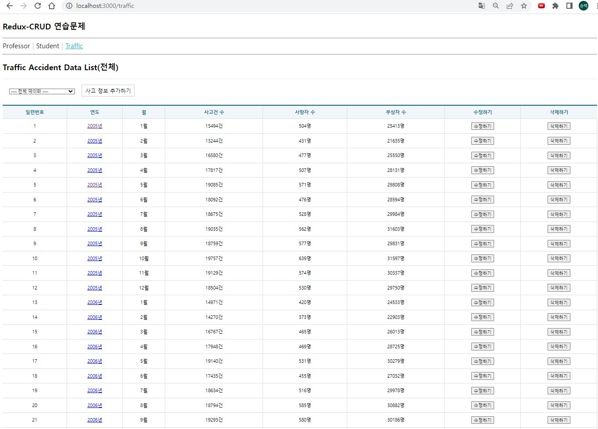
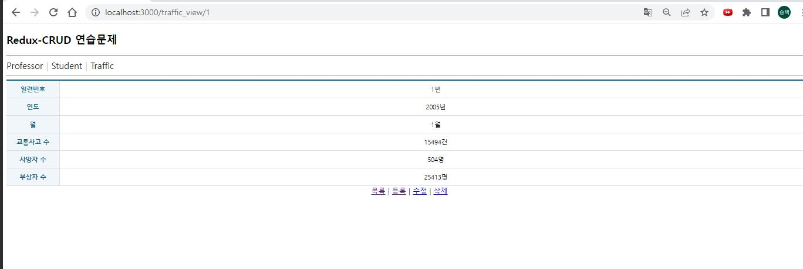
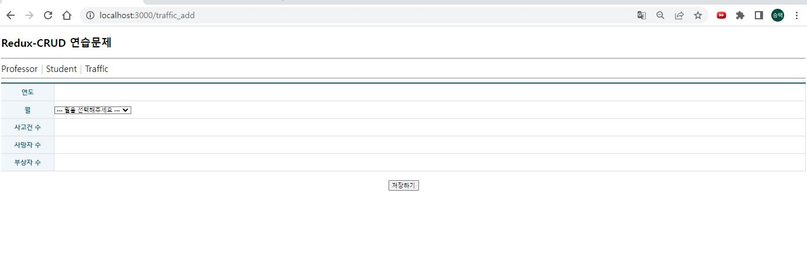
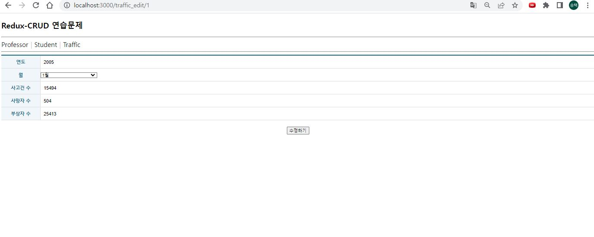
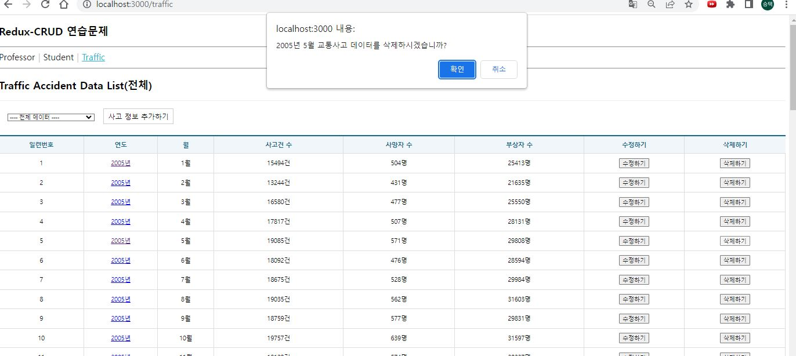

# 22.11.16-Redux-CRUD(3) 연습문제 홍승택

# 파일 구조
```
src 
├────  components
│           ├─ ErrorView.js
│           ├─ MenuLink.js
│           ├─ Spinner.js
│           ├─ Table.js
│           └─ TableEx.js
├────  helper
│           └─ ReduxHelper.js
├────  pages
│           ├─ TrafficAdd.js
│           ├─ TrafficEdit.js
│           ├─ TrafficList.js
│           └─ TrafficView.js
├────  slices
│           └─ TrafficSlice.js
├────  App.js
├────  index.js
└────  store.js

/backend/data.json

.env.development
.env.production

```

# pages
### TrafficAdd.js
```js
import React, { memo, useCallback, useEffect } from 'react';
/** 주소 강제 이동 */
import { useNavigate } from 'react-router-dom';
/** redux 패키지 */
import { useSelector, useDispatch } from 'react-redux';

import { postItem } from '../slices/TrafficSlice';

/** 컴포넌트 */
import TableEx from '../components/TableEx';
import Spinner from '../components/Spinner';
import ErrorView from '../components/ErrorView';

const ProfessorAdd = memo(() => {
  // 슬라이스 사용을 위한 초기화
  const dispatch = useDispatch();

  const { loading, error} = useSelector(state => state.TrafficSlice);
  
  // 저장 후 주소 이동을 위한 네비게이터 '/professor' 로 갈 것
  const navigate = useNavigate();

  
  /** 데이터 폼 제출 시 이벤트 처리 */
  const onSubmitAdd = useCallback(e => {
    e.preventDefault();
    const current = e.currentTarget;
    
    dispatch(postItem({
      id: null,
      year: current.year.value,
      month: current.month.value,
      accident: current.accident.value,
      death: current.death.value,
      injury: current.injury.value

    })).then((result) => {
      // dispatch 함수는 promise 객체를 반환함, 성공시 fulfilled의 리턴이 결과로 나옴.
      navigate(`/traffic_view/${result.payload.id}`);
    });
  }, [dispatch, navigate]);
  return (
    <>
      <Spinner loading={loading} />
      {
        error ? (
          <ErrorView error={error} />
        ) : (
            <form onSubmit={onSubmitAdd}>
              <TableEx>
                <colgroup>
                  <col width='120' />
                  <col />
                </colgroup>
                <tbody>
                  <tr>
                    <th>연도</th>
                    <td className="inputWrapper">
                      <input type="text" className="field" name="year" />
                    </td>
                  </tr>

                  <tr>
                    <th>월</th>
                    <td className="inputWrapper">
                      <select name="month">
                        <option value="">--- 월을 선택해주세요 ---</option>
                        {
                          [...new Array(12)].map((v,idx) => {
                            return(
                            <option key={idx+1} value={idx+1}>{idx+1}월</option>
                            );
                          })
                        }
                      </select>
                    </td>
                  </tr>

                  <tr>
                    <th>사고건 수</th>
                    <td className="inputWrapper">
                      <input type="text" className="field" name="accident" />
                    </td>
                  </tr>

                  <tr>
                    <th>사망자 수</th>
                    <td className="inputWrapper">
                      <input type="text" className="field" name="death" />
                    </td>
                  </tr>

                  <tr>
                    <th>부상자 수</th>
                    <td className="inputWrapper">
                      <input type="text" className="field" name="injury" />
                    </td>
                  </tr>
                </tbody>
              </TableEx>

              <div style={{ textAlign: 'center', marginTop: '20px' }}>
                <button type="submit">저장하기</button>
              </div>
            </form>
          )}
    </>
  );
});

export default ProfessorAdd;
```
### TrafficEdit.js
```js
import React, { memo, useCallback, useEffect, useMemo } from 'react';
/** 리덕스 사용 */
import { useSelector, useDispatch } from 'react-redux';

/** 파라미터, 네비게이터 사용 */
import { useParams, useNavigate } from 'react-router-dom';

/** 슬라이스 */
import { getItem, putItem, getCurrentData } from '../slices/TrafficSlice';

/** 컴포넌트 */
import Spinner from '../components/Spinner';
import TableEx from '../components/TableEx';
import ErrorView from '../components/ErrorView';


const TrafficEdit = memo(() => {
    const { id } = useParams();

    const dispatch = useDispatch();
    const { data, loading, error } = useSelector(state => state.TrafficSlice);
    useEffect(() => {
        dispatch(getCurrentData());
    },[])
    /** Traffic 데이터 변경에 따른 사이드 이펙트 처리 */
    const item = useMemo(() => {
        if (data) {
            return data.find((v, i) => v.id == id);
        } else {
            dispatch(getItem({ id: id }));
        }
    }, [data]);

    const navigate = useNavigate();

    const onSubmitEdit = useCallback(e => {
        e.preventDefault();
        const current = e.currentTarget;

        dispatch(putItem({
            id: current.id.value,
            year: current.year.value,
            month: current.month.value,
            accident: current.accident.value,
            death: current.death.value,
            injury: current.injury.value
        })).then((result) => {
            navigate(`/traffic_view${result.payload.id}`);
        });
    }, [])
    return (
        <>
            <Spinner loading={loading} />
            {
                error ? (
                    <ErrorView error={error} />
                ) : (
                    data && (

                        <form onSubmit={onSubmitEdit}>
                            <input type="hidden" name="id" defaultValue={item.id} />
                            <TableEx>
                                <colgroup>
                                    <col width='120' />
                                    <col />
                                </colgroup>
                                <tbody>
                                    <tr>
                                        <th>연도</th>
                                        <td className="inputWrapper">
                                            <input type="text" className="field" name="year" defaultValue={item.year} />
                                        </td>
                                    </tr>

                                    <tr>
                                        <th>월</th>
                                        <td className="inputWrapper">
                                            <select name="month" defaultValue={item.month}>
                                                <option value="" >--- 월을 선택해주세요 ---</option>
                                                {
                                                    [...new Array(12)].map((v, idx) => {
                                                        return (
                                                            <option key={idx + 1} value={idx + 1}>{idx + 1}월</option>
                                                        );
                                                    })
                                                }
                                            </select>
                                        </td>
                                    </tr>

                                    <tr>
                                        <th>사고건 수</th>
                                        <td className="inputWrapper">
                                            <input type="text" className="field" name="accident" defaultValue={item.accident} />
                                        </td>
                                    </tr>

                                    <tr>
                                        <th>사망자 수</th>
                                        <td className="inputWrapper">
                                            <input type="text" className="field" name="death" defaultValue={item.death} />
                                        </td>
                                    </tr>

                                    <tr>
                                        <th>부상자 수</th>
                                        <td className="inputWrapper">
                                            <input type="text" className="field" name="injury" defaultValue={item.injury} />
                                        </td>
                                    </tr>
                                </tbody>
                            </TableEx>


                            <div style={{ textAlign: 'center', marginTop: '20px' }}>
                                <button type="submit">수정하기</button>
                            </div>
                        </form>
                    )
                )
            }
        </>
    );
});

export default TrafficEdit;
```
### TrafficList.js
```js
import React, { memo, useEffect, useCallback, useState } from "react";
import { NavLink, useNavigate } from "react-router-dom";

import Spinner from "../components/Spinner";
import ErrorView from "../components/ErrorView";
import Table from "../components/Table";
import dayjs from "dayjs";
import { useDispatch, useSelector } from "react-redux";
import { deleteItem, getList } from "../slices/TrafficSlice";

import styled from "styled-components";

import { useQueryString } from "../hooks/useQueryString";
import { current } from "@reduxjs/toolkit";

const ControlContainer = styled.form`
  position: sticky;
  top: 0;
  background-color: #fff;
  border-top: 1px solid #eee;
  border-bottom: 1px solid #eee;
  padding: 10px 0;

  .control {
    margin-right: 5px;
    display: inline-block;
    font-size: 16px;
    padding: 7px 10px 5px 10px;
    border: 1px solid #ccc;
  }

  .clickable {
    background-color: #fff;
    color: #000;
    text-decoration: none;
    cursor: pointer;

    &:hover {
      background-color: #06f2;
    }

    &:active {
      transform: scale(0.9, 0.9);
    }
  }
`;
const TrafficList = memo(() => {

    const dispatch = useDispatch();
    const { data, loading, error } = useSelector((state) => state.TrafficSlice);
    const [range, setRange] = useState([]);
    const [when, setWhen] = useState("전체");

    /** 드롭다운 범위 */
    useEffect(() => {
        const period = [];
        dispatch(getList()).then(result => {
            result.payload.forEach(v => {
                if (period.indexOf(v.year) < 0) period.push(v.year);
            });
            setRange(period);
        });
    }, []);

    /** 페이지 강제 이동 */
    const navigate = useNavigate();

    /** 드롭다운 change 이벤트 */
    const onSelectChangeYear = useCallback(e => {
        e.preventDefault();
        const currentValue = e.currentTarget.value;
        if (currentValue != "") {
            dispatch(getList({ year: currentValue }));
            setWhen(currentValue);
        } else {
            dispatch(getList());
            setWhen("전체");
        }
    }, []);
    /** 수정 리스너 */
    const onTrafficEditClick = useCallback(e => {
        e.preventDefault();
        const {id} = e.currentTarget.dataset;

        navigate(`/traffic_edit/${id}`);
    })
    /** 삭제 리스너 */
    const onTrafficItemDelete = useCallback(e => {
        e.preventDefault();

        const { id, year, month } = e.currentTarget.dataset;
        if (window.confirm(`${year}년 ${month}월 교통사고 데이터를 삭제하시겠습니까?`)) {
            dispatch(deleteItem({ id: id }));
        }
    }, []);

    return (
        <>  
            <h2>Traffic Accident Data List({when})</h2>
            <Spinner loading={loading} />
            <ControlContainer>
            <select onChange={onSelectChangeYear} style={{ margin:"20px", width: '200px'}}>
                <option value="">---- 전체 데이터 ----</option>
                {
                    range[0] && range.sort((a, b) => a - b).map(v => {
                        return (
                            <option key={v + 100} value={v}>{v}년도</option>
                        );
                    })
                }
            </select>
            <NavLink to = '/traffic_add' className="control clickable">사고 정보 추가하기</NavLink>
            </ControlContainer>

            {
                error ? <ErrorView error={error} /> : (
                    data && data.length > 0 && (<Table>
                        <thead>
                            <tr>
                                <th>일련번호</th>
                                <th>연도</th>
                                <th>월</th>
                                <th>사고건 수</th>
                                <th>사망자 수</th>
                                <th>부상자 수</th>
                                <th>수정하기</th>
                                <th>삭제하기</th>
                            </tr>
                        </thead>
                        <tbody>
                            {
                                data.map(v2 => {
                                    return (
                                        <tr key={v2.id}>
                                            <td>{v2.id}</td>
                                            <td>
                                                <NavLink to={`/traffic_view/${v2.id}`}>{v2.year}년</NavLink>
                                                </td>
                                            <td>{v2.month}월</td>
                                            <td>{v2.accident}건</td>
                                            <td>{v2.death}명</td>
                                            <td>{v2.injury}명</td>
                                            <td>
                                                <button type="button" data-id={v2.id} data-year = {v2.year} data-month={v2.month} onClick={onTrafficEditClick}>
                                                    수정하기
                                                </button>
                                            </td>
                                            <td>
                                                <button type="button" data-id={v2.id} data-year = {v2.year} data-month={v2.month} onClick={onTrafficItemDelete}>
                                                    삭제하기
                                                </button>
                                            </td>
                                        </tr>
                                    )
                                })
                            }
                        </tbody>
                        <tfoot>
                            <tr>
                                <th colSpan='3'>합계</th>
                                <th>
                                    {data.map((v,i) => v.accident).reduce((acc,cur) => acc+cur, 0).toLocaleString()}건
                                </th>
                                <th>
                                    {data.map((v,i) => v.death).reduce((acc,cur) => acc+cur, 0).toLocaleString()}건
                                </th>
                                <th>
                                    {data.map((v,i) => v.injury).reduce((acc,cur) => acc+cur, 0).toLocaleString()}건
                                </th>
                                <th></th>
                                <th></th>
                            </tr>
                        </tfoot>
                    </Table>
                ))
            }
        </>
    );
});

export default TrafficList;
```
### TrafficView.js
```js
import React, { memo, useEffect, useMemo, useCallback } from 'react';
import { NavLink, useParams, useNavigate } from 'react-router-dom';
import { useSelector, useDispatch } from 'react-redux';
import { getCurrentData, deleteItem, gteItem, getItem } from '../slices/TrafficSlice';

import Spinner from '../components/Spinner';
import Table from '../components/Table';
import ErrorView from '../components/ErrorView';

const TrafficView = memo(() => {
    const { id } = useParams();

    /** 리덕스 초기화 */
    const dispatch = useDispatch();
    const { data, loading, error } = useSelector((state) => state.TrafficSlice);

    /** 렌더링 시 데이터 가져오기 */
    useEffect(() => {
        dispatch(getItem({ id: id }));
    }, []);

    /** 데이터 값 변경에 따른 사이드 이펙트 처리 */
    const item = useMemo(() => {
        if (data) {
            return data.find((v, i) => v.id == id);
        } else {
            dispatch(getItem({ id: id }));
        }
    }, [data]);

    /** 페이지 강제 이동을 위한 navigate */
    const navigate = useNavigate();

    /** 삭제 클릭 이벤트 리스너 */
    const onTrafficItemDelete = useCallback(e => {
        e.preventDefault();
        const current = e.currentTarget;
        const { id, year, month } = current.dataset;

        if (window.confirm(`일련번호 ${id}번 ${year}년 ${month}월의 교통사고 데이터를 삭제하시겠습니까?`)) {
            dispatch(deleteItem({
                id: id
            })).then(({ meta, payload }) => {
                navigate('/traffic');
            });
        }
    }, []);

    const onTrafficEdit = useCallback(e => {
        e.preventDefault();

        const current = e.currentTarget;
        const { id } = current.dataset;

        navigate(`/traffic_edit/${id}`);
    }, []);

    return (
        <div>
            <Spinner loading={loading} />

            {error ? (
                <ErrorView error={error} />
            ) : (

                item && (
                    <div>
                        <Table>
                            <colgroup>
                                <col width='120' />
                                <col />
                            </colgroup>

                            <tbody>
                                <tr>
                                    <th>일련번호</th>
                                    <td>{item.id}번</td>
                                </tr>
                                <tr>
                                    <th>연도</th>
                                    <td>{item.year}년</td>
                                </tr>
                                <tr>
                                    <th>월</th>
                                    <td>{item.month}월</td>
                                </tr>
                                <tr>
                                    <th>교통사고 수</th>
                                    <td>{item.accident}건</td>
                                </tr>
                                <tr>
                                    <th>사망자 수</th>
                                    <td>{item.death}명</td>
                                </tr>
                                <tr>
                                    <th>부상자 수</th>
                                    <td>{item.injury}명</td>
                                </tr>


                            </tbody>
                        </Table>
                        <div style={{ textAlign: 'center' }}>
                            <NavLink to="/traffic">목록</NavLink>
                            &nbsp;|&nbsp;
                            <NavLink to="/traffic_add">등록</NavLink>
                            &nbsp;|&nbsp;
                            <NavLink to="/traffic_edit" data-id={item.id} onClick={onTrafficEdit}>수정</NavLink>
                            &nbsp;|&nbsp;
                            <NavLink to="/traffic/#!" data-id={item.id} data-year={item.year} data-month={item.month} onClick={onTrafficItemDelete}>삭제</NavLink>
                        </div>
                    </div>
                )
            )}

        </div>
    );
});

export default TrafficView;
```
# slices
### TrafficSlice.js
```js
import { createSlice, createAsyncThunk } from "@reduxjs/toolkit";
import axios from "axios";
import { pending, fulfilled, rejected } from "../helper/ReduxHelper";
import { cloneDeep } from "lodash";

export const getList = createAsyncThunk("TrafficSlice/getList", async (payload, {rejectWithValue}) => {
    let result = null;
    const URL = process.env.REACT_APP_API_TRAFFIC_LIST;

    let params = null;
    if(payload?.year){
        params = {
            year: payload.year,
        };
    }

    try{
        const response = await axios.get(URL, {params: params});
        result = response.data;
    } catch (e) {
        result = rejectWithValue(e.response);
    }
    return result;
});

/** 단일행 데이터 조회를 위한 비동기 함수 */
export const getItem = createAsyncThunk("TrafficSlice/getItem", async(payload, {rejectWithValue}) => {
    let result = null;
    const URL = process.env.REACT_APP_API_TRAFFIC_ITEM.replace(":id", payload.id);

    try{
        const response = await axios.get(URL);
        result = response.data;
    } catch(e) {
        result = rejectWithValue(e.response);
    }
    return result;
});

/** post */
export const postItem = createAsyncThunk("TrafficSlice/postItem", async(payload, {rejectWithValue}) => {
    let result = null;
    const URL = process.env.REACT_APP_API_TRAFFIC_LIST;

    try{
        const response = await axios.post(URL, {
            id: payload.id,
            year: payload.year,
            month: payload.month,
            accident: payload.accident,
            death: payload.death,
            injury: payload.injury
        });
        result = response.data;
    } catch(e) {
        result =rejectWithValue(e.response);
    }
    return result;
});

/** PUT */
export const putItem = createAsyncThunk("TrafficSlice/putItem", async(payload, {rejectWithValue}) => {
    const result = null;
    const URL = process.env.REACT_APP_API_TRAFFIC_ITEM.replace(":id", payload.id);

    try{
        const response = await axios.put(URL, {
            id: payload.id,
            year: payload.year,
            month: payload.month,
            accident: payload.accident,
            death: payload.death,
            injury: payload.injury
        });
        result = response.data;
    } catch(e) {
        result = rejectWithValue(e.response);
    }

    return result;
});

export const deleteItem = createAsyncThunk("TrafficSlice/deleteItem", async(payload, {rejectWithValue}) => {
    const result = null;
    const URL = process.env.REACT_APP_API_TRAFFIC_ITEM.replace(":id", payload.id);
    try{
        const response = await axios.delete(URL);
        result = response.data;
    } catch(e) {
        result = rejectWithValue(e.response);
    }
    return result;
});

const TrafficSlice = createSlice({
    name: 'TrafficSlice',
    initialState:{
        data:null,
        loading: false,
        error: null,
    },
    reducers: {
        getCurrentData: (state, action) => {
            return state;
        },
        
    },
    extraReducers: {
        /** 다중행 데이터 조회를 위한 액션 함수 */
        [getList.pending]: pending,
        [getList.fulfilled]: fulfilled,
        [getList.rejected]: rejected,
        /** 단일행 데이터 조회를 위한 액션 함수 */
        [getItem.pending]: pending,
        [getItem.fulfilled]: (state, { meta, payload }) => {
          return {
            // 전체적으로 데이터가 배열이지만, 단일행 조회의 경우 단건의 데이터만 응답결과로 수신되므로,
            // 배열로 묶어서 처리한다.
            data: [payload],
            loading: false,
            error: null,
          };
        },
        [getItem.rejected]: rejected,
        /** 데이터 저장을 위한 액션 함수 */
        [postItem.pending]: pending,
        [postItem.fulfilled]: (state, { meta, payload }) => {
          // 기존의 상태값을 복사한다. (원본이 JSON이므로 깊은 복사를 수행해야 한다.)
          const data = cloneDeep(state.data);
          console.log(data);
    
          // 새로 저장된 결과를 기존 상태값 배열의 맨 뒤에 추가한다.
          data.push(payload);
    
          return {
            data: data,
            loading: false,
            error: null,
          };
        },
        [postItem.rejected]: rejected,
        /** 데이터 수정을 위한 액션 함수 */
        [putItem.pending]: pending,
        [putItem.fulfilled]: (state, { meta, payload }) => {
          const data = cloneDeep(state.data);
    
          const targetId = data.findIndex((v, i) => v.id == meta.arg.id);
          console.log(targetId);
    
          data.splice(targetId, 1, payload);
    
          return {
            data: data,
            loading: false,
            error: null,
          };
        },
        [putItem.rejected]: rejected,
        /** 데이터 삭제를 위한 액션 함수 */
        [deleteItem.pending]: pending,
        [deleteItem.fulfilled]: (state, { meta, payload }) => {
          // 기존의 상태값을 복사한다. (원본이 JSON 이므로 깊은 복사를 수행해야 한다.)
          const data = cloneDeep(state.data);
    
          // id값이 일치하는 항목의 배열 인덱스를 찾는다.
          const targetId = data.findIndex((v, i) => v.id == meta.arg.id);
          console.log(targetId);
    
          // 해당 인덱스의 원소를 삭제한다.
          data.splice(targetId, 1);
    
          return {
            data: data,
            loading: false,
            error: null,
          };
        },
        [deleteItem.rejected]: rejected,
      },
    
});

export const { getCurrentData } = TrafficSlice.actions;
export default TrafficSlice.reducer;
```
# 기본 구성 요소

### App.js
```js
import React, { memo } from "react";
import { NavLink, Routes, Route } from "react-router-dom";
import MenuLink from "./components/MenuLink";

import ProfessorList from "./pages/ProfessorList";
import ProfessorAdd from "./pages/ProfessorAdd";
import ProfessorView from "./pages/ProfessorView";
import ProfessorEdit from "./pages/ProfessorEdit";

import StudentAdd from "./pages/StudentAdd";
import StudentEdit from "./pages/StudentEdit";
import StudentList from "./pages/StudentList";
import StudentView from "./pages/StudentView";

import TrafficAdd from "./pages/TrafficAdd";
import TrafficEdit from "./pages/TrafficEdit";
import TrafficList from "./pages/TrafficList";
import TrafficView from "./pages/TrafficView";

const App = memo(() => {
  return (
    <div>
      <nav>
        <NavLink to='/' exapt='true' style={{ textDecoration: 'none', color: 'black' }}><h1>Redux-CRUD 연습문제</h1></NavLink>
        <hr />
        <MenuLink to='/professor'>Professor</MenuLink>
        <MenuLink to='/student'>Student</MenuLink>
        <MenuLink to='/traffic'>Traffic</MenuLink>

        {/* <MenuLink to = '/student'>Student</MenuLink>&nbsp;|
        <MenuLink to = '/traffic_acc'>Traffic</MenuLink>&nbsp; */}
      </nav>
      <hr />

      <Routes>

        {/* professor */}
        <Route path="/professor" element={<ProfessorList />} />
        <Route path="/professor_add" element={<ProfessorAdd />} />
        <Route path="/professor_view/:id" element={<ProfessorView />} />
        <Route path="/professor_edit/:id" element={<ProfessorEdit />} />

        {/* student */}
        <Route path="/student" element={<StudentList />} />
        <Route path="/student_add" element={<StudentAdd />} />
        <Route path="/student_view/:id" element={<StudentView />} />
        <Route path="/student_edit/:id" element={<StudentEdit />} />

        {/* traffic */}
        <Route path="/traffic" element={<TrafficList />} />
        <Route path="/traffic_add" element={<TrafficAdd />} />
        <Route path="/traffic_view/:id" element={<TrafficView />} />
        <Route path="/traffic_edit/:id" element={<TrafficEdit />} />

      </Routes>
    </div>
  );
});

export default App;

```

### index.js
```js
import React from "react";
import ReactDOM from "react-dom/client";

/**/
import App from "./App";
/*/
import App from "./Test";
/**/

import { BrowserRouter } from "react-router-dom";
import { Provider } from "react-redux";
import store from "./store";

const root = ReactDOM.createRoot(document.getElementById("root"));
root.render(
  <Provider store={store}>
    <BrowserRouter>
      <App />
    </BrowserRouter>
  </Provider>
);

```

### store.js
```js
import { configureStore } from "@reduxjs/toolkit";
import ProfessorSlice from "./slices/ProfessorSlice";
import DepartmentSlice from "./slices/DepartmentSlice";
import StudentSlice from "./slices/StudentSlice";
import TrafficSlice from "./slices/TrafficSlice";
const store = configureStore({
  reducer: { 
    ProfessorSlice: ProfessorSlice,
    DepartmentSlice: DepartmentSlice,
    StudentSlice: StudentSlice,
    TrafficSlice: TrafficSlice
  },
});
export default store;

```

# 실행결과




