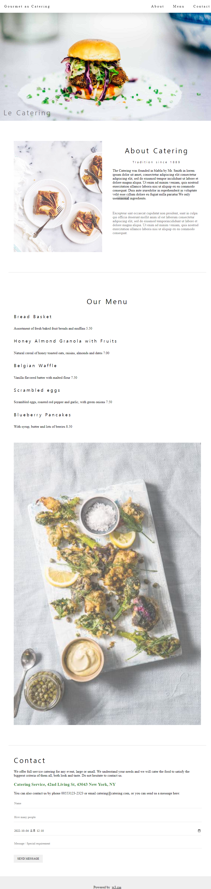
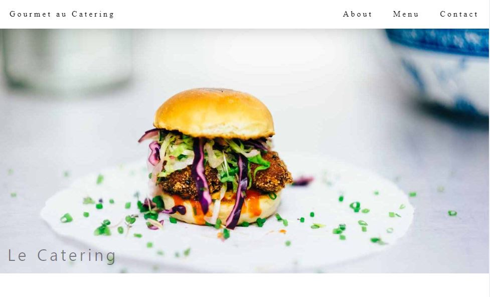
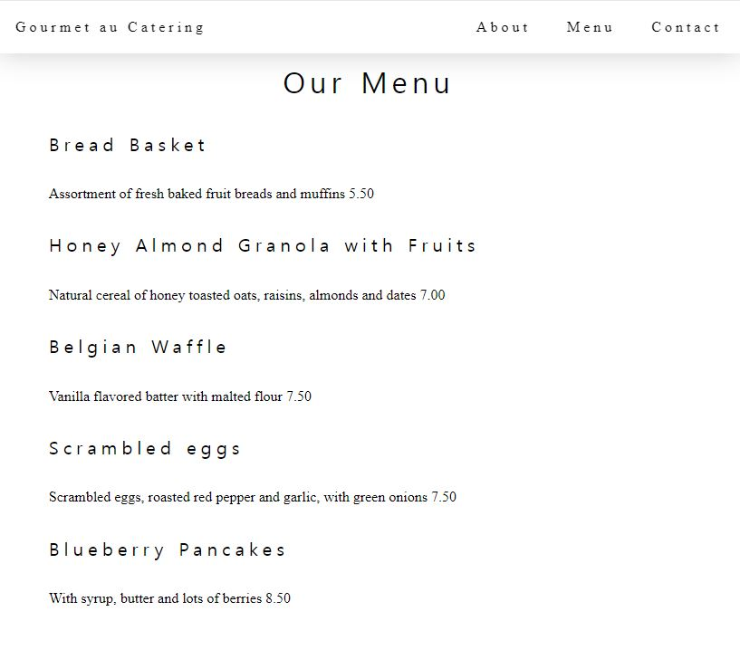
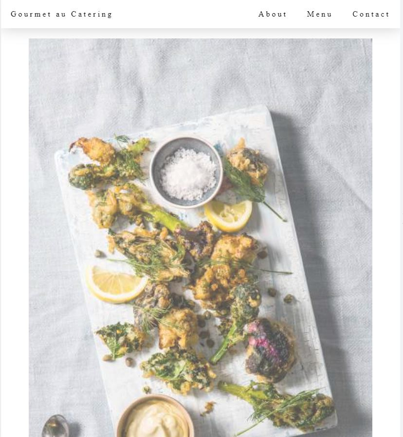
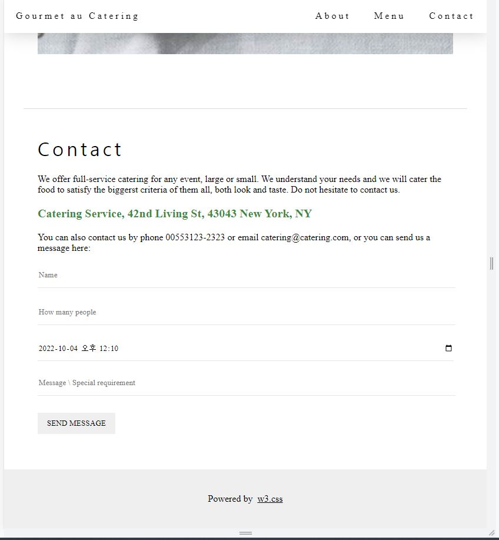
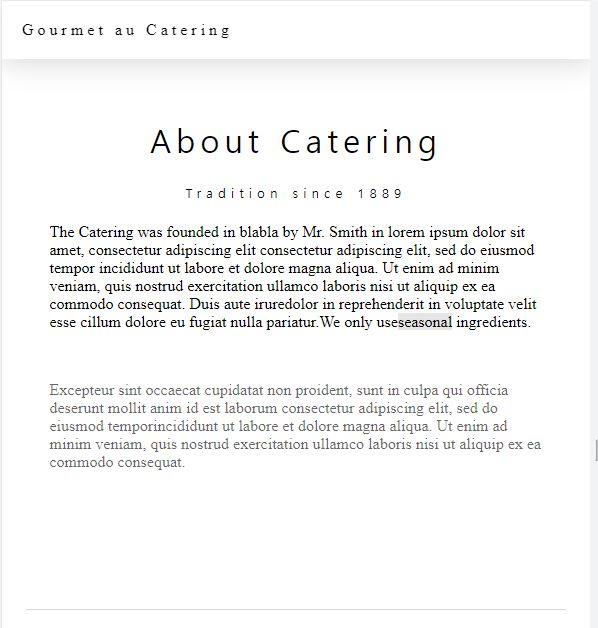

# React 연습문제-(6) 클론코딩 홍승택

## 구조

src

━ index.js

━ App.js

━ GlobalStyles.js

━ Meta.js

━ MediaQuery.js

assets
    
    ━ img
    ━ hamburger.jpg
    ━ tablesetting.jpg
    ━ tablesetting2.jpg

common

    ━ Footer.js
    ━ Jumbotron.js
    ━ Navbar.js

━ pages

    ━ Main
        ━ index.js
        ━ About.js
        ━ Menu.js
        ━ Contact.js

## Code


## src

#### App.js

```js
import React from "react";
import { Routes, Route } from "react-router-dom";

import Navbar from './common/Navbar';
import Footer from './common/Footer';
import Jumbotron from "./common/Jumbotron";
import Main from './pages/Main';
import Meta from "./Meta";
function App() {
  return (
    <div>
      <Meta title='클론코딩1' description='연습문제06' />
      <Navbar/>
      <Jumbotron></Jumbotron>
      <Routes>
        <Route path="/" exact = {true} element = {<Main/>} />
      </Routes>
      <Footer/>
    </div>
  );
};

export default App;

```

#### index.js

```js
import React from 'react';
import ReactDOM from 'react-dom/client';

import { BrowserRouter } from 'react-router-dom';
import Meta from './Meta';
import GlobalStyles from './GlobalStyles';
import App from './App';


const root = ReactDOM.createRoot(document.getElementById('root'));
root.render(
    <BrowserRouter>
        <Meta />
        <GlobalStyles />
        <App />
    </BrowserRouter>

);


```

#### GlobalStyles.js

```js
/**
 * @filename : GlobalStyles.js
 * @description: 전역으로 적용될 기본 스타일 시트. 
 *               이 파일에서 정의한 class는 ReactJSX에서 className 속성으로 참조해야 한다. 
 * @author: HST
 * 
 */
/** Package */
import { createGlobalStyle  } from "styled-components";
//  rest.css


const GlobalStyles = createGlobalStyle`
 

  *{
    font-family: 'Times New Roman', Georgia, Serif;
  }

  body{
    margin: 0;
    padding: 0;
  }

  h1, h2, h3, h4, h5, h6 {
    font-family: "Playfair Display";
    font-weight: 400;
    text-align: center;
    letter-spacing: 5px;
}
`;
export default GlobalStyles;
```

#### Meta.js

```js
import React from 'react'
import { Helmet, HelmetProvider } from 'react-helmet-async';

const Meta = (props) => {
    
    return (
        <HelmetProvider>
            <Helmet>
                <meta charset='utf-8' />
                <title>{props.title}</title>
                {/*SEO 태그 */}
                <meta name="description" content={props.description} />
            </Helmet>
        </HelmetProvider>
    );
};
Meta.defaultProps = {
    title:'React Sample',
    description: 'React example',
};
export default Meta;
```

#### MediaQuery.js

```js
import breakpoints from 'styled-components-breakpoints';

const sizes = {
    sm: 600,
    md: 768,
    lg: 992,
    xl: 1200
};

export default breakpoints(sizes);
```

---
## common

#### Footer.js

```js
/**
 * @filename: Footer.js
 * @description: 페이지 하단 공통 컴포넌트
 * @author: seungtaek (tmdxordusdo@gmail.com)
 */

/** packages */

/** 패키지 */
import React from "react";
import styled from "styled-components";


const FooterComponets = styled.footer`
    width: 100%;
    height: 100px;
    display: flex;
    justify-content: center;
    align-items: center;
    margin-top: 3vh;
    background-color: rgba(224,224,224,0.5);
    a{
        text-align: center;
        width: 100%;
        color:black;
        &:hover{
            color:green;
        }
    }
`


const Footer = () => {
    return (
        <div>
            <FooterComponets>
            <p>Powered by &nbsp;<a href="https://www.w3schools.com/w3css/default.asp">w3.css</a></p>
            </FooterComponets>
        </div>
    );
};

export default Footer;
```

#### Jumbotron.js

```js
/**
 * @filename: Jumbotrons.js
 * @description: 페이지 헤더부분
 * @author: seungtaek (tmdxordusdo@gmail.com)
 */

import React from 'react';
import styled from 'styled-components';
import hamburger from '../assets/img/hamburger.jpg';

const JumbotronsContainer = styled.header`
    width: 100%;
    max-width: 1600px;
    min-width: 514px;
    max-height: 900px;
    
    position: relative;
    margin: 0 auto;
    div{
      &.img_wrap{
        width: 100%;
        .img{
          width: 100%;
          height: 100%;
        }
      }
      &.text_wrap{
        position: absolute;
        bottom: 0px;
        left : 16px;
        color: rgba(15,12,15,0.5);
      }
    }
`;

const Jumbotron = () => {
  return (
    <JumbotronsContainer>
      <div className="img_wrap" id="home">
        
      </div>
      <div className="text_wrap">
        <h1>Le Catering</h1>
      </div>
    </JumbotronsContainer>
  );
};

export default Jumbotron;
```

#### Navbar.js

```js
/**
 * @filename: Navbar.js
 * @description: 페이지 상단 공통 컴포넌트
 * @author: seungtaek (tmdxordusdo@gmail.com)
 */

/** packages */

/** 패키지 */
import React from "react";
import styled from "styled-components";
//import { NavLink } from "react-router-dom";
import { HashLink } from 'react-router-hash-link';

/** 파일 */
import mq from "../MediaQuery";

/** Navbar 컴포넌트 style 정의 */
const NavbarComponents = styled.nav`
    width: 100%;
    position: sticky;
    top: 0;
    z-index: 2;
    
    background-color: #fff;
    box-shadow: 1px 0.2px 30px rgba(0,0,0,0.2);
    div{
        display: flex;
        justify-content: space-between;
        flex-direction: row;
        div{
            a{
                display: block;
                padding: 20px;
                box-sizing: border-box;
                font-size: 1em;
                letter-spacing: 4px;
                text-decoration: none;
                color: black;
                &:hover {
                    background-color: rgba(0,0,0,0.3);
                }
                
            }
            &.right {
                justify-content: space-between;
                ${mq.maxWidth('sm')`
                    display:none;
                `}
            }
        }
    }
`;

/**
 * 
 * @returns {JSX.Element}
 */

const Navbar = () => {
    return (

        <NavbarComponents>
            <div>
                <div>
                    <HashLink to="#">Gourmet au Catering</HashLink>
                </div>
                <div className="right">
                    <HashLink to="#about">About</HashLink>
                    <HashLink to="#menu">Menu</HashLink>
                    <HashLink to="#contact">Contact</HashLink>
                </div>
            </div>
        </NavbarComponents>

    );
};

export default Navbar;
```

---
## pages/Main

#### About.js

```js
/**
 * @filename: About.js
 * @description: Main의 About부분
 * @author: seungtaek (tmdxordusdo@gmail.com)
 */

/** import package */
import React from 'react';
import styled from 'styled-components';

/** import MediaQuery */
import mq from '../../MediaQuery';

/** import image */
import tbSettings from '../../assets/img/tablesetting2.jpg';

/** make About Container */
const AboutContainers = styled.div`
    width: 100%;
    max-width: 1100px;
    min-height: 600px;
    display: flex;
    margin: auto;
    padding: 64px 0;
    box-sizing: border-box;
    div{
      width: 50%;
      padding: 24px;
      box-sizing: border-box;
      
      img{
        width: 100%;
        opacity: 0.7;
      }

      span {
        background-color: rgba(0,0,0,0.1);
      }
      p.md_hide{
        color: rgba(0,0,0,0.6);
      }
      ${mq.maxWidth('sm')`
            width: 100%;
            &.low_hide{
              display:none;
            }
      `}
      ${mq.maxWidth('lg')`
            width: 100%;
            &.md_hide{
              display:none;
            }
      `}
      
    }
`;

const About = () => {
  return (
    <div id="about">
      <AboutContainers>
        <div className="low_hide">
          
        </div>
        <div>
          <h1>About Catering</h1>
          <h5>Tradition since 1889</h5>
          <p>The Catering was founded in blabla by Mr. Smith in lorem ipsum dolor sit amet, consectetur adipiscing elit consectetur adipiscing elit, sed do eiusmod tempor incididunt ut labore et dolore magna aliqua. Ut enim ad minim veniam, quis nostrud exercitation ullamco laboris nisi ut aliquip ex ea commodo consequat. Duis aute iruredolor in reprehenderit in voluptate velit esse cillum dolore eu fugiat nulla pariatur.We only use
            <span>seasonal</span> ingredients.
          </p><br />

          <p className="md_hide">Excepteur sint occaecat cupidatat non proident, sunt in culpa qui officia deserunt mollit anim id est laborum consectetur adipiscing elit, sed do eiusmod temporincididunt ut labore et dolore magna aliqua. Ut enim ad minim veniam, quis nostrud exercitation ullamco laboris nisi ut aliquip ex ea commodo consequat.</p>
        </div>
      </AboutContainers>
    </div>


  )
}

export default About
```

#### Contact.js

```js
/**
 * @filename: Contact.js
 * @description: Main의 Contact부분
 * @author: seungtaek (tmdxordusdo@gmail.com)
 */
/** import package */
import React from 'react';
import styled from 'styled-components';

/* Create ContactContainer */
const ContactContainer = styled.div`
  padding: 24px;
  h1{
    text-align: left;
  }
  p:nth-of-type(2) {
      color: rgba(15,106,15,0.8);
      font-size: 20px;
      font-weight: bold;
  }
  div{
    width: 100%;
    height: 300px;
    form{
    height: auto;
    border: none;
    border-bottom: 1px solid rgba(0,0,0,0.1);
    width: 100%;
    height: 40px;
    input{
      border: none;
      border-bottom: 1px solid rgba(0,0,0,0.1);
      width: 100%;
      height: 40px;
    }
    
    button {
      margin-top: 13px;
      border: none;
      padding: 10px 16px;
    }
  }
  }
`;

const Contact = () => {
  return (
    <div id='contact'>
      <ContactContainer>
        <h1>Contact</h1>
        <p>We offer full-service catering for any event, large or small. We understand your needs and we will cater the food to satisfy the biggerst criteria of them all, both look and taste. Do not hesitate to contact us.</p>
        <p>Catering Service, 42nd Living St, 43043 New York, NY</p>
        <p>You can also contact us by phone 00553123-2323 or email catering@catering.com, or you can send us a message here:</p>
        <div>
          <form>
          <p><input type="text" placeholder="Name" required /></p>
          <p><input type="number" placeholder="How many people" required /></p>
          <p><input className="date" type="datetime-local" placeholder="Date and Time" value="2022-10-04T12:10" /></p>
          <p><input type="text" placeholder="Message \ Special requirement" /></p>
          <button>SEND MESSAGE</button>
        </form>
        </div>
        
      </ContactContainer>
    </div>
  );
};

export default Contact;
```

#### Menu.js

```js
/**
 * @filename: Menu.js
 * @description: Main의 메뉴 부분 
 * @author: seungtaek (tmdxordusdo@gmail.com)
 */

/** import package */
import React from 'react';
import styled from 'styled-components';

/** import MediaQuery */
import mq from '../../MediaQuery';

/** import image */
import image from '../../assets/img/tablesetting.jpg';

const MenuContainer = styled.div`
    width: 100%;
    max-width: 1100px;
    min-height: 600px;
    display: flex;
    margin: auto;
    padding: 64px 0;
    box-sizing: border-box;
    border-top: 1px solid rgba(128,128,128,0.3);;
    border-bottom: 1px solid rgba(128,128,128,0.3);
    div{
      width: 50%;
      padding: 24px;
      box-sizing: border-box;

      h5 {
        font-size: 20px;
        text-align: left;
      }
      img{
        width: 100%;
        opacity: 0.7;
      }  
    }
    ${mq.maxWidth('lg')`
          display: flex;
          flex-direction: column;
          margin: auto; 
          div{
            width: 100%;
          }
         
      `}
`;

const Menu = () => {
  return (
    <div id='menu'>
      <MenuContainer>
        <div>
          <h1>Our Menu</h1>

          <h5>Bread Basket</h5>
          <p>Assortment of fresh baked fruit breads and muffins 5.50</p>

          <h5>Honey Almond Granola with Fruits</h5>
          <p>Natural cereal of honey toasted oats, raisins, almonds and dates 7.00</p>

          <h5>Belgian Waffle</h5>
          <p>Vanilla flavored batter with malted flour 7.50</p>

          <h5>Scrambled eggs</h5>
          <p>Scrambled eggs, roasted red pepper and garlic, with green onions 7.50</p>

          <h5>Blueberry Pancakes</h5>
          <p>With syrup, butter and lots of berries 8.50</p>

        </div>
        <div>
          
        </div>
      </MenuContainer>
    </div>
  )
}

export default Menu
```

### index.js

```js
/**
 * @filename: index.js (path= /Main/index.js)
 * @description: 페이지의 메인
 * @author: seungtaek (tmdxordusdo@gmail.com)
 */
/** import package */
import React from 'react'
import styled from 'styled-components';

/** import PagesContainers */
import About from './About';
import Contact from './Contact';
import Menu from './Menu';

const MainContainer = styled.div`
    max-width: 1100px;
    width: 92%;
    margin: 0 auto;
`;

const index = () => {
  return (
    <MainContainer>
        <About/>
        <Menu/>
        <Contact/>
    </MainContainer>
  );
};

export default index;
```
---
### 실행화면 PC


### 실행화면 태블릿








### 스마트폰 변경점

