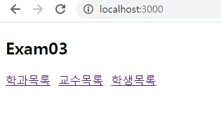
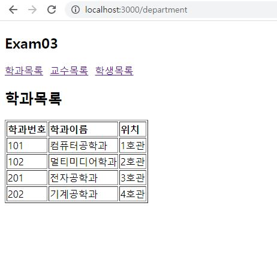
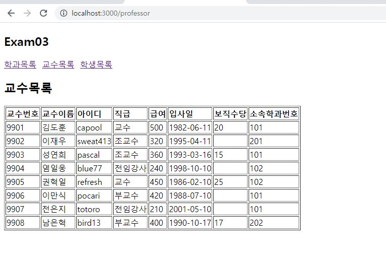
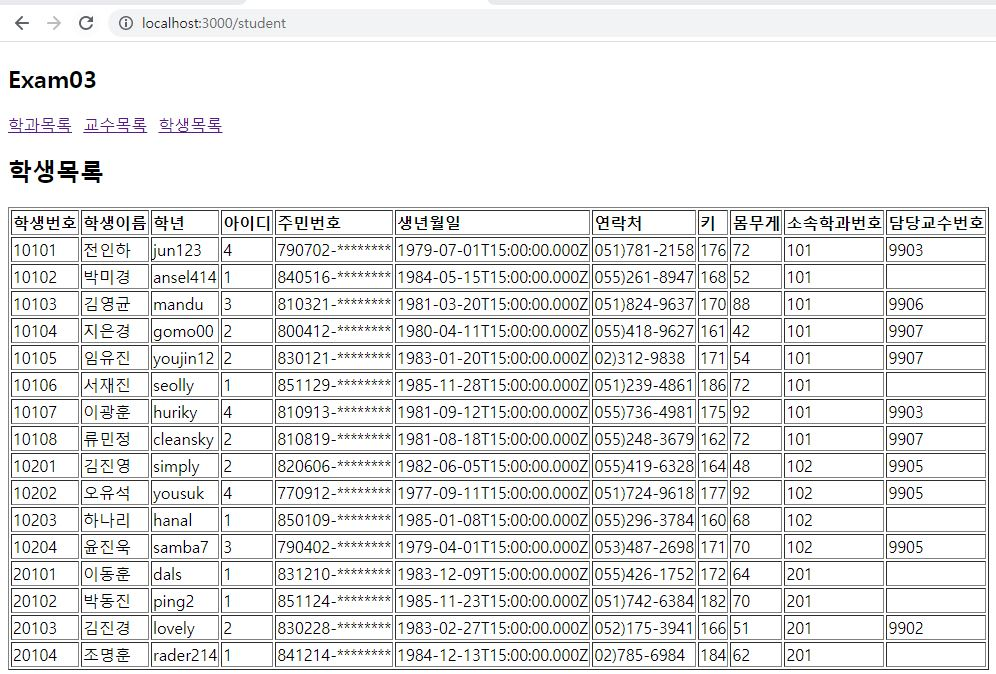

# 연습문제 react(3)-jsx 홍승택

/pages/Department.js
```js
import React from 'react'
import Data from '../myschool'

const department = () => {
  const data = Data.department;
  return (
    <div>
      <h2>학과목록</h2>
      <table border="1">
        <tbody>
          <tr>
            <td><strong>학과번호</strong></td>
            <td><strong>학과이름</strong></td>
            <td><strong>위치</strong></td>
          </tr>
          {data.map((v,i) => {
            return(
              <tr>
                <td key={(i+"0")}>{v.id}</td>
                <td key={(i+"1")}>{v.dname}</td>
                <td key={(i+"2")}>{v.loc}</td>
              </tr>
            );
          })}
        </tbody>
      </table>
    </div>
  );
};

export default department;
```
/pages/Professor.js
```js
import React from 'react'
import Data from '../myschool';
const Professor = () => {
  const data= Data.professor;
  return (
    <div>
      <h2>교수목록</h2>
      <table border='1'>
        <tbody>
          <tr>
            <td ><strong>교수번호</strong></td>
            <td><strong>교수이름</strong></td>
            <td><strong>아이디</strong></td>
            <td><strong>직급</strong></td>
            <td><strong>급여</strong></td>
            <td><strong>입사일</strong></td>
            <td><strong>보직수당</strong></td>
            <td><strong>소속학과번호</strong></td>
          </tr>
          {data.map((v, i) => {
            return (
              <tr>
                <td key={(i+"1")}>{v.id}</td>
                <td key={(i+"2")}>{v.name}</td>
                <td key={(i+"3")}>{v.userid}</td>
                <td key={(i+"4")}>{v.position}</td>
                <td key={(i+"5")}>{v.sal}</td>
                <td key={(i+"6")}>{(v.hiredate).substring(0, 10)}</td>
                <td key={(i+"7")}>{v.comm}</td>
                <td key={(i+"0")}>{v.deptno}</td>
              </tr>
            );
          })}
        </tbody>
      </table>
    </div>
  );
};

export default Professor;
```

/pages/Student.js
```js
import React from 'react';
import Data from '../myschool';
const Student = () => {
  const data = Data.student;
  return (
    <div>
      <h2>학생목록</h2>
      <table border="1">
        <tbody>
          <tr>
            <td><strong>학생번호</strong></td>
            <td><strong>학생이름</strong></td>
            <td><strong>학년</strong></td>
            <td><strong>아이디</strong></td>
            <td><strong>주민번호</strong></td>
            <td><strong>생년월일</strong></td>
            <td><strong>연락처</strong></td>
            <td><strong>키</strong></td>
            <td><strong>몸무게</strong></td>
            <td><strong>소속학과번호</strong></td>
            <td><strong>담당교수번호</strong></td>
          </tr>
          {data.map((v,i) => {
            return(
              <tr>
                <td key={(i+"0")}>{v.id}</td>
                <td key={(i+"1")}>{v.name}</td>
                <td key={(i+"2")}>{v.userid}</td>
                <td key={(i+"3")}>{v.grade}</td>
                <td key={(i+"4")}>{(v.idnum).substring(0,6)+"-********"}</td>
                <td key={(i+"5")}>{v.birthdate}</td>
                <td key={(i+"6")}>{v.tel}</td>
                <td key={(i+"7")}>{v.height}</td>
                <td key={(i+"8")}>{v.weight}</td>
                <td key={(i+"9")}>{v.deptno}</td>
                <td key={(i+"00")}>{v.profno}</td>
              </tr>
            );
          })}
        </tbody>
      </table>
    </div>
  );
};

export default Student;
```

App.js
```js
import React from "react";
import Department from "./pages/Department";
import Professor from "./pages/Professor";
import Student from "./pages/Student";
import {Link, Routes, Route} from 'react-router-dom';
function App() {
  return (
    <div>
      <h2>Exam03</h2>
      <nav>
        <Link to="/department">학과목록</Link>&nbsp;&nbsp;
        <Link to="/professor">교수목록</Link>&nbsp;&nbsp;
        <Link to="/student">학생목록</Link>
      </nav>
      <hr />
      <Routes>
        <Route path="/department" element={<Department/>} />
        <Route path="/professor" element={<Professor/>} />
        <Route path="/student" element={<Student/>} />
      </Routes>
    </div>
  );
}

export default App;

```

index.js
```js
import React from 'react';
import ReactDOM from 'react-dom/client';
import App from './App';

import { BrowserRouter } from 'react-router-dom';


const root = ReactDOM.createRoot(document.getElementById('root'));
root.render(
  <BrowserRouter>
    <App />
  </BrowserRouter>
);

```
## 첫 로드 화면

## 학과목록

## 교수목록

## 학생목록
