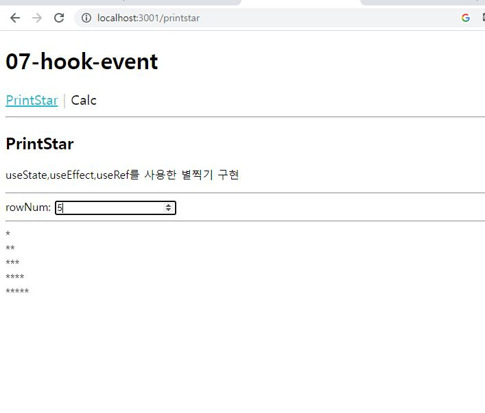
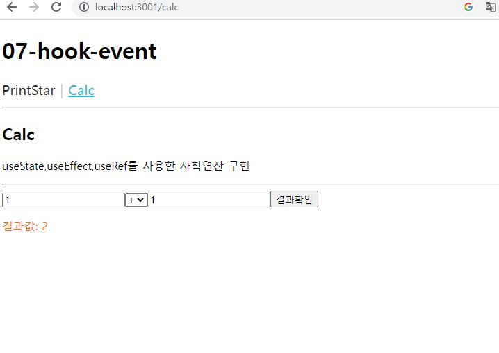
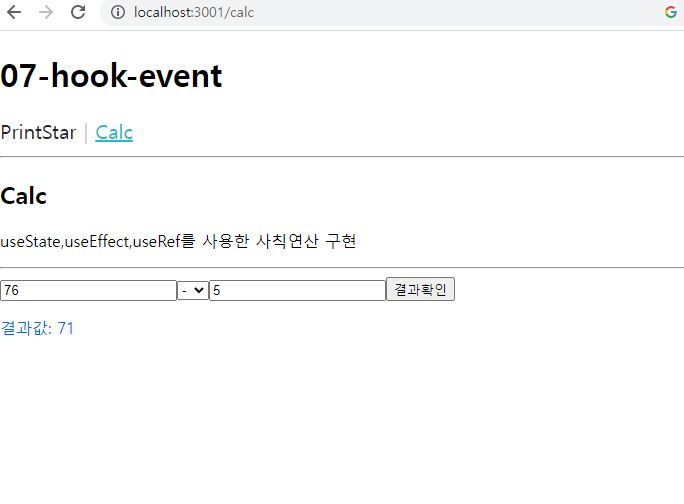
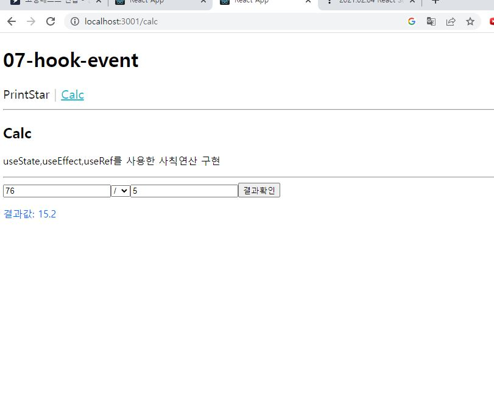

# 연습문제 React -(7) hook 홍승택

```
src
-components
    - MenuLink.js
-pages
    - Calc.js
    - PrintStar.js
App.js
index.js
```

### MenuLink.js

```js
import React from 'react';
import styled from 'styled-components';
import { NavLink } from "react-router-dom";

/** 메뉴링크 --> NavLink: 현재 머물고 있는 페이지와 관련된 링크에 CSS 적용 */

const MenuLinkContainer = styled(NavLink)`
    font-size: 20px;
    cursor: pointer;
    text-decoration: none;
    padding-bottom: 2px;
    color: #222;

    /* CSS의 가상 클래스 hover */
    &:hover {
        color: #22b8cf;
    }

    &:after{
        content: "|";
        display: inline-block;
        padding: 0 7px;
        color: #ccc;
    }
    &:last-child{
        &:after{
            color:#fff;
        }
    }

    &.active {
        text-decoration: underline;
        color: #22b8cf;

        &:after{
            border-bottom: 4px solid #fff !important;
        }
    }
`;


const MenuLink = ({to, children}) => <MenuLinkContainer to ={to}>{children}</MenuLinkContainer>;

export default MenuLink;
```

### Calc.js

```js
import React from 'react'

/** action array */
const act = ['+', '-', '*', '/'];

/** function */
function myCalc(state, action) {
    console.log(action);
    switch (action[0]) {
        case '+':
            return +action[1] + +action[2];
        case '-':
            return +action[1] - +action[2];

        case '*':
            return +action[1] * +action[2];

        default:
            return +action[1] / +action[2];
    }
}
const Calc = () => {

    /** ref */
    const x = React.useRef();
    const y = React.useRef();
    const exec = React.useRef();

    /** reducer */
    const [resultValue, getResultValue] = React.useReducer(myCalc, 0);

    /** Memo (color)*/

    const colors = React.useMemo(() => {
        return (Math.floor(resultValue%2) === 0) ?'#f60' : '#06f';
    }, [resultValue]);

    /** Callback */
    const onBtnClick = React.useCallback(e => {
        const action = [exec.current.value, x.current.value, y.current.value];
        getResultValue(action);
    }, []);

    return (
        <div>
            <h2>Calc</h2>
            <p>useState,useEffect,useRef를 사용한 사칙연산 구현</p>
            <hr />

            <input type="text" ref={x} />
            <select ref={exec}>
                {act.map((v, i) => {
                    return (<option key={i}>{v}</option>);
                })}
            </select>
            <input type="text" ref={y} />
            <button
                type='button'
                onClick={onBtnClick}
            >
                결과확인</button>
            <p style={{ color: colors }}>
                결과값: {resultValue}
            </p>
        </div>
    );
};

export default Calc;
```
### PrintStar.js

```js
import React from 'react';


const PrintStar = () => {
    const console = React.useRef();    //ref
    const [rowNum, setRowNum] = React.useState(0); //state
    const onRowNumChange = e => {
        setRowNum(e.currentTarget.value);
    }

    //effect
    React.useEffect(() => {
        let str =''
        for (let i = 0; i < rowNum; i++) {
            for (let j = 0; j <= i; j++) {
                str += '*';
            }
            str +='<br/>';
        }
        console.current.innerHTML = str;
    }, [rowNum]);

    return (
        <div>
            <h2>PrintStar</h2>
            <p>useState,useEffect,useRef를 사용한 별찍기 구현</p>
            <hr />
            <div>
                <label htmlFor="rowNum">rowNum: </label>
                <input
                    type="number"
                    id='rowNum'
                    onChange={onRowNumChange}
                />
            </div>
            <hr />
            <div ref={console}>

            </div>
        </div>
    )
}

export default PrintStar;
```
### App.js

```js
import React from "react";
import { Routes, Route } from 'react-router-dom';

import MenuLink from "./components/MenuLink";
import PrintStar from "./pages/PrintStar";
import Calc from "./pages/Calc";

function App() {
  return (
    <div >
      <h1>07-hook-event</h1>
      <nav>
        <MenuLink to='/printstar'>PrintStar</MenuLink>
        <MenuLink to='/calc'>Calc</MenuLink>
      </nav>

      <hr />

      <Routes>
        <Route path='/printstar' element={<PrintStar/>}></Route>
        <Route path='/calc' element={<Calc/>}></Route>
      </Routes>
    </div>
  );
}

export default App;


```

### index.js

```js
import React from 'react';
import ReactDOM from 'react-dom/client';
import App from './App';

import { BrowserRouter } from 'react-router-dom';


const root = ReactDOM.createRoot(document.getElementById('root'));
root.render(
  <BrowserRouter>
    <App />
  </BrowserRouter>
);


```

### 실행결과









