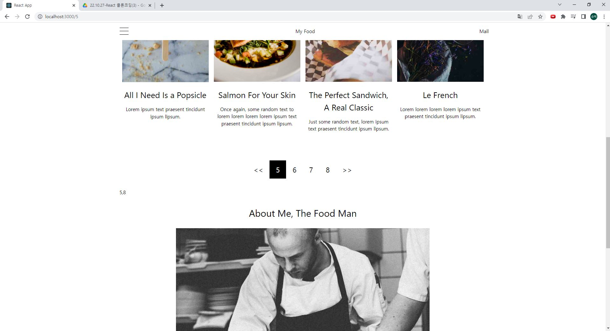
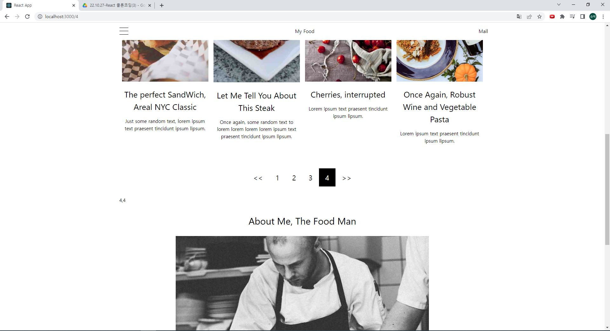
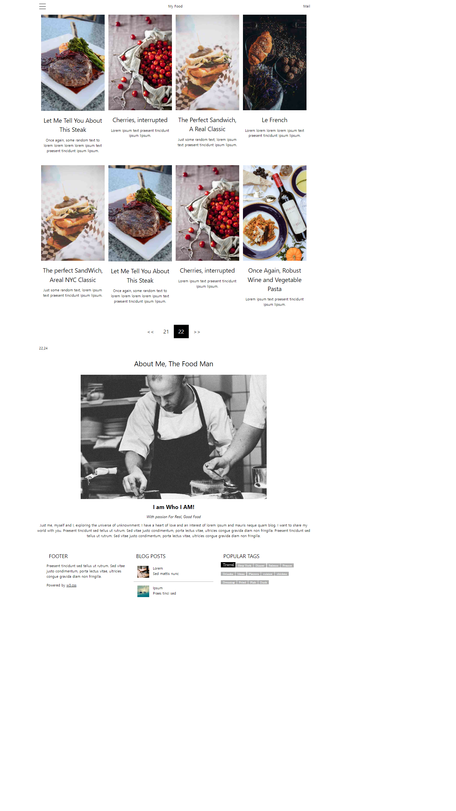

# 연습문제 react(8-2) 클론코딩3 홍승택

## 폴더 구조
```
src
├─ assets
│    └─── img
│           └─ 이미지들..
├─ common
│    └──┬─ Sidebar.js
│       └─ SidebarTrigger.js
│       ├─ Blur.js
│       └─ Nabar.js
│
├─ components
│    └──── DataPath.js
│
│
├─ pages
│    └─── img
│          └─ Main
│               ├─ About.js
│               ├─ Footer.js
│               ├─ index.js
│               └─ MyFOod.js
│               
├─ App.js
├─ GlobalStyle.js
├─ Data.js
├─ index.js
└─ MediaQuery.js
```


## 코드

### src/common

**Blur.js**
```js
import React from 'react'
import styled from 'styled-components'

const BlurContainer = styled.label`
    position: fixed;
    z-index: 2;
    width: 100%;
    height: 100vh;
    background-color: rgba(0,0,0,0.6);
    opacity:0;
    transition: 0.3s;
    pointer-events: none;
`
const blur = () => {
    return (
        <BlurContainer htmlFor ='side-btn' className='blur'/>
    );
};

export default blur;
```

**Navbar.js**
```js
import React from 'react';
import styled from 'styled-components';
import { HashLink } from 'react-router-hash-link';
const NavbarContainer = styled.nav`
  position: sticky;
  top:0;
  background-color: white;
  max-width: 1200px;
  
  display: flex;
  justify-content: space-between;
  margin: 0 auto;
  padding: 0 8px;
  box-sizing: border-box;

  label {
    width: 60px;
    height: 53px;
    padding: 16px;
    box-sizing: border-box;

    display: flex;
    flex-direction: column;
    gap: 10px;
    
    span{
      display: block;
      background-color: black;
      height: 1px;
    }
    &:hover {
      background-color: #666;
    }
  }
  a, p{
    display: block;
    width: auto;
    margin: 0;
    padding: 16px 8px;
    box-sizing: border-box;
    text-align: center;

    text-decoration: none;
    color: black;

    &:hover {
      background-color: #666;
    }
  }
  
`;

const Navbar = () => {
  return (
    <NavbarContainer>
      <label htmlFor='side-btn'>
        <span></span>
        <span></span>
        <span></span>
      </label>
      <HashLink to='#myfood'>My Food</HashLink>
      <p>Mail</p>
    </NavbarContainer>
  )
}

export default Navbar
```

**Sidebar.js**
```js
import React from 'react'
import styled from 'styled-components'
import { HashLink } from 'react-router-hash-link';
import mq from '../MediaQuery';
const SidebarContainer = styled.div`
  position: fixed;
  top: 0;
  left: -100%;
  z-index: 3;
  width: 40%;
  height: 100vh;

  display: flex;
  flex-direction: column;

  transition: all 0.3s;
  box-shadow: 0px 3px 8px rgba(0,0,0,0.8);
  background-color: rgb(255,255,255);
  label, a{
    display: block;
    width: 100%;
    padding: 20px 0;
    padding-left: 20px;
    box-sizing: border-box;    
    
    font-size: 30px;
    color: black;
    text-decoration: none;

    &:hover{
      background-color: rgba(0,0,0,0.3);
    }
    ${mq.maxWidth('lg')`
      font-size: 24px;
    `}
    ${mq.maxWidth('sm')`
      font-size: 18px;
    `}

  }

`
const Sidebar = () => {
  return (
    <SidebarContainer className= 'side_menu'>
      <label htmlFor="side-btn">Close Menu</label>
      <HashLink to= '#myfood'> My Food</HashLink>
      <HashLink to= '#about'> About</HashLink>
    </SidebarContainer>
  );
};

export default Sidebar;
```

**SidebarTrigger.js**
```js
import React from 'react'
import styled from 'styled-components'

const SidebarTriggerContainer = styled.input`
    display: none;
    &:checked {
        ~.side_menu {
            left: 0;
        }
        ~.blur {
            opacity: 1;
            pointer-events: all;
        }
    }
`;

const SidebarTrigger = () => {
    return (
        <SidebarTriggerContainer type='checkbox' id='side-btn' />
    );
};

export default SidebarTrigger;
```

### src/components

**DataPath.js**
```js
import React from 'react';
import { useParams } from 'react-router-dom';
import myData from '../Data.js';

const DataPath = () => {

    const params = useParams();
    let idxNum = params.numbering;
    if (!idxNum) {
        idxNum = 1;
    }


    const createComponents = (element) => {
        return element.map((v2, i2) => {
            return (
                    <div key={100 + i2} className='tbnl'>
                        
                        <h3>{v2.title}</h3>
                        <p>{v2.description}</p>
                    </div>
            );
        });
    }

    return (
        <div className='tbnl_wrap'>
            {/* idxNum은 1부터 시작이기 때문이다. */}
            {createComponents(myData[idxNum-1])}
        </div>
    )
}


export default DataPath;
```


### src/pages/Main

**About.js**
```js
import React from 'react'
import styled from 'styled-components';
import chef from '../../assets/img/chef.jpg';
const AboutContainer = styled.div`
  .img_wrap {
            width: 70%;
            margin: auto;
            padding: 0 16px;
            box-sizing: border-box;
            img {
                width: 100%;
            }
        }
        h2 {
            font-size: 30px;
        }
        h5 {
            font-size: 24px;
            margin: 10px;
        }
        h6 {
            margin: 10px;
            font-size: 16px;
        }

        h2,
        h5,
        h6,
        p {
            text-align: center;
        }
`
const About = () => {
  return (
    <AboutContainer id = 'about' >
      <h2>About Me, The Food Man</h2>
            <div className="img_wrap">
                
            </div>
            <div className="text">
                <h5><b>I am Who I AM!</b> </h5>
                <h6><i>With passion For Real, Good Food</i></h6>
                <p>Just me, myself and I, exploring the universe of unknownment. I have a heart of love and an interest
                    of lorem ipsum and mauris neque quam blog. I want to share my world with you. Praesent tincidunt sed
                    tellus ut rutrum. Sed vitae justo condimentum, porta lectus vitae, ultricies congue gravida diam non
                    fringilla. Praesent tincidunt sed tellus ut rutrum. Sed vitae justo condimentum, porta lectus vitae,
                    ultricies congue gravida diam non fringilla.</p>
            </div>
    </AboutContainer>
  )
}

export default About;
```

**Footer.js**
```js
import React from 'react'
import styled from 'styled-components';
import workshop from '../../assets/img/workshop.jpg';
import gondol from '../../assets/img/gondol.jpg';

const FooterContainer = styled.footer`
        width: 100%;
        display: flex;
        flex-direction: row;
        padding: 32px;
        box-sizing: border-box;
        .box {
            width: 33.3333%;
            padding: 0 16px;
            box-sizing: border-box;
            h2 {
                margin: 10px;
            }
            p {
                font-size: 15px;
            }
            p > a {
                color: black;
                &:visited {
                    color: black;
                }
                &:hover {
                    color: green;
                }
            }
            ul {
                display: flex;
                flex-direction: column;
                padding: 0;
                margin: 0;
                li {
                    padding: 16px;

                    box-sizing: border-box;
                    list-style: none;
                    &:nth-of-type(1) {
                        border-bottom: 1px solid rgba(122, 122, 122, 0.6);
                    }
                    img {
                        float: left;
                        width: 50px;
                        margin-right: 16px;
                    }

                    &:hover {
                        background-color: rgba(122, 122, 122, 0.6);
                    }
                }
            }
            div:last-of-type {
                display: flex;
                flex-wrap: wrap;
                align-items: flex-end;
                gap: 2px;

                span {

                    display: inline-block;
                    padding: 0 8px;
                    margin-bottom: 16px;
                    color: white;
                    background-color: #7a7a7a99;
                    font-family: serif;
                    font-size: 12px;
                    text-align: center;

                    &:first-of-type {
                        background-color: black;
                        font-size: 15px;
                    }
                }
            }
        }
    
`
const Footer = () => {
  return (
    <FooterContainer>
      <div className="box">
        <h2>FOOTER</h2>
        <p>Praesent tincidunt sed tellus ut rutrum. Sed vitae justo condimentum, porta lectus vitae, ultricies
          congue gravida diam non fringilla.</p>
        <p>Powered by <a href="https://www.w3schools.com/w3css/default.asp">w3.css</a></p>
      </div>

      <div className="box">
        <h2>BLOG POSTS</h2>
        <ul>
          <li>
            
            <span>Lorem</span><br />
            <span>Sed mattis nunc</span>
          </li>
          <li>
            
            <span>Ipsum</span> <br /> <span>Praes tinci sed</span>
          </li>
        </ul>
      </div>
      <div className="box">
        <h2>POPULAR TAGS</h2>
        <div>
          <span>Travel</span> <span>New York</span> <span>Dinner</span>
          <span>Salmon</span>
          <span>France</span> <span>Drinnks</span> <span>Ideas</span> <span>Flavors</span>
          <span>cuisine</span>
          <span>chicken</span>
          <span>Dressing</span>
          <span>Fried</span>
          <span>Fish</span>
          <span>Duck</span>
        </div>
      </div>
    </FooterContainer>
  );
};
export default Footer;
```
**index.js**
```js
/** import package */
import React from 'react';
import styled from 'styled-components';

/** import pages */
import MyFood from './MyFood';
import About from './About';
import Footer from './Footer';

const MainContainer = styled.div`
    max-width: 1200px;
    width: 100%;
    margin: 30px auto;
    padding: 0 8px;
    box-sizing: border-box;
    margin: 0 auto;
    
`

const index = () => {
  return (
    <MainContainer>
      <MyFood />
      <About />
      <Footer />
    </MainContainer>
  )
}

export default index
```

**MyFood.js**
```js
import React, { memo } from 'react';
import styled from 'styled-components';
import myData from '../../Data';
import { Link, Routes, Route, useLocation } from 'react-router-dom';
import mq from '../../MediaQuery';

/** components */
import DataPath from '../../components/DataPath';
import { useCallback } from 'react';
import classNames from 'classnames';

const MyFoodContainer = styled.div`
          width: 100%;
          padding: 0 16px;
          margin-bottom: 32px;
          box-sizing: border-box;
          display: flex;
          flex-direction: column;
          .tbnl_wrap{
            width:100%;
            height: auto;
            min-height: 1300px;
            display: flex;
            flex-direction: row;
            flex-wrap: wrap;
            justify-content: space-around;
          
            .tbnl {
                width: 25%;
                min-width: 280px;
                max-width: 350px;
                padding: 8px;
                box-sizing: border-box;
                flex: 1 1 auto;

                img {
                    width: 100%;
                }

                h3,p {
                    display: block;
                    margin: 15px 0;
                    text-align: center;
                }
                h3 {
                    font-size: 26px;
                }
            }
        }
        .myfood_bottom{
          bottom: 0;
        display: flex;
        justify-content: center;
        padding: 32px 0;
        box-sizing: border-box;

        a {
            padding: 12px 20px;
            box-sizing: border-box;

            text-decoration: none;
            color: black;
            font-size: 22px;
            
            &:hover {
                background-color: black;
                color: white;
            }
            &.active{
              background-color: black;
              color:white;
            }
        }
        }
`
// 변수들
const len = myData.length;

const MyFood = memo(() => {
  /** state */
  const [pageNum, setPageNum] = React.useState(1);
  const location = useLocation();
  const ref = React.useRef();

  // Effect, memo 
  const URL = React.useMemo(() => {
    return (+(location.pathname.substring(1)));
  }, [location])
  React.useEffect(() => {
    URL !== 0 ? setPageNum(URL) : setPageNum(1);

  }, [URL]);

  const standard = React.useMemo(() => {
    return (Math.floor((pageNum - 1) / 4) + 1) * 4
  }, [pageNum]);


  /** pageNum이 바뀔때 마다 버튼 새로 생성(active를 위함) */
  const createBtn = React.useMemo(() => {
    let a = [];
    let arrow = ["<<", ">>"];
    let i = standard - 3;
    let standard2 = standard - 4 <= 0 ? "" : standard - 4;
    a.push(<Link to={"/" + (standard2)}   >{arrow[0]}</Link>);

    while (i <= standard && i <= len) {
      const cls1 = classNames({
        'active': URL === 0
      })
      const cls2 = classNames({
        'active': i === URL
      });
      i !== 1 ? a.push(<Link to={"/" + i} className={cls2} >{i}</Link>) : a.push(<Link to={"/"} className={cls1} >{i}</Link>);

      i++;
    }
    a.push(<Link to={"/" + (standard + 1 <= len ? standard + 1 : len)}  >{arrow[1]}</Link>);
    return a;
  }, [pageNum]);


  return (
    <MyFoodContainer id = 'myfood'>
      <Routes>
        <Route path="/" element={<DataPath />} />
        <Route path="/:numbering" element={<DataPath />} />
      </Routes>
      <div className='myfood_bottom'>
        {createBtn}
      </div>
      <div>{pageNum},{standard}</div>
    </MyFoodContainer>

  );
});

export default MyFood;
```

### src

**App.js**
```js
import Main from './pages/Main';
import Navbar from './common/Navbar';
import Sidebar from './common/Sidebar';
import SidebarTrigger from './common/SidebarTrigger';
import Blur from './common/Blur';
const App = () => {
  return (
    <div>
      <SidebarTrigger/>
      <Blur/>
      <Sidebar />
      <Navbar />
      <Main />
    </div>
  );
}

export default App;

```
**Data.js**
```js
/** img  */
import imgSandwitch from './assets/img/sandwich.jpg';
import imgSteak from './assets/img/steak.jpg';
import imgCherry from './assets/img/cherries.jpg';
import imgWine from './assets/img/wine.jpg';
import imgPopsicle from './assets/img/popsicle.jpg';
import imgSalmon from './assets/img/salmon.jpg';
import imgCroissant from './assets/img/croissant.jpg';
/** 데이터 생성 */
// 데이터 생성에 사용할 예비 데이터들
const md1 = [{
    title: 'The perfect SandWich, Areal NYC Classic',
    description: 'Just some random text, lorem ipsum text praesent tincidunt ipsum lipsum.',
    img: imgSandwitch,
}, {
    title: 'Let Me Tell You About This Steak',
    description: 'Once again, some random text to lorem lorem lorem lorem ipsum text praesent tincidunt ipsum lipsum.',
    img: imgSteak
}, {
    title: 'Cherries, interrupted',
    description: 'Lorem ipsum text praesent tincidunt ipsum lipsum.',
    img: imgCherry
}, {
    title: 'Once Again, Robust Wine and Vegetable Pasta',
    description: 'Lorem ipsum text praesent tincidunt ipsum lipsum.',
    img: imgWine
}, {
    title: 'All I Need Is a Popsicle',
    description: 'Lorem ipsum text praesent tincidunt ipsum lipsum.',
    img: imgPopsicle
}, {
    title: 'Salmon For Your Skin',
    description: 'Once again, some random text to lorem lorem lorem lorem ipsum text praesent tincidunt ipsum lipsum.',
    img: imgSalmon
}, {
    title: 'The Perfect Sandwich, A Real Classic',
    description: 'Just some random text, lorem ipsum text praesent tincidunt ipsum lipsum.',
    img: imgSandwitch
}, {
    title: 'Le French',
    description: 'Lorem lorem lorem lorem ipsum text praesent tincidunt ipsum lipsum.',
    img: imgCroissant
}];
const md2 = [
    // ---- 8 (idx 7);
    {
        title: 'Let Me Tell You About This Steak',
        description: 'Once again, some random text to lorem lorem lorem lorem ipsum text praesent tincidunt ipsum lipsum.',
        img: imgSteak
    }, {
        title: 'Cherries, interrupted',
        description: 'Lorem ipsum text praesent tincidunt ipsum lipsum.',
        img: imgCherry
    }, {
        title: 'The Perfect Sandwich, A Real Classic',
        description: 'Just some random text, lorem ipsum text praesent tincidunt ipsum lipsum.',
        img: imgSandwitch
    }, {
        title: 'Le French',
        description: 'Lorem lorem lorem lorem ipsum text praesent tincidunt ipsum lipsum.',
        img: imgCroissant
    }, {
        title: 'The perfect SandWich, Areal NYC Classic',
        description: 'Just some random text, lorem ipsum text praesent tincidunt ipsum lipsum.',
        img: imgSandwitch
    }, {
        title: 'Let Me Tell You About This Steak',
        description: 'Once again, some random text to lorem lorem lorem lorem ipsum text praesent tincidunt ipsum lipsum.',
        img: imgSteak
    }, {
        title: 'Cherries, interrupted',
        description: 'Lorem ipsum text praesent tincidunt ipsum lipsum.',
        img: imgCherry
    }, {
        title: 'Once Again, Robust Wine and Vegetable Pasta',
        description: 'Lorem ipsum text praesent tincidunt ipsum lipsum.',
        img: imgWine
    }];
// 넘버페이지에 사용할 데이터 생성 ( 구분이 가도록 두개의 데이터를 섞어서..)
let myData = [];
for (let i = 1; i <= 22; i++) {
    i % 2 === 1 ? myData.push(md1.map(v => v)) : myData.push(md2.map(v => v));
}

export default myData;
```
**GlobalStyle.js**
```js
/**
 * @filename : GlobalStyles.js
 * @description: 전역으로 적용될 기본 스타일 시트. 
 *               이 파일에서 정의한 class는 ReactJSX에서 className 속성으로 참조해야 한다. 
 * @author: HST
 * 
 */
/** Package */
import { createGlobalStyle } from "styled-components";
//  rest.css


const GlobalStyles = createGlobalStyle`
 
html,body {
    font-family: Verdana, sans-serif;
    font-size: 15px;
    line-height: 1.5;
}
body {
    position: relative;
    padding: 0;
    margin: 0;
}
body {
    font-family: "Karma", sans-serif;
}
h1,h2,h3,h4,h5,h6 {
    font-family: "Segoe UI", Arial, sans-serif;
    font-weight: 400;
}
`;

export default GlobalStyles;
```
**index.js**
```js
import React from 'react';
import ReactDOM from 'react-dom/client';
import App from './App';
import {BrowserRouter} from 'react-router-dom';
import GlobalStyle from './GlobalStyle';


const root = ReactDOM.createRoot(document.getElementById('root'));
root.render(
  <BrowserRouter>
    <GlobalStyle />
    <App />
  </BrowserRouter>
);


```
**MediaQuery**
```js
import breakpoints from 'styled-components-breakpoints';

const sizes = {
    sm: 600,
    md: 768,
    lg: 992,
    xl: 1200
};

export default breakpoints(sizes);
```


## 실행화면

### 기능
```
  숫자 버튼을 누르면 해당하는 숫자로 쿼리스트링이 이동하고, 자료들을 화면에 나타나도록 하였다.
  << 버튼을 누르면 
  (1~4) 사이일때 누르면 무조건 1이 나오도록 하였고
  (5~) 일때 누르면 해당 버튼의 첫번째 값 -1로 이동하도록 하였다 (ex 5~8일때는 4)
  >> 버튼을 누르면 
  (1~) 일때 누르면 해당 마지막 페이지 +1이 나오도록 하였다 (ex 1일때 5)
  인덱스가 마지막일때에는 변함이 없도록 하였다. (ex 자료길이 22일때 22이면 22가 그대로 나옴, 21이면 22)
  
  사이드바를 열면 우측 화면은 어둡게 나타나도록 하였다.
```




### desktop


### tab


### mobile
