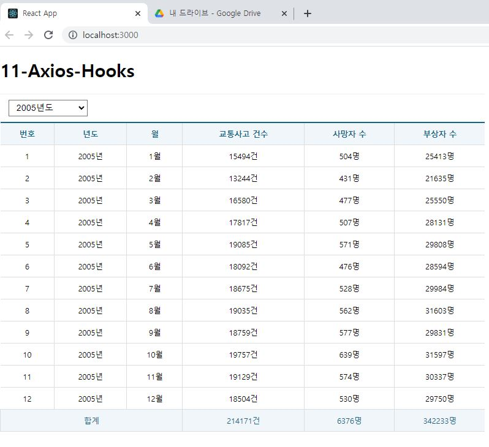

# 연습문제 React-(11) 홍승택

### 폴더구조

```
/src
components | hooks | pages |  App.js | index.js

src/components
Spinner.js | Table.js

src/hooks
useMounteRef.js

pages/Traffic
index.js
```

## code

Spinner.js

```js
import React, { memo } from "react";
import PropTypes from "prop-types";

/** 로딩바 컴포넌트 */
// --> hhtps://mhnpd.github.io/react-loader-spinner/
import { Blocks } from "react-loader-spinner";

const Spinner = memo(({ loading, width, height }) => {
  return (
    <Blocks
      visible={loading}
      height={width}
      width={height}
      ariaLabel="blocks-loading"
      wrapperStyle={{
        position: "absolute",
        zIndex: 9999,
        left: "50%",
        top: "50%",
        transform: "translate(-50%,50%)",
      }}
      wrapperClass="blocks-wrapper"
    />
  );
});

/** 기본 값 정의 */
Spinner.defaultProps = {
  visible: false,
  width: 100,
  height: 100,
};

/** 데이터 타입 설정 */
Spinner.propTypes = {
  visible: PropTypes.bool.isRequired,
  width: PropTypes.number,
  height: PropTypes.number,
};

export default Spinner;
```

Table.js

```js
import styled from "styled-components";

/** 표에 css를 적용한 stlyedComponent */
const Table = styled.table`
  border-collapse: collapse;
  border-top: 3px solid #168;
  font-size: 14px;
  text-align: center;
  margin: auto;
  width: 100%;

  th,
  .bottom {
    color: #168;
    background: #f0f6f9;
    padding: 10px;
    border: 1px solid #ddd;

    &:first-child {
      border-left: 0;
    }

    &:last-child {
      border-right: 0;
    }
  }

  td {
    padding: 10px;
    border: 1px solid #ddd;

    &:first-child {
      border-left: 0;
    }

    &:last-child {
      border-right: 0;
    }
  }
`;

export default Table;
```

src/hooks/useMounterRef

```js
import React from "react";

const useMounterdRef = () => {
  const mountedRef = React.useRef(false);

  React.useEffect(() => {
    setTimeout(() => {
      mountedRef.current = true;
    });
  }, []);
  return mountedRef;
};

export default useMounterdRef;
```

pages/Traffic/index.js

```js
import React, { memo } from 'react';
import styled from 'styled-components';
import Spinner from '../../components/Spinner';
import Table from '../../components/Table';

// Axios 기능 제공 hook
import useAxios from 'axios-hooks';

//  페이지 마운트 여부 확인 hook
import useMounterRef from '../../hooks/useMounterRef';

/** 드롭다운을 배치하기 위한 박스 */
const SelectionContainer = styled.div`
    position: sticky;
    top: 0;
    background-color: #fff;
    border-top: 1px solid #eee;
    padding: 10px 0;
    margin: 0;

    select {
        margin-left: 15px;
        font-size: 16px;
        padding: 5px 10px;
    }
`
// 접속 백엔드 URL
const URL = 'http://localhost:3001/traffic_acc';

let yearArr = [];
for (let i = 2005; i <= 2015; i++) {
    yearArr.push(i);
}


const index = memo(() => {

    const [{ data, loading, error }, refetch] = useAxios(URL);
    
    /** state */
    const [state, setState] = React.useState({
        year: ''
    });
    const mountedRef = useMounterRef();

    

    /** 드롭다운 상태 변경 */
    const onSelectChange = React.useCallback(e => {
        e.preventDefault();

        // 드롭다운의 입력값 취득
        const current = e.target;
        const value = current[current.selectedIndex].value;

        //  기존의 상태값을 그대로 복사한 상태에서
        //  드롭다운의 name속성과 일치하는 key에 대한 value 수정
        const newState = { ...state, year: value };
        //  상태값 갱신
        setState(newState);
        //  갱신된 상태값 확인
        console.log(newState);
        //  hook함수 안에서 다른 상태값을 사용할 경우 해당 상태값을 모니터링 해야한다.
    }, [state]);
    
    /** state 상태 값이 변경되었을 때 실행될 hook */
    React.useEffect(() => {
        //  컴포넌트가 화면에 마운트 된 이후에만 동작하도록 한다.
        if (mountedRef.current) {
            // 상태값 중에서 빈값이 아닌 항목들을 옮겨담는다
            const params = {};
            if (state['year']) {
                params['year'] = state['year'];
            } 
            //  Ajax 재요청
            refetch({
                params: params
            });
           
        }
    }, [mountedRef, refetch, state]);

    if (error) {
        console.error(error);

        return (
            <div>
                <h1>Oops {error.code}</h1>
                <hr />
                <p>{error.message}</p>
            </div>
        );
    }


    return (
        <div>
            <Spinner loading={loading} />
            {/* 검색 조건 드롭다운 박스 */}
            <SelectionContainer>
                <select name="year" onChange={onSelectChange}>
                    <option value=""> -- 연도 선택 --</option>
                    {yearArr.map((v, i) => {
                        return (
                            <option key={i} value={v}>{v + "년도"}</option>
                        )
                    })}
                </select>
            </SelectionContainer>
            <Table>
                <thead>
                    <tr>
                        <th>번호</th>
                        <th>년도</th>
                        <th>월</th>
                        <th>교통사고 건수</th>
                        <th>사망자 수</th>
                        <th>부상자 수</th>
                    </tr>
                </thead>
                <tbody>
                    {data && data.map(({
                        id, year, month, accident, death, injury
                    }, i) => {
                        return (
                            <tr key={id}>
                                <td>{id}</td>
                                <td>{year + "년"}</td>
                                <td>{month + "월"}</td>
                                <td>{accident + "건"}</td>
                                <td>{death + "명"}</td>
                                <td>{injury + "명"}</td>
                            </tr>

                        )
                    })}
                    <tr className='bottom'>
                        <td colSpan='3'>합계</td>
                        <td>{data && data.reduce((prev ,cur) => prev+cur.accident ,0) + '건'}
                        </td>
                        <td>{data && data.reduce((prev ,cur) => prev+cur.death ,0)+'명'}</td>
                        <td>{data && data.reduce((prev ,cur) => prev+cur.injury ,0)+'명'}</td>
                    </tr>
                </tbody>
            </Table>
        </div>
    );
});

export default index;


```

App.js

```js
import React, { memo } from "react";
import Traffic from "./pages/Traffic";
const App = memo(() => {
  return (
    <div>
      <h1>11-Axios-Hooks</h1>
      <Traffic />
    </div>
  );
});

export default App;
```

index.js

```js
import React from "react";
import ReactDOM from "react-dom/client";
import App from "./App";

import { BrowserRouter } from "react-router-dom";

const root = ReactDOM.createRoot(document.getElementById("root"));
root.render(
  <BrowserRouter>
    <App />
  </BrowserRouter>
);
```

## 실행화면


