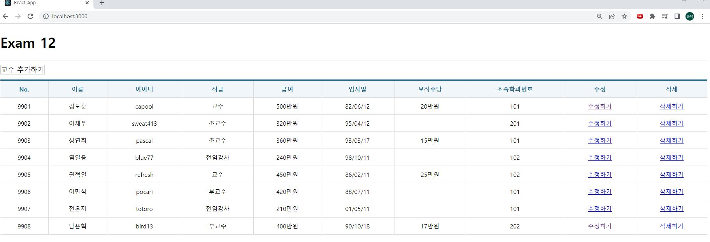
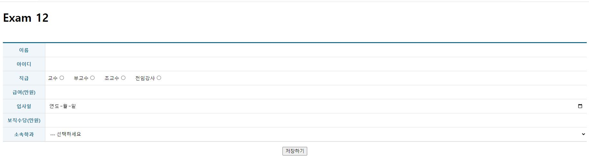
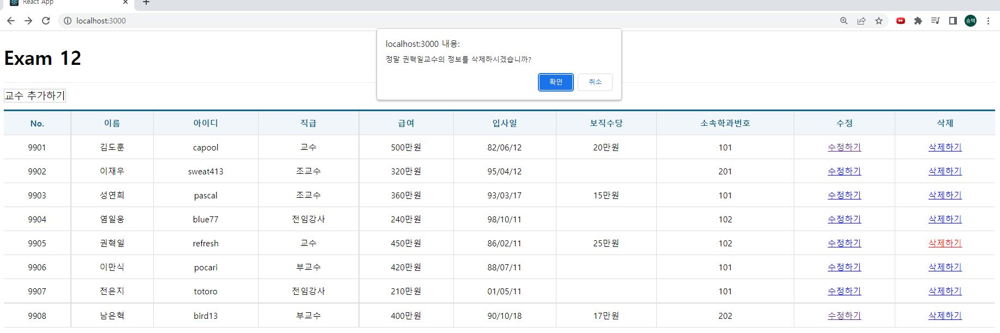
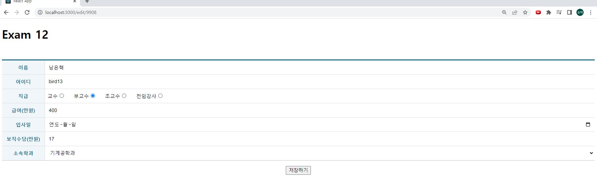

# 연습문제 React(12)

## 코드
App.js
```js
import React, { memo } from 'react';
import { Routes, Route } from 'react-router-dom';
import ProfessorList from './pages/ProfessorList';
import ProfessorAdd from './pages/ProfessorAdd';
import ProfessorEdit from './pages/ProfessorEdit';
const App = memo(() => {
  return (
    <div>
      <h1>Exam 12</h1> <Routes>
        <Route path='/' exapt={true} element={<ProfessorList />} />
        <Route path='/add' element={<ProfessorAdd />} />
        <Route path='/edit/:id' element={<ProfessorEdit />} /> </Routes>
    </div>
  );
});
export default App;
```
index.js
```js
import React from 'react';
import ReactDOM from 'react-dom/client';
import App from './App';
import { BrowserRouter } from 'react-router-dom';
const root = ReactDOM.createRoot(document.getElementById('root')); root.render(
  <BrowserRouter>
    <App />
  </BrowserRouter>
);

```

ProfessorAdd.js
```js
import React, { memo } from 'react';
import useAxios from 'axios-hooks';
import styled from 'styled-components';
import { useNavigate } from 'react-router-dom';

import Spinner from '../components/Spinner';
import Table from '../components/Table';
import dayjs from 'dayjs';

/** Table 컴포넌트의 CSS 확장한 컴포넌트 */
const TableEX = styled(Table)`
    margin-top: 50px;
    margin-bottom: 15px;
    .inputWrapper {
        padding: 0;
        position: relative;
        text-align: left;

        .field {
            box-sizing: border-box;
            display: block;
            position: absolute;
            left: 0;
            top: 0;
            width: 100%;
            height: 100%;
            border: 0;
            padding: 0 10px;
            outline: none;
            font-size: 14px;
        }

        label {
            margin-left: 7px;
            margin-right: 10px;

            input {
                margin-right: 10px;
            }
        }
    }

`;

const ProfessorAdd = memo(() => {
    /** 저장 완료 후 목록으로 되돌아가기 위한 페이지 강제 이동 함수 생성  */
    const navigate = useNavigate();

    /** 드롭다운에 표시할 학과 목록 조회 */
    const [{ data, loading: loading1, error }] = useAxios('http://localhost:3022/department');

    /** 백엔드에 데이터 저장을 위한 Ajax 요청 객체 생성 - 메뉴얼 전송 모드 */
    const [{ loading: loading2 }, refetch] = useAxios({
        url: 'http://localhost:3022/professor',
        method: 'POST'
    }, { manual: true });


    const onSubmit = React.useCallback(e => {
        e.preventDefault();
        //  이벤트 발생한 폼 객체
        const current = e.target;
        //  입력, 수정, 삭제 처리는 async-await 문법 사용해야함
        (async () => {
            try {
                await refetch({
                    data: {
                        name: current.name.value,
                        userid: current.userid.value,
                        position: current.position.value,
                        sal: +current.sal.value,
                        hiredate: dayjs(current.hiredate.value).toISOString(),
                        comm: +current.comm.value,
                        deptno: +current.deptno.value
                    }
                });
            } catch (e) {
                console.error(e);
                window.alert(`[${e.response.status} ${e.response.statusText} \n${e.message}]`);
                return;
            }

            window.alert('저장되었습니다.');
            //  페이지 강제 이동 (window.location.href= URL 기능과 동일)
            navigate('/');

        })();
    }, [refetch, navigate]);

    return (
        // 플래그먼트 <></ >
        // 감싸기만하는 역할임
        // 가상의 존재임, HTML태그는 생성하지 않는다.
        <>
            <Spinner loading={loading1 || loading2} />

            {error ? (
                <div>
                    <h1>Oops~!! {error.code} Error.</h1>
                </div>
            ) :
                (
                    <form onSubmit={onSubmit}>
                        <TableEX>
                            <colgroup>
                                <col width="120" />
                                <col />
                            </colgroup>
                            <tbody>
                                <tr>
                                    <th>이름</th>
                                    <td className="inputWrapper"><input className='field' type='text' name='name' /></td>
                                </tr>
                                <tr>
                                    <th>아이디</th>
                                    <td className="inputWrapper"><input className='field' type='text' name='userid' /></td>
                                </tr>
                                <tr>
                                    <th>직급</th>
                                    <td className="inputWrapper">
                                        <label>교수<input type="radio" name='position' value='교수' /></label>
                                        <label>부교수<input type="radio" name='position' value='부교수' /></label>
                                        <label>조교수<input type="radio" name='position' value='조교수' /></label>
                                        <label>전임강사<input type="radio" name='position' value='전임강사' /></label>
                                    </td>
                                </tr>
                                <tr>
                                    <th>급여(만원)</th>
                                    <td className="inputWrapper"><input className='field' type='number' name='sal' /></td>
                                </tr>
                                <tr>
                                    <th>입사일</th>
                                    <td className="inputWrapper"><input className='field' type='date' name='hiredate' /></td>
                                </tr>
                                <tr>
                                    <th>보직수당(만원)</th>
                                    <td className="inputWrapper"><input className='field' type='number' name='comm' /></td>
                                </tr>
                                <tr>
                                    <th>소속학과</th>
                                    <td className="inputWrapper">
                                        <select name="deptno" className="field">
                                            <option value="">--- 선택하세요</option>
                                            {data && data.map((v, i) => {
                                                return (
                                                    <option key={i} value={v.id}>{v.dname}</option>
                                                );
                                            })}
                                        </select>
                                    </td>

                                </tr>
                            </tbody>
                        </TableEX>

                        <div style={{ textAlign: 'center' }}>
                            <button type='submit'>저장하기</button>
                        </div>
                    </form>
                )}
        </>

    );
});

export default ProfessorAdd;
```

ProfessorEdit.js
```js
import React, { memo } from 'react';
import useAxios from 'axios-hooks';
import styled from 'styled-components';
import { useNavigate, useParams } from 'react-router-dom';

import Spinner from '../components/Spinner';
import Table from '../components/Table';
import dayjs from 'dayjs';

/** Table 컴포넌트의 CSS 확장한 컴포넌트 */
const TableEX = styled(Table)`
    margin-top: 50px;
    margin-bottom: 15px;
    .inputWrapper {
        padding: 0;
        position: relative;
        text-align: left;

        .field {
            box-sizing: border-box;
            display: block;
            position: absolute;
            left: 0;
            top: 0;
            width: 100%;
            height: 100%;
            border: 0;
            padding: 0 10px;
            outline: none;
            font-size: 14px;
        }

        label {
            margin-left: 7px;
            margin-right: 10px;

            input {
                margin-right: 10px;
            }
        }
    }

`;

const ProfessorEdit = memo(() => {
    /** path파라미터로 전송된 교수id */
    const {id} = useParams();
    /** 저장 완료 후 목록으로 되돌아가기 위한 페이지 강제 이동 함수 생성  */
    const navigate = useNavigate();

    /** 드롭다운에 표시할 학과 목록 조회 */
    const [{ data: department, loading: loading1, error: er1 }] = useAxios('http://localhost:3022/department');

    /** 저장되어있는 교수 데이터 조회 */
    const [{ data: professor, loading: loading2, error: er2 }, refetch] = useAxios(`http://localhost:3022/professor/${id}`);


    const onSubmit = React.useCallback(e => {
        e.preventDefault();
        //  이벤트 발생한 폼 객체
        const current = e.target;
        //  입력, 수정, 삭제 처리는 async-await 문법 사용해야함
        (async () => {
            try {
                await refetch({
                    method: 'PUT',
                    data: {
                        name: current.name.value,
                        userid: current.userid.value,
                        position: current.position.value,
                        sal: +current.sal.value,
                        hiredate: dayjs(current.hiredate.value).toISOString(),
                        comm: +current.comm.value,
                        deptno: +current.deptno.value
                    }
                });
            } catch (e) {
                console.error(e);
                window.alert(`[${e.response.status} ${e.response.statusText} \n${e.message}]`);
                return;
            }

            window.alert('수정되었습니다.');
            //  페이지 강제 이동 (window.location.href= URL 기능과 동일)
            navigate('/');

        })();
    }, [refetch, navigate]);
    
    return (
        // 플래그먼트 <></ >
        // 감싸기만하는 역할임
        // 가상의 존재임, HTML태그는 생성하지 않는다.
        <>
            <Spinner loading={loading1 || loading2} />

            {(er1 || er2) ? (
                <div>
                    <h1>Oops~!! {er1.code || er2.code} Error.</h1>
                </div>
            ) :
                (
                    professor&& (<form onSubmit={onSubmit}>
                        <TableEX>
                            <colgroup>
                                <col width="120" />
                                <col />
                            </colgroup>
                            <tbody>
                                <tr>
                                    <th>이름</th>
                                    <td className="inputWrapper">
                                        <input className='field' type='text' name='name' defaultValue={professor.name} />
                                    </td>
                                </tr>
                                <tr>
                                    <th>아이디</th>
                                    <td className="inputWrapper">
                                        <input className='field' type='text' name='userid' defaultValue={professor.userid} />
                                    </td>
                                </tr>
                                <tr>
                                    <th>직급</th>
                                    <td className="inputWrapper" >
                                        <label>교수
                                            <input type="radio" name='position' value='교수' defaultChecked={professor.position === '교수'} />
                                        </label>
                                        <label>부교수
                                            <input type="radio" name='position' value='부교수' defaultChecked={professor.position === '부교수'} />
                                        </label>
                                        <label>조교수
                                            <input type="radio" name='position' value='조교수' defaultChecked={professor.position === '조수'} />
                                        </label>
                                        <label>전임강사
                                            <input type="radio" name='position' value='전임강사' defaultChecked={professor.position === '전임강사'} />
                                        </label>
                                    </td>
                                </tr>
                                <tr>
                                    <th>급여(만원)</th>
                                    <td className="inputWrapper"><input className='field' type='number' name='sal' defaultValue={professor.sal} /></td>
                                </tr>
                                <tr>
                                    <th>입사일</th>
                                    <td className="inputWrapper">
                                        <input className='field' type='date' name='hiredate' defaultValue={professor.hiredate} />
                                    </td>
                                </tr>
                                <tr>
                                    <th>보직수당(만원)</th>
                                    <td className="inputWrapper">
                                        <input className='field' type='number' name='comm' defaultValue={professor.comm} />
                                    </td>
                                </tr>
                                <tr>
                                    <th>소속학과</th>
                                    <td className="inputWrapper">
                                        <select name="deptno" className="field" defaultValue={professor.deptno}>
                                            <option value="">--- 선택하세요</option>
                                            {department && department.map((v, i) => {
                                                return (
                                                    <option key={i} value={v.id}>{v.dname}</option>
                                                );
                                            })}
                                        </select>
                                    </td>

                                </tr>
                            </tbody>
                        </TableEX>

                        <div style={{ textAlign: 'center' }}>
                            <button type='submit'>저장하기</button>
                        </div>
                    </form>)
                )}
        </>

    );
});

export default ProfessorEdit;
```

ProfessorList.js
```js
import React, { memo, useCallback, useEffect } from 'react';
import useAxios from 'axios-hooks';
import styled from 'styled-components';
import { NavLink } from 'react-router-dom';
import dayjs from 'dayjs';
import Spinner from '../components/Spinner';
import Table from '../components/Table';


const LinkContainer = styled.div`
    position: sticky;
    top: 0;
    background-color: #fff;
    border-top: 1px solid #eee;
    border-bottom: 1px solid #eee;
    padding: 10px 0;
`;

const TopLink = styled(NavLink)`
    margin-right: 15px;
    display: inline-block;
    font-size: 16px;
    border: 1px solid #ccc;
    background-color: #fff;
    color: #000;
    text-decoration: none;

    &:hover {
        background-color: #06f2;
    }
`;

const ProfessorList = memo(() => {
    /** 화면에 표시할 성적표 데이터를 저장하기 위한 상태 변수 */
    const [professor, setProfessor] = React.useState([]);

    /** 백엔드로부터 데이터 불러오기  - 자체 캐시기능 방지 */
    const [{ data, loading: loading1, error }, refetch] = useAxios("http://localhost:3022/professor", {
        useCache: false

    });
    /** axios-hook에 의해 생성된 상태값인 data가 변경되었을때 (ajax로딩이 완료되었을 때) 실행될 hook */
    useEffect(() => {
        //  ajax의 결과를 화면에 표시하기 위한 상태값에 복사한다.
        setProfessor(data);
    },[data]);
    /** 백엔드로부터 데이터 삭제하기 - 자체 캐시기능 방지 , 삭제 버튼 이벤트에 의해 호출되어야 하므로 메뉴얼 실행 모드*/
    //  조회를 위한 useAxios와 구조분해 변수명이 겹치는 것을 방지하기 위해 변수이름을 loading2로 변경하여 처리
    //  조회를 위한 useAxios와 reftch 함수이름이 중복되는 것을 방지하려고 함수명을 sendDelete로 변경
    const [{loading: loading2}, sendDelete] = useAxios({
        method: 'DELETE'
    }, {
        // useCache: false,
        manual: true
    })
    const onDeleteClick = useCallback((e) => {
        e.preventDefault();

        //  이벤트가 발생한 대상을 가져옴 --> 삭제하기 링크
        const current = e.target;

        // 클릭된 링크에 숨겨져 있는 일련번호와 교수이름 가져오기
        const id = parseInt(current.dataset.id);
        const name = current.dataset.name;

        if(window.confirm(`정말 ${name}교수의 정보를 삭제하시겠습니까?`)){
            //  백엔드에 삭제 오쳥하기 -> 입력, 수정, 삭제는 async-await 문법으로 처리해야 한다.
            (async() => {
        
                try{
                    await sendDelete(`http://localhost:3022/professor/${id}`);
                } catch(e){
                    console.error(e);
                    window.alert(`[${e.response.status}] ${e.response.statusText}\n${e.mssage}`);
                    return;
                }
                setProfessor(professor => {
                    const findIdx = professor.findIndex((v,i) => v.id === id);
                    professor.splice(findIdx,1);
                    return professor;
                })
            })();
        }
    },[]);


    return (
        <div>
            <Spinner loading={loading1 || loading2} />

            <LinkContainer>
                <TopLink to='add'>교수 추가하기</TopLink>
            </LinkContainer>

            {error ? (
                <div>
                    <h1>Oops~!!! {error.code} Error.</h1>
                    <hr />
                    <p>{error.message}</p>
                </div>
            ) : (
                <Table>
                    <thead>
                        <tr>
                            <th >No.</th>
                            <th >이름</th>
                            <th >아이디</th>
                            <th >직급</th>
                            <th >급여</th>
                            <th >입사일</th>
                            <th >보직수당</th>
                            <th>소속학과번호</th>
                            <th>수정</th>
                            <th>삭제</th>
                        </tr>
                    </thead>
                    <tbody>
                        {data && data.map(({id,name,userid,position,sal,hiredate,comm,deptno }, i) => {
                            return (
                                <tr key={id}>
                                    <td>{id}</td>
                                    <td>{name}</td>
                                    <td>{userid}</td>
                                    <td>{position}</td>
                                    <td>{sal}만원</td>
                                    <td>{dayjs(hiredate).format('YY/MM/DD')}</td>
                                    <td>{comm && `${comm}만원`}</td>
                                    <td>{deptno}</td>
                                    <td>
                                        {/*수정할 대상을의미하는 id값을 'edit'라는 URL을 갖는 페이지에 path파라미터로 전달 */}
                                        <NavLink to ={`edit/${id}`}>수정하기</NavLink>
                                    </td>

                                    <td>
                                        {/* '#!'는 일반 html페이지서 <a>태그에 적용하는 '#'과 동일 */}
                                        <a href="#!" data-id={id} data-name = {name} onClick = {onDeleteClick}>
                                             삭제하기
                                        </a>
                                    </td>
                                </tr>
                            );
                        })}
                    </tbody>
                </Table>
            )}
        </div>
    );
});

export default ProfessorList;
```
## 실행화면

### 첫 로드


### 추가


### 삭제


### 수정
